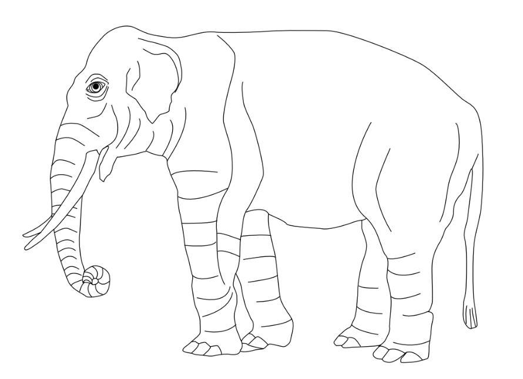

<!-- Italics are "grayed out" to make the example use stand out from dummy content. To make them black, just remove the last line in header_extra.tex: "\renewcommand\emph[1]{\oldemph{\color{gray}#1}}" -->

# Introduktion

## Bavianer 
Bavianer (slægten *Papio*) er en gruppe af nært beslægtede primater, der lever i store dele af Afrika. Gruppen består af seks nulevende arter: 

 * olive baboon (*Papio anubis*), 
 * yellow baboon (*Papio cynocephalus*), 
 * chacma baboon (*Papio ursinus*), 
 * Guinea baboon (*Papio papio*), 
 * hamadryas baboon (*Papio hamadryas*)
 * Kinda baboon (*Papio kindae*). 

Disse arter har overlappende geografiske udbredelser og mødes i flere områder, hvor de danner naturlige hybridzoner @fig-elephant. I sådanne zoner kan individer fra forskellige arter få afkom sammen, hvilket fører til genetisk admixture mellem populationer. 

::: {#fig-elephant }

{width="50%"}

Some caption for an illustration showing an elephant
:::

Dataanalyser har vist, at bavianernes evolutionære historie er kompleks og involverer gentagne perioder med både isolation og genetisk udveksling mellem populationer. I Rogers et al. (2019), viste de at mange af de genetiske mønstre i moderne populationer bedst forklares ved en historie med både divergens og efterfølgende admixture mellem populationer.

### Hybdridisering og selektion
Hybridisering spiller en særlig vigtig rolle i dette system. I flere områder af Afrika findes populationer, hvor individer med genetisk oprindelse fra forskellige arter lever side om side. Studier af sådanne hybridzoner har vist, at genetisk oprindelse kan påvirke både adfærd og sociale relationer mellem individer (Fogel et al., 2021). Samtidig viser analyser, at selektion kan virke forskelligt på forskellige dele af genomet. For eksempel har undersøgelser vist, at negativ selektion mod admixture kan være særligt stærk på X-kromosomet (Vilgalys et al., 2022).

Disse resultater viser, at bavianer udgør et særligt interessant system for studiet af populationshistorie. Kombinationen af relativt nylig artsdannelse, geografisk struktur og omfattende hybridisering gør det muligt at undersøge, hvordan genetiske signaler fra historiske begivenheder kan identificeres. 

Derudover har studiet af bavianer også relevans for forståelsen af menneskets evolution. Ligesom hos bavianer tyder genetiske analyser på, at menneskets evolutionære historie involverer både populationsopdeling og efterfølgende admixture mellem populationer.

## Matematiske modeller
Matematiske modeller spiller en stor rolle i populationsgenetik, da de evolutionære processer, der former genetisk variation, i høj grad er stokastiske. Processer såsom mutation, rekombination og genetisk drift sker tilfældigt over tid og påvirker de genealogiske relationer mellem individer i en population. For at kunne analysere disse mønstre anvendes stokatiske modeller, som beskriver udviklingen af ancestrale linjer gennem tid.

En vigtigt del af populationsgenetik er coalescent teorien, som beskriver de genealogiske relationer mellem genetiske sekvenser i en stikprøve. I stedet for at modellere populationen fremad i tid beskriver coalescent modellen udviklingen baglæns i tid, hvor genetiske linjer gradvist samles i fælles forfædre.

Matematisk kan coalescent processen beskrives som en kontinuert tids Markov proces, hvor systemets tilstand svarer til antallet af eksisterende ancestrale linjer. Overgange mellem tilstande sker, når to linjer coalescerer og dermed reducerer antallet af linjer med én. Hvis der på et tidspunkt findes *k* ancestrale linjer, sker den næste koalescensbegivenhed med rate

$$ 
\lambda_k = \binom{k}{2}
$$

Ventetiden til næste coalescensbegivenhed følger derfor en eksponentialfordeling

$$
T_k \sim \text{Exp}\left(\binom{k}{2}\right)
$$

Denne Markov struktur gør det muligt at analysere genealogiske processer ved hjælp stokastiske modeller (Hobolth lecture notes). 

### Markov processer

En Markov proces er en stokastisk proces, hvor fremtidige tilstande kun afhænger af den nuværende og ikke af hele historien. Dette kaldes Markov egenskaben. 

Lad $X_t$ være en stokatisk proces med tilstandsrum *S*. Markov egenskaben kan formelt skrives som:

$$
P(X_{t+1}=j \mid X_t=i, X_{t-1},\dots,X_0) = P(X_{t+1}=j \mid X_t=i)
$$

Dette betyder, at hvis systemet befinder sig i tilstand *i* på tidspunkt *t*, er sandsynligheden for næste tilstand *j* uafhængig af tidligere tilstande. 

Så er der diskret Markov kæde, som beskrives ved en overgangsmatrix

$$
P =
\begin{pmatrix}
p_{11} & p_{12} & \dots & p_{1n} \\
p_{21} & p_{22} & \dots & p_{2n} \\
\vdots & \vdots & \ddots & \vdots \\
p_{n1} & p_{n2} & \dots & p_{nn}
\end{pmatrix}
$$

Hvor 

$$
p_{ij} = P(X_{t+1}=j \mid X_t=i).
$$

Rækkerne summerer til 1:

$$
\sum_{j=1}^{n} p_{ij} = 1.
$$

Hvis startfordelingen er

$$
\pi^{(0)} = (\pi_1^{(0)},\dots,\pi_n^{(0)})
$$

er fordelingen efter $k$ skridt

$$
\pi^{(k)} = \pi^{(0)} P^k
$$

Så er der også kontinuerte Markov processer, hvor tiden er kontinuert. Processen beskrives ved en intensitetsmatrix 

$$
\Lambda = 
\begin{pmatrix}
\lambda_{11} & \lambda_{12} & \dots & \lambda_{1n} \\
\lambda_{21} & \lambda_{22} & \dots & \lambda_{2n} \\
\vdots & \vdots & \ddots & \vdots \\
\lambda_{n1} & \lambda_{n2} & \dots & \lambda_{nn}
\end{pmatrix}.
$$

Her gæælder

$$
\lambda_{ij} \ge 0 \quad (i \neq j)
$$

og 

$$
\lambda_{ii} = - \sum_{j\neq i} \lambda_{ij}.
$$

Den tilsvarnde overgangsmatrix efter tid *t* er givet ved matrixeksponentialet 

$$
P(t) = \exp(\Lambda t)
$$

Matrixeksponentialet defineres som

$$
e^{\Lambda t}
=
\sum_{k=0}^{\infty}
\frac{(\Lambda t)^k}{k!}.
$$

Dette giver sandsynligheden for overgang mellem tilstande (states) over tid. 

Ofte ser man at der systemet modelleres som en absorberende Markov proces, her opdeles tilstandene i:
 * transiente tilstande 
 * absorberende tilstande

Kan skrives som

$$
\Lambda =
\begin{pmatrix}
T & t \\
0 & 0
\end{pmatrix}
$$

Hvor 
 * *T* er en *p x p* sub-intensitetsmatrix
 * *t* er exit-raten til den absorberende tilstand. 

### Hidden Markov Models (HMM)
En Hidden Markov Model (HMM) er en udvidelse af en Markov-proces, hvor de faktiske tilstande ikke observeres direkte. 

Man observerer i stedet en skevens

$$
Y_1, Y_2, \dots, Y_T
$$

Som genereres af skjulte tilstande

$$
X_1, X_2, \dots, X_T.
$$

Modellen består af tre komponenter:

1. Start fordelingen 

$$
\pi_i = P(X_1=i).
$$

2. Overgangssandsynligheder

$$
a_{ij} = P(X_{t+1}=j \mid X_t=i).
$$

3. Emissionsfordeling

$$
b_j(y) = P(Y_t = y \mid X_t = j).
$$

I HMM finder man en fælles sandsynlighed for skjulte tilstande og observationer ved:

$$
P(X_1,\dots,X_T, Y_1,\dots,Y_T)
=
\pi_{X_1}
\prod_{t=1}^{T-1} a_{X_t X_{t+1}}
\prod_{t=1}^{T} b_{X_t}(Y_t).
$$

Den observerede likelihood fås ved at summere over alle mulige skjulte tilstande:

$$
P(Y_1,\dots,Y_T)
=
\sum_{X_1,\dots,X_T}
P(X_1,\dots,X_T, Y_1,\dots,Y_T).
$$

## Coalsecent teori 
Coalescent teorien giver en stokastisk beskrivelse af genealogien for en stikprøve af genetiske sekvenser fra en population. Hvis man betragter *n* sekvenser fra en population og følger deres ancestrale linjer baglæns i tid, vil linjerne gradvist coalescere indtil der kun er én fælles forfader tilbage.

Den samlede tid til den mest nylige fælles forfader (MRCA) kan skrives som summen af ventetider mellem coalescensbegivenheder:

$$
T_{\text{MRCA}} = \sum_{k=2}^{n} T_k
$$

Hvor hver $T_k$ er eksponentialfordelt med parameter $\binom{k}{2}$

Genealogiske træer genereret af coalescent modellen danner grundlaget for mange statistikker i populationsgenetik. Mutationer antages typisk at opstå langs grenene i det genealogiske træ som en Poisson-proces med rate $\frac{\theta}{2}$. Antallet af mutationer på en gren med længde $t$ følger dermed en Poissonfordeling

$$
M \sim \text{Poisson}\left(\frac{\theta}{2} t\right)
$$

Fordelingen af disse mutationer i en stikprøve giver ophav til forskellige genetiske statistikker, herunder Site Freuency Spectrum (SFS)

### Coalescent with mutation 

### Coalescent with recombination 

## Ancestral Recombination Graph (ARG)

Den klassiske coalescent model antager, at hele genomet deler samme genealogiske træ. I virkeligheden sker der imidlertid rekombination, hvor DNA-segmenter udveksles mellem kromosomer under reproduktion. Dette betyder, at forskellige dele af genomet kan have forskellige genealogiske historier.

Når rekombination inkluderes i modellen, beskrives den fulde ancestrale struktur ved Ancestral Recombination Graph (ARG). ARG'en udvider coalescent modellen ved at inkludere både coalescens- og rekombinationsbegivenheder.
I en sådan model kan en rekombinationsbegivenhed opdeles i to ancestrale linjer, som efterfølgende kan coalescere med andre linjer. Rekombination sker typisk med en rate proportional med rekombinationsraten *r* og længden af DNA-segmentet.

ARG'en giver en fuldstændig beskrivelse af genealogien langs genomet, men strukturen er matematisk kompleks og ofte vanskelig at beregne direkte. Derfor anvendes ofte approksimationer eller statistiske modeller til at analysere genetiske data i praksis.

## Phase-type Distributioner 
Phase-type distributioner opstår naturligt i følge af Markov processer og beskriver fordelingen af tiden indtil absorption i en endelig Markov kæde. Hvis *X(t)* er en kontinuert tids Markov proces med en absorberende tilstand, kan absorptionstiden

$$
\tau = \inf \{ t \geq 0 : X(t) \text{ er absorberende} \}
$$

beskrives ved en phase-type distribution. 

En phase-type distribution kan repræsenteres ved en initialfordeling $\alpha$ og en transitionsmatrix *S*, hvor sandsynlighedstætheden er givet ved

$$
f(t) = \alpha e^{St} s
$$

Hvor

$$
s = -S \mathbf{1}
$$

Som beskrevet i Hobolth, kan mange størrelser i coalescent teorien beskrives ved hjælp af phase-type distributioner. Dette gælder blandt andet coalescenstider og grenlængder i genealogiske træer.

Denne repræsentation gør det muligt at beregne statistikker fra populationsgenetik på en kompakt matrixform. For eksempel kan den forventede værdi af absorptionstiden skrives som

$$
\mathbb{E}[\tau] = \boldsymbol{\alpha} (-S)^{-1} \mathbf{1}
$$

Ved at kombinere phase-type distributioner med coalescent modellen kan man dermed udlede analytiske udtryk for genetiske statistikker såsom Site Frequency Spectrum (SFS), som beskriver fordelingen af mutationer i en stikprøve.

## Site Frequency Spectrum (SFS)

## Formål med speciale 

Dette speciale har til formål at undersøge, hvordan Markov modeller kan anvendes til at analysere genetiske data i populationsgenetik. Særligt fokuseres der på sammenhængen mellem Markov processer, coalescent teori og phase-type distributioner, samt hvordan disse matematiske modeller kan anvendes til at beskrive statistikker udledt fra genetiske data.

Projektet kombinerer teoretisk analyse af de matematiske modeller med arbejde i Python, hvor udvalgte metoder anvendes og undersøges. Som case-study anvendes genetiske data fra bavianpopulationer, som udgør et interessant eksempel på komplekse populationshistorier med dokumenteret hybridisering og selektion.

Tidligere studier har blandt andet vist, at negativ selektion mod introgressede genetiske varianter kan være særligt stærk på X-kromosomet hos bavianer. Dette illustrerer, hvordan evolutionære processer kan efterlade karakteristiske mønstre i genetiske data, som kan analyseres ved hjælp af statistiske modeller.

 

::: {#fig-twoelephants layout-ncol=2}

{#fig-surus}

{#fig-hanno}

Some caption for an illustration with two elephants.
:::

# Theory 

## Markov processer 

## Hidden Markov Models 

## Phase-type distributions

### Multivariate phase-type distribution 

### Discrete phase-type distribution 

## Rewards and branch lengths 

## Site Frequency Spectrum (SFS)

## Singletone, doubletons osv. 

# Methods

## PHASIC

# Discussion

# Conclusion

# References

::: {#refs}
:::
