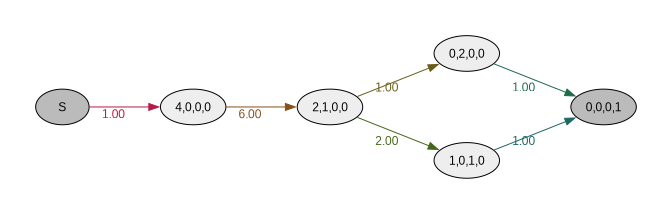
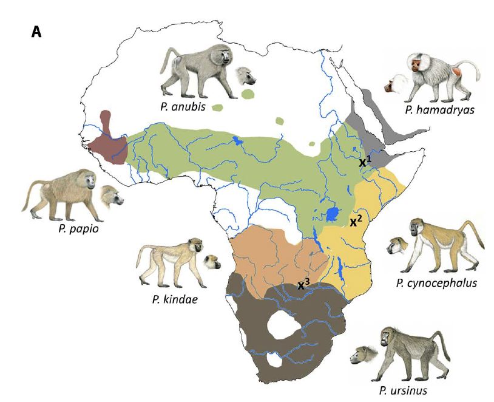
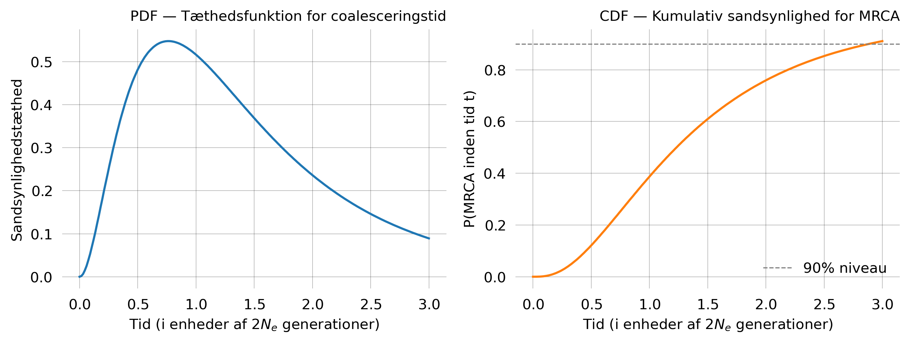
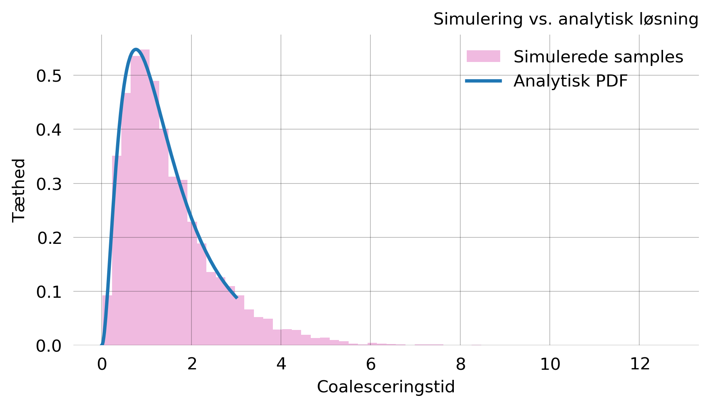
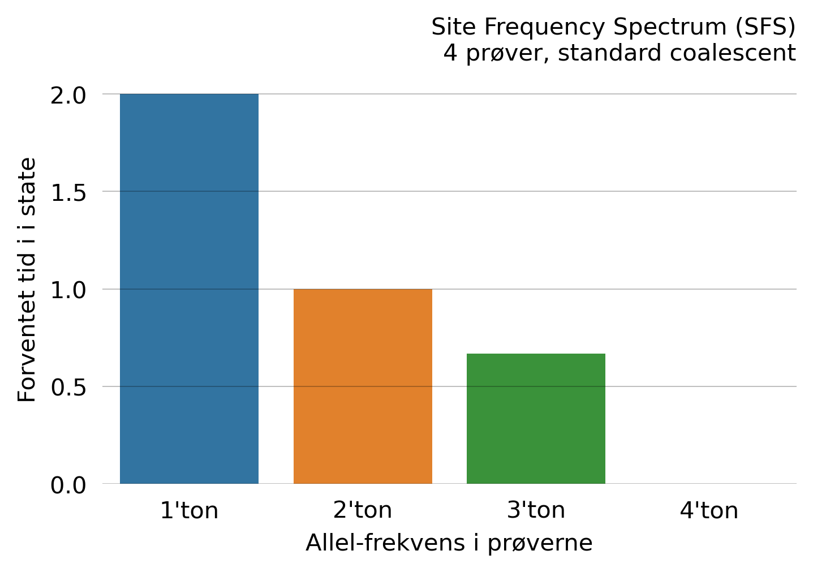
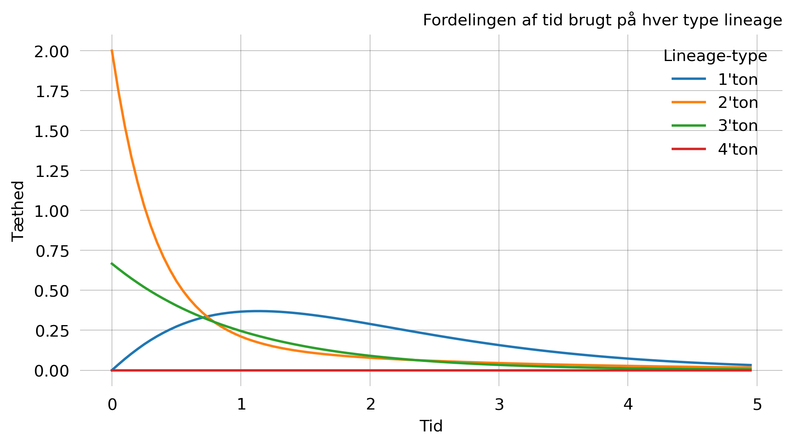
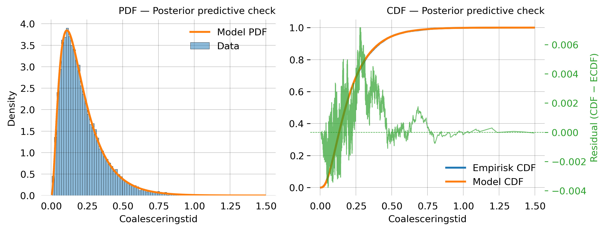
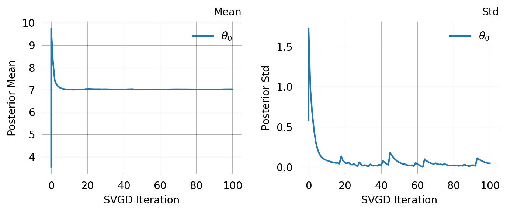
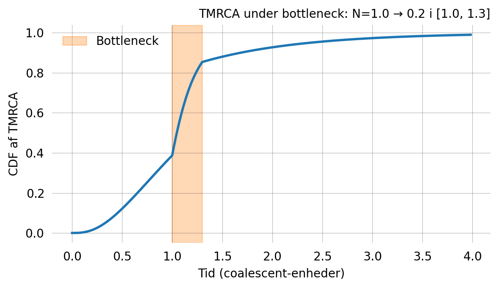

<!-- Italics are "grayed out" to make the example use stand out from dummy content. To make them black, just remove the last line in header_extra.tex: "\renewcommand\emph[1]{\oldemph{\color{gray}#1}}" -->

# Introduktion 

I populationsgenetik arbejder man blandt andet med at forstå, hvordan genetisk variation opstår og ændrer sig over tid. Denne variation kan skyldes forskellige processer såsom genetisk drift, mutation, rekombination og selektion [@hobolth2019]. Tilsammen påvirker de, hvordan individer i en population er genetisk relaterede og også de mønstre man ser i DNA-sekvenser. Når man analyserer DNA-sekvenser fra flere individer, indeholder disse data, information om deres fælles evolutionære historie, selvom man ikke har observeret det direkte [@hobolth2019]. Denne historie kan ofte beskrives ved hjælp af et genealogisk træ, hvor grenene repræsenterer de observerede sekvenser, mens de indre knuder svarer til fælles forfædre. Nyere studier har vist, at evolutionære relationer mellem populationer ofte er mere komplekse, end hvad simple træstrukturer kan beskrive. For eksempel kan processer som hybridisering og gene flow føre til komplekse strukturer og ikke følge simple træer [@sorensen2023; @rogers2019; @vilgalys2022]. Derfor er der behov for mere komplekse strukturer end simple træer til at beskrive disse sammenhænge [@kelleher2019]. Til at analysere sådanne strukturer kan man bruge matrixbaserede metoder som phase-type distributioner [@Hobolth2018; @Hobolth2024]. Nyere forskning viser dog, at graf-baserede repræsentationer af disse modeller kan være mere effektive, især når man arbejder med store og komplekse state spaces [@Roikjer2022]. 

I modeller af genetisk variation antager man ofte, at mutationer opstår tilfældigt langs grenene i et træ. Dette modelleres som en Poisson-proces[@Hobolth2018; @hobolth2021]. Hvis mutationeraten er $\frac{\theta}{2}$, vil antallet af mutationer på en gren med længde $t$ være poisson fordelt, altså $M \sim \text{Poisson}\left(\frac{\theta}{2} t \right)$.
Grenene i træet kan også beskrives ud fra, hvor mange efterkommere de har i det observerede sample. En gren med en efterkommer kaldes en *singleton lineage* og mutationer på sådan en gren vil kunne observeres i en sekvens, disse kaldes *singletons* [@munchphasic]. Tilsvarende vil en gren med to efterkommere give mutationer der ses i præcis to sekvenser altså *doubletons*. På samme måde kan man definere *tripletons, quadrupletons* osv. [@munchphasic]. 
Givet et sample bestående af $n$ sekvenser, kan man definere $\xi_i$ som antallet af mutationer, der forekommer i præcis $i$ sekvenser, hvor $i = 1,2,\dots,n-1$. Vektoren $\xi = (\xi_1,\xi_2,\dots, \xi_{n-1})$ kaldes *Site Frequency Spectrum* (SFS) [@hobolth2019; @hobolth2021]. SFS er en statistisk størrelse og bruges blandt andet til at estimere mutationsrater, analysere populationsstørrelser, teste for selektion og undersøge populationshistorie [@hobolth2021; @spence2018].

## Markovprocesser 

Markovprocesser er gode modeller til at kunne modellere genetiske processer der udvikler sig over tid, da de beskriver systemer hvor fremtiden kun afhænger af den nuværende state og ikke af, hvordan systemet nåede dertil [ @wakeley2009coalescent].
En diskret-tids Markovprocs er en stokastisk procs ${X_t}_{t=0,1,2,\dots}$, som opfylder Markov egenskaben (*Markov properperty*) [@kemeny1976]: 
$$
P(X_{t+1} = j \mid X_t = i, X_{t-1}, \dots, X_0) = P(X_{t+1} = j \mid X_t = i) = P_{ij}.
$$

Her er $P_{ij}$ sandsynligheden for at gå fra state $i$ til state $j$ på et tidsstep. Disse sandsynligheder kan samles i en overgangsmatrix: 
$$
P =
\begin{bmatrix}
P_{11} & P_{12} & \cdots & P_{1n} \\
P_{21} & P_{22} & \cdots & P_{2n} \\
\vdots & \vdots & \ddots & \vdots \\
P_{n1} & P_{n2} & \cdots & P_{nn}
\end{bmatrix},
$$

hvor hver række summerer til $1$. De $t$-trins overgangssandsynligheder kan udtrykkes ved matrixpotenser $P^{(t)} = P^t$, der opfylder Chapman-Kolmogorov-ligningerne[@kemeny1976]:
$$
P^{(t+s)} = P^{(t)} P^{(s)}.
$$

For mange Markovprocesser vil fordelingen efter mange skridt konvergerer mod en stationær fordeling, som ikke længere afhænger af startstaten[@kemeny1976]. 

### Continuous-time Markovprocesser

I mange modeller sker overgange ikke i faste tidstrin, men kontinuerligt over tid. Derfor er continuous-time Markovprocesser ofte mere passende end diskret-tids modeller. En diskret-tids Markovkæde med overgangsmatrix $P=I+A$ kan i en grænseovergang approksimeres af continuous-time Markovproces. Når overgangssandsynlighederne bliver meget små, fås:
$$
P^{\lfloor N_a t \rfloor} = (I + A)^{\lfloor N_a t \rfloor} \to e^{tQ} \quad \text{for } N_a \to \infty,
$$

hvor $Q$ kaldes rategeneratoren og har elementer $Q_{ij} = N_a a_{ij}$. Diagonalelementerne er givet ved:
$$
Q_{ii}=-\sum_{j \neq i} Q_{ij},
$$

så hver række summerer til nul. En nyttig måde at forstå processen på er via *jump chains*. Her er ventetiden i state $i$ eksponentielt fordelt med rate $\lambda_i = \sum_{j \neq i} q_{ij}$, mens den tilhørende diskrete jump chain beskriver, hvilken state processen springer til næste gang, hvis et spring finder sted [@wakeley2009coalescent].
Til analyse af sådanne processer, bruges *first-step analysis*, hvor man opstiller rekursive ligninger for størrelser man gerne vil undersøge og ser på hvad der sker i første trin.
For eksempel kan den forventede tid fra state $i$ til state $j$ skrives som:
$$
\mathbb{E}[T_{ij}] = \mathbb{E}[\tau_i] + \sum_{k \neq i} P^*_{ik} \mathbb{E}[T_{kj}],
$$

og tilsvarende fås for variansen:
$$
\mathrm{Var}[T_{ij}] = \mathrm{Var}[\tau_i] + \sum_{k \neq i} P^*_{ik} \left( \mathrm{Var}[T_{kj}] + \mathbb{E}[T_{kj}]^2 \right) - \left( \sum_{k \neq i} P^*_{ik} \mathbb{E}[T_{kj}] \right)^2.
$$

Disse rekursive relationer er nyttige i analysen af coalescent modeller med populationsstruktur. 

## Coalescent teorien 

For at kunne beskrive den genealogiske struktur bag de observerede data bruges coalescent teori [@wakeley2009coalescent; @hobolth2019]. Ideen er, at man følger genetiske linjer bagud i tid og ser på, hvornår de mødes i fælles forfædre. Hvis to genkopier kan spores tilbage til den samme forfader i en tidligere generation, siger man, at de coalescerer [@wakeley2009coalescent]. 

### Wright-Fisher- og Moran-modellerne

Coalescent teorien hænger tæt sammen med de klassiske fremadrettede modeller *Wright–Fisher-* og *Moran-modellerne*. 
I Wright–Fisher-modellen antages det, at populationen har en konstant størrelse $N$ og at hele populationen udskiftes fra generation til generation. Den nye generation dannes ved tilfældig sampling fra den forrige, hvilket fører til genetisk drift. Hvis der er to alleler, $A_1$ og $A_2$ og $i$ kopier af $A_1$, er frekvensen $p = \frac{i}{N}$. Antallet af kopier i næste generation følger da en binomialfordeling:
$$
P_{ij} = \binom{N}{j} p^j (1-p)^{N-j}, \quad 0 \leq j \leq N
$$

Den forventede værdi er $\mathbb{E}[K_1] = Np = i$, mens variansen er $\mathrm{Var}[K_1] = Np(1-p)$. Selvom middelværdien er konstant, vil allelfrekvensen variere tilfældigt over tid, og på lang sigt vil en allel enten blive fikseret eller forsvinde. Indenfor genetiske variation måler man også heterozygositeten, som udvikler sig som:
$$
\mathbb{E}[H_t] = H_0(1-\frac{1}{N})^t \approx H_0 e^{-t/N}
$$

I Moran-modellen sker ændringerne løbende i stefet for i generationer. Et individ reproducerer og et dør ved hvert tidsstep [@wakeley2009coalescent]. Overgangssandsynlighederne er givet ved:
$$
P_{ij} = 
\begin{cases} 
p(1-p), & \text{hvis } j = i+1, \\
p(1-p), & \text{hvis } j = i-1, \\
p^2 + (1-p)^2, & \text{hvis } j = i, \\
0, & \text{ellers.}
\end{cases}
$$

Her er den forventede værdi $\mathbb{E}[K_1] = Np$, mens variansen er $\mathrm{Var}[K_1] = 2p(1-p)$. Heterozygositeten aftager som $\mathbb{E}[H_t] \approx H_0 e^{-2t/N}$ på en skaleret tidsskala, hvilket viser at genetisk drift i Moran-modellen sker dobbelt så hurtigt som i Wright–Fisher-modellen. For store populationsstørrelser konvergerer begge modeller mod den standard coalescent.

### Den standard coalescent:

Den standard coalescent udviklet af Kingman, beskriver den genealogiske struktur for en stikprøve ved at følge de ancestrale linjer bagud i tid [@Hobolth2024; @Kingman1982]. For en stikprøve med $n$ linjer sker der $n-1$ coalescent begivenheder, hvor to linjer ad gangen samles til en fælles forfader, indtil alle linjer er samlet i MRCA (*most recent common ancestor*) [@wakeley2009coalescent].

Coalescent processen bygger på to centrale egenskaber: kun et par linjer kan coalescere ad gangen, og alle par er lige sandsynlige. Når populationsstørrelsen $N$ er stor, er ventetiderne mellem coalescent begivenheder eksponentielt fordelte. Hvis der er $k$ linjer tilbage, har ventiden $T_k$ følgende tæthed:
$$
f_{T_k}(t_k) = \binom{k}{2} e^{-\binom{k}{2} t_k}, \quad k = 2, \dots, n,
$$

med
$$
\mathbb{E}[T_k] = \frac{2}{k(k-1)}, \qquad \mathrm{Var}[T_k] = \left(\frac{2}{k(k-1)}\right)^2.
$$

Det betyder, at coalescent begivenheder sker hurtigt, når der er mange linjer og langsommere når der er få. Derfor ligger MRCA typisk relativt langt tilbage i tiden.
For en haploid population af størrelse $N$ er sandsynligheden for, at to linjer coalescerer i den foregående generation $\frac{1}{N}$. Når der er $k$ linjer tilbage, er der $\binom{k}{2}$ mulige par, og den samlede coalescensrate er:
$$
\lambda_k = \binom{k}{2} \cdot \frac{1}{N} = \frac{k(k-1)}{2N}
$$

Hvis man i stedet måler i coalescent-enheder, hvor tiden skaleres med $2N$ generationer, reduceres dette til $\lambda_k = \binom{k}{2}$ og ventetiden mellem begivenheder er eksponentielt fordelt med forventning:
$$
\mathbb{E}[T_k] = \frac{1}{\binom{k}{2}} = \frac{2}{k(k - 1)}
$$

Den samlede forventede tid til MRCA for $n$ linjer er:
$$
\mathbb{E}[T_{\mathrm{MRCA}}] = \sum_{k=2}^{n} \frac{2}{k(k - 1)} = 2\left(1 - \frac{1}{n}\right)
$$

For eksempel giver $n=4$ at $\mathbb{E}[T_{\mathrm{MRCA}}] = \frac{3}{2}$. Den effektive populationsstørrelse $N_e$ skalerer den absolutte tid lineært, hvilket gør det muligt at estimere historiske populationsstørrelser. En vigtig pointe ved er, at den genealogiske proces kan analyseres uafhængigt af mutationsprocessen under antagelse af neutral evolution [@wakeley2009coalescent]. Det gør det muligt først at modellere slægtskabsstrukturen og derefter indkluderer mutationer.

**Staterepræsentation**: En state kan repræsenteres som en vektor $s = (s_1, s_2, \ldots, s_n)$, hvor $s_i$ angiver antallet af lineages med netop $i$ efterkommere. Startstaten er $(n, 0, \ldots, 0)$ og den absorberende state er $(0, \ldots, 0, 1)$ svarende til MRCA @fig-coalescent_plot. En transition sker, når to lineages med henholdsvis $i$ og $j$ efterkommere coalescerer til en med $i+j$ efterkommere, med rate:
$$
q_{ij}(s) = \frac{s_i(s_j-\delta_{ij})}{1+\delta_{ij}} * \frac{1}{N_e}
$$

hvor $\delta_{ij}$ er Kronecker-delta, der korrigerer for tilfælde hvor de to lineages er ens.

::: {#fig-coalescent_plot }

{width="65%"}

Grafrepræsentation af coalescent-modellen for $n=4$. Noder repræsenterer state og pile repræsenterer mulige coalescenstransitioner med tilhørende rater. Startstate $(4,0,0,0)$ er øverst til venstre, og den absorberende state nås, når alle fire linjer er forenet. 
:::

## Populationsstruktur og coalescenstider 

I den klassiske coalescent antager man, at populationen er homogen. I virkeligheden er populationer dog ofte opdelt i mindre subpopulationer med begrænset migration og derfor er denne antagelse ikke altid realistisk [@wakeley2009coalescent]. I den strukturerede coalescent følger man stadig lineages bagud i tid, men nu kan de også skifte mellem subpopulation via migration. Man skelner typisk mellem coalescenstiden for to sekvenser, der er samplet fra samme subpopulation (*within*, $T_w$) og fra forskellige subpopulationer (*between*, $T_b$). I en symmetrisk model med $D$ subpopulationer og migrationsrate $M$ kan man ved hjælp first-step analysis udlede [@wakeley2009coalescent]:
$$
\mathbb{E}[T_w] = D, \qquad \mathbb{E}[T_b] = D\left(1 + \frac{D-1}{MD}\right).
$$

Her ses det, at $T_w$ ikke afhænger af migrationsraten, mens $T_b$ i høj grad gør. Hvis migrationen er lav, bliver coalescenstiden mellem subpopulationer markant længere. Det samme gør sig gældende for variansen, som også vokser kraftigt for små værdier af $M$:
$$
\mathrm{Var}[T_w] = D^2 + \frac{2(D-1)^2}{M}, \qquad \mathrm{Var}[T_b] = D^2 + \frac{2(D-1)^2}{M} + \frac{(D-1)^2}{M^2}.
$$

I grænsen $M \to \infty$ forsvinder populationsstrukturen og modellen reduceres til den klassiske coalescent med $N_e = DN$. Omvendt vil $\mathbb{E}[T_b]$ vokse uden grænse, når $M \to 0$ [@wakeley2009coalescent].

### Geografisk struktur

I de tidligere afsnit blev populationsstruktur introduceret i en simpel form. I virkeligheden er mange populationer geografisk strukturerede, hvor individer kun i begrænset grad bevæger sig over større afstande. Derfor er antagelsen om panmixi ofte urealstisk [@wakeley2009coalescent].
I sådanne modeller antages populationen opdelt i $D$ subpopulationer med størrelser $N_1, \dots, N_D$, og migration beskrives ved backward migration rate $m_{ij}$ som angiver sandsynligheden for, at en lineage i subpopulationen $i$ stammer fra $j$ i forrige generation [@wakeley2009coalescent]. Den samlede migrationsrate ud af subpopulation $i$ er givet ved:
$$
m_i = \sum_{j \neq i} m_{ij}.
$$

og dermed er sandsynligheden for, at en lineage forbliver i samme subpopulation bagud i tid: $1-m_i$.
En ofte anvendt antagelse er *conservativ migration*, hvor det gennemsnitlige antal individer, der forlader en subpopulation svarer til antallet der ankommer [@wakeley2009coalescent]. Dette kan udtrykkes som
$$
N_i \sum_{j \neq i} q_{ij} = \sum_{j \neq i} N_j q_{ji},
$$

hvilket sikrer, at populationsstørrelserne forbliver konstante over tid. I mere generelle modeller kan migration dog være stokastisk og ikke nødvendigvis bevare størrelsen af subpopulationerne.
For små samples (for eksempel størrelse $2$) kan genealogien beskrives ved en Markov proces med tre states:

 1.	Begge lineager i samme subpopulation
 2.	Lineages i forskellige subpopulationer
 3.	Lineages har coalesceret

Overgangene mellem disse states bestemmes af både migration og coalescens. Den diskrete transitionsmatrix kan skrives som
$$
P =
\begin{pmatrix}
(g_{1,0} + g^{(s)}_{1,2})(1 - \tfrac{1}{N}) & g_{1,1} + g^{(d)}_{1,2} & (g_{1,0} + g^{(s)}_{1,2}) \tfrac{1}{N} \\
(g^{(s)}_{2,1} + g^{(s)}_{2,2})(1 - \tfrac{1}{N}) & g_{2,0} + g^{(d)}_{2,1} + g^{(d)}_{2,2} & (g^{(s)}_{2,1} + g^{(s)}_{2,2}) \tfrac{1}{N} \\
0 & 0 & 1
\end{pmatrix}.
$$

Her beskriver $g_{i,j}$ sandsynligheder for migrationsbegivenheder, mens indekserne $(s)$ og $(d)$ angiver om lineages ender i samme (*same*) eller forskellige (*different*) subpopulationer efter migration [@wakeley2009coalescent]. Matrixen inkluderer både simple hændelser og situationer hvor migration og coalescens sker i samme generation.
Ved at tage grænsen $N \to \infty$, og skalere tiden passende opnås en continuous-time Markov proces med generator [@wakeley2009coalescent]
$$
Q = \lim_{N \to \infty} N(P - I).
$$

I den symmetriske model for sample size $2$ reduceres dette til en generator af formen
$$
Q =
\begin{pmatrix}
- M - 1 & M & 1 \\
\frac{M}{D-1} & - \frac{M}{D-1} & 0 \\
0 & 0 & 0
\end{pmatrix},
$$

som svarer til de tre state. Denne formulering viser tydeligt, at processen styres af to typer hændelser:

 * coalescens (rate $1$ når lineages er i samme subpopulation)
 * migration (med rate proportional med $M$)

[@wakeley2009coalescent].

### Selektion

Indtil nu har fokus været på neutrale modeller, hvor alle lineages betragtes som udskiftelige. Når selektion er til stede, ændrer dette sig, da nogle alleler får en fordel frem for andre og dermed påvirkes også coalescent processen. I Wright–Fisher-modellen med diploid viability selection og fitness-parametre $w_{11}, w_{12}, w_{22}$ ændres allelfrekvensen fra $p$ til:
$$
p' = \frac{p(p\, w_{11} + q\, w_{12})}{\bar{w}}, \quad \bar{w} = p^2 w_{11} + 2pq\, w_{12} + q^2 w_{22}.
$$

Afhængigt af fitness-parametrene kan man skelne mellem forskellige typer af selektion. Ved positiv retningsbstemt selektion favoriseres en allel, som vil blive fikseret i populationen. Ved balancerende selektion opretholdes flere alleler over tid, mens negativ (purifying) selektion fjernes skadelige mutationer fra populationen. 
I  genealogisk sammenhæng betyder selektion, at lineages ikke længere er udskiftelige. Derfor må coalescent modellen udvides for at kunne tage højde for disse efekter [@wakeley2009coalescent].

## Phase-type fordelinger

Coalescent teorien giver os en måde at beskrive genealogien på, men for at beregne konkrete størrelser analytisk bruges *phase-type fordelinger*. De beskriver absorptionstider i tidskontinuerte, endelige Markov-kæder [@Hobolth2024]. Coalescent processen passer naturligt ind i denne ramme: den kan beskrives som en Markov-kæde med endeligt antal state, konstante overgangsrater og en absorberende state svarende til MRCA. Absorptionstiden er derfor per definition phase-type fordelt.

Coalescenstider kan analyseres ved hjælp af *phase-type fordelinger*, som beskriver absorptionstider i tidskontinuerte, endelige Markov-kæder [@Hobolth2024]. Coalescent processen passer naturligt ind i denne ramme, da den netop kan beskrives som en Markov-kæde, med et endeligt antal state, konstante overgangsrater og en absorberende state svarende til MRCA. Absorptionstiden er derfor per definition phase-type fordelt.

**Definition (Continuous phase-type fordeling)**. Lad $\alpha = (\alpha_1, \ldots, \alpha_p)$ være startfordelingen over de $p$ transiente state, og lad $S$ være den tilhørende $p \times p$ sub-intensitetsmatrix med $S_{ij} \geq 0$ for $i \neq j$ og $S_{ii} < 0$. Rækkesummerne er ikke-positive ($\leq 0$) og exitratevektoren er givet ved $s = -Se$. Absorptionstiden defineres som:
$$
\tau = \inf\{t \geq 0 : X_t = p+1\}
$$

og man skriver $\tau \sim \mathrm{PH}_p(\alpha, S)$ [@Neuts1981; @BladtNielsen2017].
Tæthedsfunktionen og fordelingsfunktionen er givet ved:
$$
f_{\tau}(t) = \alpha e^{St}s, \quad
F_{\tau}(t) = 1 - \alpha e^{St}e, \quad t \ge 0
$$

Hvor $e^{St}$ matrixeksponentialet. Elementet $(i,j)$ i denne matrix kan fortolkes som sandsynligheden for at befinde sig i state $j$ på tidspunkt $t$ givet at processen startede startde i state $i$ [@BladtNielsen2017]. 
Momenter kan beregnes ved hjælp *Green-matrixen* $\mathbf{U} = (-\mathbf{S})^{-1}$ [@munchphasic; @BladtNielsen2017]:
$$
\mathbb{E}[\tau^n] = n!\, \alpha \mathbf{U}^n\, \mathbf{e}
$$

Elementet $U_{ij}$ kan fortolkes som den forventede samlede tid, processen tilbringer i state $j$ givet at den startede i state $i$. Ved at kombinere startfordelingen $\alpha$ med Green-matrixen fås vektoren $\alpha \mathbf{U}$ som angiver de forventede opholdstider i de transiente state. Summen af disse giver den forventede absorptionstid:
$$
\mathbb{E}[\tau] = \alpha \mathbf{U}\mathbf{e}
$$

Sandsynligheden for at befinde sig i de forskellige states til tidspunkt $t$ er givet ved:
$$
\mathbf{p}(t)=\alpha e^{\mathbf{S}t}
$$

som beskriver fordelingen over de transiente state på tidspunkt $t$. Dette gør det muligt at beregne størrelser som det forventede antal lineages som funktion af tiden:
$$
\mathbb{E}[\text{lineages}(t)] = \sum_i p_i(t) \cdot n_i
$$

hvor $n_i$ er antallet af lineages i state $i$.
En motivation for at anvende phase-type fordelinger er, at komplekse udtryk for coalescenstider kan reduceres til relativt simple matrixoperationer [@Hobolth2018; @Hobolth2024]. Som vist i nyere arbejde kan denne ramme anvendes på mange modeller herunder Two-island modellen, Isolation with migration modellen og tisinhomogene modeller. 

### Phase-type repræsentation af coalescenten

Coalescent processen kan somsagt beskrives som en absorberende Markovproces, hvor state svarer til antallet af lineages [@Hobolth2024]. For et sample af størrelse $n$ er staterummet $\{n, n-1, \dots, 2, 1\}$, hvor processen bevæger sig nedad efterhånden som lineages coalescerer. Når der er $i$ lineages sker coalescens med rate $\lambda_i = \binom{i}{2}$. Dette fører til en generatormatrix på formen:
$$
\begin{pmatrix}
-\lambda_n & \lambda_n & 0 & \cdots & 0 \\
0 & -\lambda_{n-1} & \lambda_{n-1} & \cdots & 0 \\
\vdots & \ddots & \ddots & \ddots & \vdots \\
0 & \cdots & 0 & -\lambda_2 & \lambda_2 \\
0 & \cdots & \cdots & 0 & -\lambda_1 
\end{pmatrix}
$$

Med startvektor $\alpha = (1, 0, \dots, 0)$ svarende til at processen starter med $n$ lineages, kan træhøjden skrives som summen af ventetider mellem coalescensbegivenheder:
$$
H = \sum_{i=2}^{n} H_i \sim \mathrm{PH}(\alpha, \mathbf{S}),
$$

fordelingen af $H$ er dermed en phase-type fordeling, som i dette tilfælde kan ses som en generaliseret Erlang-fordeling da den består af en sum af eksponentielt fordelte ventetider med forskellige rater [@Hobolth2018].

### Reward-transformationer og Site Frequency Spectrum (SFS)

En vigtig udvidelse af phase-type teorien er *reward-transformationer* [@BladtNielsen2017; @munchphasic]. I stedet for at måle den samlede absorptionstid tildeler man en ikke-negativ reward $r_i \geq 0$ til hver transient state $i$ og akkumulerer reward frem til absorption:
$$
\tilde{\tau} = \int_0^{\tau} r(X_t)\, dt.
$$

Ideen er at man vægter den tid processen tilbringer i hver state, forskelligt uafhængigt at, hvad man ønsker at måle. 
For eksempel kan man vælge rewards, så man får forskellige relevante størrelser:

 - **Træhøjde** ($r_i = 1$): $H = \sum_{i=2}^n H_i$
 - **Total grenlængde** ($r_i = i$): $L = \sum_{i=2}^n i\, H_i$
 - **Ekstern grenlængde** ($r_i = 1$ for singleton-state, ellers $0$)

Hvis alle rewards er strengt positive, er $\tilde{\tau}$ igen phase-type fordelt [@BladtNielsen2017]:
$$
\tilde{\tau} \sim \mathrm{PH}_p\!\left(\alpha,\, \Delta(\mathbf{r})^{-1} \mathbf{S}\right),
$$

hvor $\Delta(\mathbf{r})$ er diagonalmatricen med rewardvektoren på diagonalen. Dette resultat er centralt, da det viser at klassen af phase-type fordelinger er lukktt under sådanne transformationer.
Reward-transformationer spiller en vigtig rolle i beregningen af SFS. Mutationer på grene med $k$ efterkommere bidrager til det $k$-te element i SFS. Hvis $Y_i$ er den totale grenlængde med $i$ efterkommere, fås:
$$
\mathbb{E}[\xi_i \mid Y_i] = \frac{\theta}{2} Y_i, \quad \text{så} \quad \mathbb{E}[\xi_i] = \frac{\theta}{2}, \mathbb{E}[Y_i] = \frac{\theta}{i}.
$$

Dette kan formuleres direkte i phase-type rammen ved at vælge en rewardvektor $r_k$ som tæller antallet af $k$-tons lineages i hver state. Den forventede værdi af SFS kan da skrives som:
$$
\mathbb{E}[\text{SFS}_k] = \mu \cdot \alpha\, \mathbf{U}\, \mathbf{r}_k.
$$

Dermed kan hele det forventede SFS beregnes analytisk [@Hobolth2024; @munchphasic].
For multivariate phase-type fordelinger, hvor flere reward-vektorer anvendes samtidig, kan man også udlede kovariansstrukturen. Det andet krydsmoment er givet ved [@Hobolth2024]:
$$
\mathbb{E}[Y_i Y_j] = \alpha, \mathbf{U}\, \Delta(\mathbf{R}_{\cdot i})\, \mathbf{U}\, \Delta(\mathbf{R}_{\cdot j})\, \mathbf{e} + \alpha, \mathbf{U}\, \Delta(\mathbf{R}_{\cdot j})\, \mathbf{U}\, \Delta(\mathbf{R}_{\cdot i})\, \mathbf{e}.
$$

Dette gør det muligt at beregne kovariansen i SFS præcis.

### Diskret phase-type fordeling

I praksis observerer man ikke coalescenstider direkte i genomdata, men i stedet diskrete tælledata i form af SNPs. Under en Poisson-mutationsmodel forvents antallet af mutationer på en gren med længde $t$ at være  $\mu \cdot t$. For at koble dette til de diskrete observationer kan man anvende den *diskrete phase-type fordeling* [@Neuts1981; @BladtNielsen2017].
For en diskret phase-type fordeling $\tau \sim \mathrm{DPH}_p(\alpha, \mathbf{T})$ er sandsynlighedsfunktionen givet ved:
$$
P(\tau = k) = \alpha \mathbf{T}^{k-1}\, \mathbf{t}, \quad k = 1, 2, \ldots
$$

hvor $\mathbf{T}$ er sub-transitionsmatricen og $\mathbf{t} = \mathbf{e} - \mathbf{T}\mathbf{e}$ er exitvektoren [@BladtNielsen2017]. I denne sammenhæng kan den totale grenlængde $S_{\text{total}}$ vises at være diskret phase-type fordelt [@Hobolth2024]. Dette giver en naturlig kobling mellem den underliggende coalescent model og de observerede mutationsdata. Ved at kombinere den kontinuerte coalescnet med mutationsmodellen kan man beregne sandsynligheden for forskellige observationsmønstre, såsom antallet af singleton-, doubleton- osv. Denne tilgang gør det muligt at udføre inferens direkte på SNP-data.

## Ancestral Recombination Graph (ARG)

Den klassiske coalescent antager, at hele genomet deler samme genealogiske træ. I virkeligheden medfører rekombination dog, at forskellige dele af genomet kan have forskellige genealogier. Den samlede ancestrale struktur beskrives derfor ved *Ancestral Recombination Graph* (ARG), som inkluderer både coalescens- og rekombinationsbegivenheder i en samlet model [@kelleher2019].
Ligesom coalescenten kan ARG-processen beskrives som en continuous-time Markovproces, men staterummet er mere kompleks, da det også skal indeholde information om hvilke loci de enkelte lineages er ancestrale til. I den simpleste to-locus model beskrives en state som $(i, j, k)$, hvor $i$ er antallet af lineages ancestrale til begge loci, $j$ til kun locus 1 og $k$ til kun locus 2 [@wakeley2009coalescent].
For lineages der er ancestrale til begge loci kan der ske to typer begivenheder:

 - **Coalescens**: $(i, j, k) \to (i-1, j, k)$ med rate $\binom{i}{2}$
 - **Rekombination**: $(i, j, k) \to (i-1, j+1, k+1)$ med rate $i\rho$

Den samlede rate for den næste begivenhed er derfor $\lambda_i + i\rho$, og sandsynligheden for, at det er en coalescensbegivenhed, er givet ved
$$
\frac{\lambda_i}{(\lambda_i + i\rho)}
$$

Ligesom i den klassisk coalescent kan absorptionstiden beskrives ved en phase-type fordeling:
$$
\tau \sim \mathrm{PH}(\alpha, \mathbf{S}),
$$

men nu over et udvidet og mere komplekst staterum. ARG-modellen er ofte mere kompleks til direkte analyse. Derfor anvendes ofte approksimationer som *Sequential Markov Coalescent* (SMC) hvor genealogien langs genomet modelleres som en Markovproces. Dette gør det muligt at anvende skjulte Markov-modeller til inferens af populationshistorie [@spence2018; @kelleher2019].

## Populationsstruktur: two-island modellen og Isolation with migration (IM)-modellen

Den standard coalescent antager en homogen population. For populationer, der lever i geografisk adskilte grupper med begrænset migration, er denne antagelse dog ikke realistisk. Derfor anvendes der i dette speciale to modeller for populationsstruktur. 

**Two-island modellen** beksriver en population opdelt i to subpopulationer med symmetrisk migration med rate $m$ per lineage per tidsenhed. Coalescens kan kun finde sted inden for samme population. Modellen har tre parametre: coalescenceraterne $\frac{1}{N_1}$ og $\frac{1}{N_2}$ for de to populationer samt migrationraten $m$. For at holde styr på, hvor hver lineage befinder sig udvides statevektoren med en populationslabe $\mathtt{in\_pop} \in \{1, 2\}$. Modellen er tidshomogen, da migrationsraten er konstant bagud i tid og den udgør dermed den simpleste model for populationsstruktur. I dette speciale anvendes modellen til at estimere migration på bavian-data og mere specifikt estimere migration mellem eastern yellow bavianer og Kinda bavianer.

**Isolation with Migration (IM)-modellen** udvider dette ved at introducere et split-tidspunkt $t_s$​ som opdeler populationens historie i to epoker:

 * Epoke $0$ ($0 \to t_s$): To separate populationer med størrelser $N_1$ og $N_2$ hvor der foregår migration med rate $m$
 * Epoke $1$ ($t_s \to \infty$): En fælles ancestral population med størrelse $N_a$ og ingen migration

[@wakeley2009coalescent]. IM-modellen er dermed *tidsindhomogen* da raterne ændrer sig ved tidspunktet $t_s$​. Modellen er motiveret af Sørensen et al. (2023)'s som finder evidens for løbende admixture mellem olive og yellow bavianer i Tanzania. I dette speicale anvendes modellen på southern-olive data. 
Split-tiden kan omregenes til absolut tid via:
$$
t_{\text{år}} = t_s \cdot 2N_{\text{ref}} \cdot g
$$

hvor $N_\text{ref}$ estimeres fra den observerede nukleotiddiversitet via sammenhængen: $\hat{\pi} \approx 4 N_\text{ref} \mu$.

## Tidsindhomogenitet og validering mod Pool & Nielsen

Standard phase-type fordelinger er tidshomogene, hvilket betyder at overgangsraterne er konstante over tid. I virkeligheden er demografiske processer dog ofte tidsvarierende, da populationer kan vokser, falde, gennemgår flaskehalse og splitte. Derfor er det nødvendigt af kunne håndtere tidsinhomogenitet i modellerne. I dette speciale undersøges to forskellige tilgange til at håndtere tidsinhomogenitet. 

**Step-wise konstruktion** indebærer, at raterne opdateres diskontinuert over tid inden for et numerisk integrationsskema. Denne tilgang kan for eksempel anvendes til at modellere en populations-bottleneck, hvor den effektive populationsstørrelse $N_e$​ falder til $N_\text{bottle}$ i et bestemt tidsinterval.

**Epoch-wise konstruktion** opdeler processen i diskrete epoker med konstante rater inden for hver epoke. Ved overgang mellem epoker beregnes fordelingen af state og opholdstider, som derefter bruges som statebetingelser for den næste epoke med ændrede rater. Denne tilgang mulligør eksakt beregning af momenter og anvendes i dette speciale til IM-modellen.

Som analytisk referencepunkt benyttes Pool & Nielsen (2009), der udledte en lukket formel for den forventede parvise coalescenstid under en stykvist konstant demografi. 

## Bavianer som modelsystem 

Bavianer (slægten *Papio*) er en gruppe af nært beslægtede primater, som lever i store dele af Afrika [@kopp2023]. Slægten består af seks nulevende arter:
 
 * Olive baboon (*Papio anubis*), 
 * Yellow baboon (*Papio cynocephalus*), 
 * chacma baboon (*Papio ursinus*), 
 * Guinea baboon (*Papio papio*), 
 * Hamadryas baboon (*Papio hamadryas*)
 * Kinda baboon (*Papio kindae*). 

Arterne er morfologisk og adfærdsmæssigt forskellige, men deres geografiske udbredelser grænser ofte op til hinanden og kan overlappe i visse områder [@sorensen2023]. [@sorensen2023] @fig-Kort. 

::: {#fig-Kort }

{width="50%"}

*Papio* baboon arter. Nuværende udbredelse af hver bavianart samt placeringen af ​​tre veldokumenterede aktive hybridzoner er også vist. x1: hybridzone mellem P. hamadryas og P. anubis, x2: hybridzone mellem P. cynocephalus og P. anubis, x3: hybridzone mellem P. kindae og P. ursinus. Billede fra Rogers et al., 2019. 
:::

På trods af disse forskelle kan flere arter krydse sig i naturen og producere fertile hybrider [@sorensen2023; @jordan2018papio]. I flere kontaktzoner er der veldokumenterede hybridzoner med løbende gene flow. Genetisk ancestry kan påvirke sociale relationer og adfærd mellem individer, hvilket kan have betydning for populationsstrukturen [@fogel2021].

Helgenomsanalyser har vist, at bavianernes evolutionære historie er langt mere kompleks end tidligere antaget. Sørensen et al. (2023) sekventerede 225 bavianer fra 19 lokaliteter og dokumenterede admixture mellem *P. anubis* og *P. cynocephalus* i det sydlige Tanzania, en tæt genealogisk forbindelse mellem Kinda-bavianer og western yellow-populationerne, samt tegn på tre-vejs admixture i western yellow-populationerne ved Mahale og Katavi, et mønster som ikke tidligere er observeret i denne slægt. Studier af hybridzonerne viser desuden, at selektion mod introgresserede genetiske varianter kan være stærk, særligt på X-kromosomet, hvor der er observeret op til syv gange stærkere selektion sammenlignet med autosomer [@sorensen2023_selection].
Bavianernes evolutionære historie startede for omtrent to millioner år siden i Afrika, parallelt med menneskets evolution [@rogers2019]. I modsætning til mennesker, hvor kun en art eksisterer i dag, har bavianer bevaret flere linjer. Det gør dem særligt velegnede som modelsystem til at studere både divergens og hybridisering i naturlige populationer. 
I dette speciale anvendes estimater fra Sørensen et al. (2023), herunder en mutationsrate på $\mu = 0.9 \times 10^{-8}$ per site per generation og en generationstid på $g = 11$ år, til at omsætte modelparametre til absolutte demografiske størrelser.

Bavianerne fungerer dermed som et konkret modelsystem, der motiverer de matematiske modeller. Fokus i dette arbejde er primært på at opbygge forstå og implementere disse og derefter anvende dem på genomdata fra bavianerne.

### Tajima's $D$ 

Data undersøges for at se om det passer med med neutral evolution. Så her finder man Tajima's $D$. Testen sammenligner to estimatorer for mutionsraten: 
$$
D = \frac{\hat{\pi} - \hat{\theta}_W}{\sqrt{\hat{V}(\hat{\pi} - \hat{\theta}_W)}}
$$

hvor $\hat{\pi}$ er nukleotiddiversiteten (baseret på parvise forskelle) og $\hat{\theta}_W = \frac{S}{a_1}$ er Wattersons estimator baseret på antallet af segregerende sites $S$ og $a_1 = \sum_{i=1}^{n-1} \frac{1}{i}$. Under neutral evolution med konstant populationsstørrelse forventes $D \approx 0$. Negative værdier indikerer et overskud af sjældne varianter (for eksempel nylig populationsvæks eller purifying selektion), mens positive værdier tyder på et overskud af hyppige varianter (for eksempel admixture, balancerende selektion eller bottlenecks).

## Problemformulering
Formålet med dette speciale er at undersøge, hvordan Markov-modeller og coalescent teori kan anvendes til at rekonstrukere genetisk populationshistorie, med bavianer som konkret case. Det lægges særligt vægt på at forstå den matematiske struktur bag metoderne samt at implementere og afprøve dem i Python via biblioteket *phasic*. Følgende spørgsmål undersøges:

1. Hvordan kan coalescensprocessen beskrives som en phase-type fordeling og hvad er de matematiske egenskaber herunder fordelinger, momenter og Site Frequency Spectrum?
2. Hvordan kan modellen udvides til at inkludere populationsstruktur og migration og hvilke parametre kan estimeres ud fra genomdata?
3. I hvilken grad kan historiske populationssplits og admixture identificeres i baviangenomerne ved hjælp af en IM model?
4. Hvordan påvirker tidsvarierende populationshistorie modellens resultater og hvor godt stemmer beregningerne overens med analytiske reference resultater?

## Populationer i dette speciale

Analyserne i dette speciale fokuserer på fem bavianpopulationer fra Sørensen et al. (2023), defineret via sample-ID'er fra artiklens Tabel S2 og baseret på data fra kromosom 20:

::: {#tbl-populations .striped}

| Population                  | Art               | Lokalitet | Individer | Rolle                   |
|:----------------------------|:------------------|:----------|----------:|:------------------------|
| Eastern yellow (Mikumi)     | *P. cynocephalus* | Tanzania  |        35 | Referencepopulation     |
| Kinda (Chunga/Dendro)       | *P. kindae*       | Zambia    |        29 | Two-island model (NB 04)|
| Southern olive (Tarangire)  | *P. anubis*       | Tanzania  |        46 | IM-model (NB 05)        |
| Western yellow (Mahale)     | *P. cynocephalus* | Tanzania  |         9 | Tre-vejs admixture      |
| Olive gog                   | *P. anubis*       | Etiopien  |        26 | Referenceanalyse        |

Populationer, arter, lokalitet, antal individer og deres rolle i analysen.
:::

De udvalgte populationer repræsenterer forskellige typer af scenarier, herunder referencepopulationer, strukturerede populationer samt populationer med dokumenteret admixture. Dette gør det muligt at teste modellerne under forskellige forhold.

## Projektstruktur

Projektets er organiseret med fokus på reproducerbarhed.

### Jupyter Notebooks

Analyser og visualiseringer er udførst i Juptyer Notebooks, som er organiseret i mappen *notebooks/* og navngivet kronologisk, så de afspejler analyseforløbet. 
Notebooks arbejder direkte på data genereret i de enkelte trin og indgår dermed som en integreret del af workflowet. Dette gør det muligt automatisk at reproducere figurer, tabeller og statistiske analyser, eksempelvis relateret til SFS eller coalescent baserede størrelser.

### Dokumentation med Quarto

Til dokumentation af resultater anvendes Quarto, som gør det mulgit at kombinere tekst, kode og output i et samlet dokument. Specialet genereres fra Markdown- og notebook-filer hvilket sikrer konsistens mellem analyser og den skrevne tekst. Samtidigt gør det det nemt at generere output i flere format, så som PDF og HTML.

### Git and GitHub

Projektet er versionsstyret med Git og hostet på GitHub. Dette muliggør løbende sporing af ændringer, dokumentation af udviklingen samt reproducerbarhed af analyserne. Ved hjælp af automatisk generering af projektets hjemmeside (GitHub Acotions) kan projekts hjemmeside og dokumentation opdateres automatisk ved ændringer i koden. 

# Metode

## Opbygning og rækkefølge

Analysen er delt op i seks Jupyter Notebooks, der følger hinanden i en bestemt rækkefølge. De to første notebooks 01-02 bruges til at forstå modellerne og teste dem på simulerede data. Notebook 03 forbereder bavian-datasættet. Notebook 04 og 05 er selve analyserne på de rigtige data og notebook 06 undersøger tidsindhomogenitet og tjekker at implementationen virker som forventet. Undervejs gemmes resultater som CSV-filer, så de efterfølgende notebooks kan bruge dem direkte.

## Konstruktion af coalescensgrafen

Det første skridt er at bygge en coalescensmodel i phasic. En state beskrives som en vektor, hvor indgang $i$ angiver antallet af lineages med $i$ efterkommere i prøven. Når to lineages smelter sammen sker en transition, og raten for det afhænger af, hvor mange mulige par der er.

For at tjekke at modellen er bygget rigtigt, bygges den på to måder: først ved at tilføje overgange manuelt, og bagefter ved hjælp af en callback-funktion der automatisk bygger hele staterummet rekursivt. Begge metoder giver det samme resultat: seks states for $n=4$ prøver @fig-coalescent_plot.

Herefter beregnes de statistiske egenskaber analytisk: forventning, varians, tæthedsfunktion, kumulativ fordelingsfunktion og den forventede opholdstid i hver state. Som ekstra tjek simuleres $10.000$ samples, og det simulerede gennemsnit sammenlignes med den analytiske forventning. Forskellen er konsekvent under $10^{-3}$ coalescent-enheder @fig-coalescent_pdf_cdf @fig-simulering.

::: {#fig-coalescent_pdf_cdf }

{width="50%"}

Analytisk PDF og CDF for $T_\text{MRCA}$ med $n=4$.
:::

::: {#fig-simulering }
{width="50%"}

Histogram af $10.000$ simulerede coalesceringstider sammenholdt med den analytiske PDF.
:::

## Rewards og Site Frequency Spectrum

For at beregne Site Frequency Spectrum bruges reward-transformationer. Ideen er at give en reward til hver state, der tæller antallet af lineages af en bestemt type, for eksempel singletons, doubletons og tripletons. Derefter beregnes den forventede akkumulerede reward frem til absorption, hvilket giver det forventede antal varianter i hvert SFS-bin direkte og uden simulering.

4-ton-komponenten er nul, fordi processen ikke tilbringer nogen tid i den absorberende state. Udover de forventede værdier beregnes også den fulde sandsynlighedsfordeling for tid brugt i hvert lineage-type, så man kan se usikkerheden på hver komponent @fig-sfs_plot @fig-reward_plot.

::: {#fig-sfs_plot }
{width="50%"}

Forventet SFS for $n=4$. Singletons dominerer; quadrupleton er nul da den absorberende state ikke bidrager til grenlængde. 
:::

::: {#fig-reward_plot }
{width="50%"}

Sandsynlighedsfordelingen for tid brugt i hhv. singleton-, doubleton-, tripleton- og quadrupleton-lineages.
:::

## Fra coalesceringstider til antal mutationer

I genomdata ser man ikke selve coalesceringstiderne, men i stedet diskrete data i form af SNPs. For at koble de to ting diskretiseres modellen: en hjælpestate akkumulerer mutationer efterhånden som de opstår langs grenene under en Poisson-mutationsmodel. Det forventede antal mutationer beregnes analytisk og tjekkes mod en alternativ beregning, nemlig den forventede totale grenlængde ganget med mutationsraten. De to tal skal stemme overens.

## Parameteriserede modeller

For at kunne estimere parametre fra data skal overgangsraterne i modellen beskrives som funktioner af parametre frem for faste tal. I phasic gøres dette ved at angive koefficienter for hver kant i grafen, der beskriver hvor meget hvert parameter bidrager til raten. Hele grafen opdateres i et kald, når parameterværdierne ændres.

Som eksempel bygges en to-locus ARG-model med coalescence-rate $\frac{1}{N}$ og rekombinationsrate $R$ som frie parametre. Det viser sig at større $N$ giver en længere forventet tid til MRCA, mens højere $R$ opdeler lineages i separate historier og giver kortere tider. Denne struktur bruges som grundlag for inferens i de efterfølgende notebooks.

## Inferensmetoder

Notebook 02 tester tre inferensmetoder på simulerede data med den kendte parameter $\theta = 7$, inden de bruges på baviandata.

**Method of Moments** finder det parameterestimat, der får modellens teoretiske momenter til at matche de empiriske momenter fra data. Det er hurtigt og giver et punktestimat med standardfejl, men siger ikke noget om usikkerheden på estimatet. Metoden bruges primært som et hurtigt udgangspunkt og til at give gode startpunkter til den Bayesianske inferens.

**SVGD** (*Stein Variational Gradient Descent*) giver i stedet den fulde posterior-fordeling over parametre. Metoden bruger 80 partikler, som iterativt opdateres mod posterior via gradient-information. Læringsraten falder eksponentielt over 150 iterationer fra 0.05 til 0.01. For at vurdere om metoden er konvergeret, ses der på den gennemsnitlige partikelflytning per iteration: når kurven flader ud, er partiklerne stabiliseret. Posterior-fordelingen præsenteres som 95% HPD-intervaller og pairwise-plots der viser korrelationen mellem parametre @fig-posterior_CI @fig-svgd_convergence.

::: {#fig-posterior_CI }
{width="50%"}

95% HPD-interval fra SVGD på $10.000$ observationer med sand $\theta=7$ markeret.
:::

::: {#fig-svgd_convergence }
{width="50%"}

Konvergensplot den fladende kurve indikerer at partiklerne er stabiliseret.
:::

Priors er Gaussiske med bredde tilpasset biologisk plausible værdier. I simple modeller bruges en bred prior direkte, men i mere komplekse modeller initialiseres de ud fra MoM-estimaterne.

For at vurdere om modellen passer til data, laves en **posterior predictive check**: modellen opdateres til posterior-gennemsnittet, og den resulterende PDF og CDF sammenlignes med de empiriske data. Stemmer de overens, fanger modellen strukturen i data @fig-posterior_predictive_check.

::: {#fig-posterior_predictive_check}

{width="50%"}

Posterior predictive check: Modellens tilpassede PDF og CDF sammenholdt med data, evalueret ved posterior-gennemsnittet. Det tætte match residual under $0.005$ over hele støtten, bekræfter god modelfit.
:::

**Joint probability inferens** bruges, når observationerne er diskrete mutationsmønstre frem for coalesceringstider. En joint probability-graf kobler coalescent-modellen til mutationsmodellen og giver sandsynligheder for hvert muligt observationsmønster $(k_1, k_2)$, altså antallet af singletons og doubletons i et SNP-par. Probability matching bruges som startestimat inden SVGD, og mutationsraten holdes fast som en fikseret parameter. Defekten, det vil sige den andel af sandsynlighed der afskæres af model-afskæringen, kontrolleres og holdes under $0.05$ i alle analyser.

## Databehandling af baviangenomet

Genomdata fra Sørensen et al. (2023) består af 225 vilde bavianer fra 19 lokaliteter, og her bruges kromosom 20. Dataene indlæses i phased Zarr-format. For hver population findes de relevante individer ud fra sample-ID'er i artiklens Tabel S2, og derived allele counts beregnes per SNP-site.

Populationerne har forskellig samplingdybde, så de subsamples til $n=4$ haplotyper per locus via hypergeometrisk sampling. Det er valgt frem for simpel tilfældig sampling, fordi det bevarer allelfrekvenserne korrekt og undgår at introducere bias i SFS.

Den foldede SFS beregnes, så man slipper for at antage at det ancestrale allel er kendt. Det gøres ved at lægge $\text{SFS}_k$ og $\text{SFS}_{n-k}$ sammen. Nukleotiddiversiteten $\hat{\pi}$ estimeres for hver population og bruges til at beregne en referencepopulationsstørrelse:
$$
N_\text{ref} = \frac{\hat{\pi}}{4\mu}
$$

med $\mu = 0.9 \times 10^{-8}$ per site per generation og generationstid $g = 11$ år fra Sørensen et al. (2023). Denne $N_\text{ref}$ bruges i alle efterfølgende notebooks til at omregne coalescent-enheder til absolutte størrelser.

::: {#tbl-populations .striped}

| Population | Art | Lokalitet | Individer | Rolle |
|:---|:---|:---|---:|:---|
| Eastern yellow (Mikumi) | *P. cynocephalus* | Tanzania | 35 | Referencepopulation, two-island |
| Kinda (Chunga/Dendro) | *P. kindae* | Zambia | 29 | Two-island model |
| Southern olive (Tarangire) | *P. anubis* | Tanzania | 46 | IM-model |
| Western yellow (Mahale) | *P. cynocephalus* | Tanzania | 9 | Tre-vejs admixture |
| Olive gog | *P. anubis* | Etiopien | 26 | Referenceanalyse |

Populationer analyseret i dette speciale med art, lokalitet, antal individer og analytisk rolle.
:::

## Two-island modellen

Two-island modellen er den simpleste model for løbende gene flow og bruges som udgangspunkt inden IM-modellen introduceres. Staterummet udvides med en population-label per lineage, der angiver hvilken af de to populationer lineagen befinder sig i. Coalescering kan kun ske inden for samme population, og migration sker med konstant rate i begge retninger. Modellen har tre frie parametre: effektiv populationsstørrelse for hver population og migrationsraten.

Inden modellen bruges på baviandata, tjekkes den på simulerede data fra msprime med kendte parametre. To-locus observationer laves ved at finde SNP-par med en fysisk afstand på $5$ kb $\pm$ $500$ bp, filtreret så hvert SNP kun indgår i et par. Disse observationer bruges som input til joint probability-inferensen.

På baviandata fittes modellen med Eastern yellow (Mikumi) som referencepopulation. Probability matching giver et startestimat, og SVGD køres med Gaussiske priors med mutationsraten fastholdt. De estimerede parametre omregnes til biologiske enheder:
$$N_i = \frac{N_\text{ref}}{\hat{\theta}_i}, \qquad m_\text{gen} = \frac{\hat{\theta}_m}{2N_\text{ref}}$$

## IM-modellen

IM-modellen bygger videre på two-island modellen ved at tilføje et split-tidspunkt $t_s$, der deler populationens historie i to epoker: en periode med to populationer og migration, og en periode med en fælles ancestral population uden migration. Det gør modellen tidsindhomogen, fordi raterne ændres ved $t_s$.

Epokeskiftet håndteres i tre trin. Phasic beregner sandsynligheden for at befinde sig i hver state ved tid $t_s$ samt den akkumulerede opholdstid frem til det tidspunkt. Forholdet mellem disse to størrelser definerer overgangsraten til de tilsvarende state i den nye epoke, og grafen udvides med epoch-1-state med ændrede rater: nu en samlet population og ingen migration.

Modellen har fem parametre: populationsstørrelserne $N_1$, $N_2$ og $N_a$, migrationsraten $m$, og epoch-switch-koefficienten, der sættes automatisk og holdes fast under inferens.

Valideringen sker på msprime-simulerede data med et split ved $1.000$ generationer og kendte populationsstørrelser. SVGD-posterior-medianerne sammenlignes med de sande parametre for at se om inferensen fungerer, inden modellen bruges på de rigtige baviandata.

På baviandata fittes IM-modellen på Southern olive (Tarangire). Den population er valgt, fordi Sørensen et al. (2023) finder løbende admixture mellem *P. anubis* og *P. cynocephalus* i det sydlige Tanzania. Split-tid omregnes til år via:
$$
t_\text{år} = t_s \cdot 2N_\text{ref} \cdot g
$$

## Tidsindhomogenitet og validering

Notebook 06 undersøger tidsindhomogenitet på to måder og tjekker begge mod analytiske referencer.

**Step-wise konstruktion** bruger numerisk integration, hvor raterne opdateres ved bestemte tidspunkter. Det illustreres med en populations-bottleneck, hvor $N_e$ falder markant i et bestemt tidsinterval og derefter returnerer til normalen. CDF'en stiger tydeligt hurtigere under bottlenecken, fordi coalescensraten er højere @fig-bottleneck.

::: {#fig-bottleneck}
{width=50%}

CDF for $T_\text{MRCA}$ under en populations-bottleneck (orange markering). CDF'en stiger hurtigere i bottleneck-perioden som følge af den øgede coalescensrate.
:::

**Epoch-wise konstruktion** opdeler processen i diskrete epoker og beregner de første fem momenter eksakt via den samme epoch-mekanisme som i IM-modellen. Resultaterne sammenlignes med uafhængige beregninger fra vejleder, og den relative fejl er under $10^{-4}$ for alle fem momenter.

Som ekstra validering implementeres Pool & Nielsen (2009)'s lukkede rekursive formel for den forventede parvise coalesceringstid i en stykvist-konstant demografi. På en ti-epoke demografi med tilfældige populationsstørrelser er den relative fejl mellem phasic og Pool & Nielsen under $0.01\%$.

Til sidst opstilles en simplificeret tre-epoke bavian-demografi baseret på størrelsesordenen fra Sørensen et al. (2023)'s PSMC-profiler. Her stemmer de to metoder overens til under $0.01\%$, hvilket bekræfter at epoch-konstruktionen er korrekt.

# Resultater

# Discussion

# Conclusion

# References

::: {#refs}
:::
