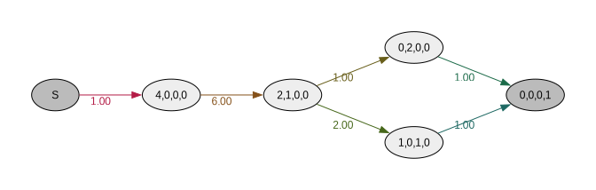
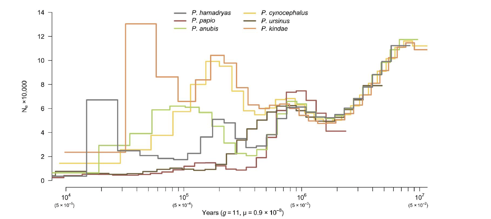

<!-- Italics are "grayed out" to make the example use stand out from dummy content. To make them black, just remove the last line in header_extra.tex: "\renewcommand\emph[1]{\oldemph{\color{gray}#1}}" -->

# Introduktion

I populationsgenetik vil man gerne forstå, hvordan genetisk variation opstår og ændrer sig over tid. Variation opstår på grund af processer som genetisk drift, mutation, rekombination og selektion [@hobolth2019] og de påvirker tilsammen, hvilke mønstre man ser i DNA-sekvenser. Når man analyserer DNA-sekvenser fra flere individer, indeholder dataene information om deres fælles evolutionære historie [@hobolth2019]. Denne historie beskrives typisk som et genealogisk træ, hvor grenene svarer til de observerede sekvenser og de indre knuder til fælles forfædre. 
Traditionelt har man ofte beskrevet evolution som et grenende træ, hvor populationer adskilles og gradvist udvikler genetiske forskelle i isolation. Nyere studier har vist, at relationer mellem populationer ofte er mere komplekse end et simpelt træ kan beskrive. Processer som hybridisering og genflow kan for eksempel føre til komplekse strukturer frem for simple træer [@sorensen2023; @rogers2019; @vilgalys2022]. Evolutionære relationer kan derfor i mange tilfælde være mere komplekse strukturer end træformede. 

Denne kompleksistet stiller større krav til de modeller og metoder der bruges til at rekonsturere populationshistorie. For at kunne undersøge størrelser som effektive populationsstørrelse $N_e$, migrationsratet $m$ og historiske split-tidspunkter $t_s$ krævles modeller, som kan håndtere populationsstruktur og genflow. Til dette formål anvendes fase-type fordelinger [@Hobolth2018; @Hobolth2024], som giver en fleksibel matematisk ramme til at beskrive coalescent-processer. Samtidig peger nyere forskning på, at grafbaserede repræsentationer kan være særligt effektive, når modellerne bliver store og komplekse [@Roikjer2022].
I dette speciale kombineres fase-type teori med Bayesiansk inferens via Stein Variational Gradient Descent (SVGD) for at analysere populationsstruktur og migrationshistorie i genomdata fra bavianpopulationer (Papio spp.) som er et af de mest veldokumenterede eksempler på kompleks evolutionær historie med genflow og admixture.

## Bavianer som modelsystem 

Bavianer (slægten *Papio*) er en gruppe af nært beslægtede primater, som lever i store dele af Afrika [@kopp2023]. Slægten består af seks nulevende arter:
 
 * Olive baboon (*Papio anubis*), 
 * Yellow baboon (*Papio cynocephalus*), 
 * chacma baboon (*Papio ursinus*), 
 * Guinea baboon (*Papio papio*), 
 * Hamadryas baboon (*Papio hamadryas*)
 * Kinda baboon (*Papio kindae*). 

Disse seks arter adskilles i to klader: en nordlig kladde bestående af *P. hamadryas*, *P. anubis* og *P. papio* og en sydlig kladde bestående af *P. kindae*, *P. cynocephalus* og *P. ursinus*, som divergerede fra en fælles stamfader for mere end 1 million år siden [@rogers2019; @vilgalys2022].

::: {#fig-Kort }
{width="50%"}
*Papio* baboon arter. Nuværende udbredelse af hver bavianart samt placeringen af ​​tre veldokumenterede aktive hybridzoner er også vist. x1: hybridzone mellem P. hamadryas og P. anubis, x2: hybridzone mellem P. cynocephalus og P. anubis, x3: hybridzone mellem P. kindae og P. ursinus. Billede fra Rogers et al., 2019. 
:::

På trods af disse geografiske adskillelser kan flere arter krydse sig i naturen og producere fertile hybrider [@sorensen2023; @jordan2018papio]. I flere kontaktzoner er der veldokumenterede hybridzoner med løbende genflow. @rogers2019 analyserede helgenomsekvenseringsdata for alle seks arter og dokumenterede multiple episoder af admixture og introgression, herunder genetisk bidrag fra en uidentificeret ancestral linje til *P. papio* og aktiv nuklear DNA-swamping ved hybridzonen mellem *P. anubis* og *P. cynocephalus*. Som det fremgår af @fig-Kort, overlapper arterne geografisk ved en række hybridzoner hvor aktiv genudveksling er dokumenteret [@sorensen2023]. @sorensen2023 udvidede denne analyse til 225 vilde bavianer fra 19 lokaliteter og dokumenterede admixture mellem *P. anubis* og *P. cynocephalus* i det sydlige Tanzania, en tæt genealogisk forbindelse mellem Kinda-bavianer og western yellow-populationerne, samt tegn på tre-vejs admixture i western yellow-populationerne ved Mahale og Katavi, et mønster som ikke tidligere er observeret i denne slægt. Studier af hybridzonerne viser desuden, at selektion mod introgresserede genetiske varianter kan være stærk, særligt på X-kromosomet, hvor der er observeret op til syv gange stærkere selektion sammenlignet med autosomer [@sorensen2023_selection].

Bavianernes evolutionære historie omkring samtidigt med menneskets evolution [@rogers2019]. I modsætning til mennesker, hvor kun en art eksisterer i dag, har bavianer bevaret flere linjer. Det gør dem særligt velegnede som modelsystem til at studere både divergens og hybridisering i naturlige populationer. I dette speciale anvendes estimater fra Sørensen et al. (2023), herunder en mutationsrate på $\mu = 0.9 \times 10^{-8}$ per site per generation og en generationstid på $g = 11$ år, til at omsætte modelparametre til absolutte størrelser.

## Markovprocesser og kontinuerte Markovkæder

Et matematisk redskab i populationsgenetik er Markovprocesser. En stokastisk proces $\{X_t\}_{t \geq 0}$ er en Markovproces hvis den fremtidige udvikling kun afhænger af den nuværende tilstand og ikke af processens historie:
$$
P(X_{t+s} = j \mid X_u, u \leq t) = P(X_{t+s} = j \mid X_t).
$$

Denne egenskab kaldes Markov-egenskaben og er opfyldt af de fleste standardmodeller i populationsgenetik [@kemeny1976].

En kontinuert Markovkæde (continuous-time Markov chain, CTMC) er en Markovproces med et diskret tilstandsrum og kontinuert tid. Processen befinder sig i en tilstand $i$ i en eksponentielt fordelt tid med rate $\lambda_i$ og springer derefter til tilstand $j \neq i$ med sandsynlighed $p_{ij}$. Overgangssandyligheden beskrives  via intensitetsmatricen $\mathbf{Q}$, hvis indgange er
$$
Q_{ij} = \lambda_i p_{ij} \quad (i \neq j), \qquad
Q_{ii} = -\lambda_i = -\sum_{j \neq i} Q_{ij}.
$$

Den tidsmæssige evolution af sandsynlighedsfordelingen over tilstande følger Kolmogorovs fremadligning
$$
\frac{d}{dt} \mathbf{P}(t) = \mathbf{P}(t)\mathbf{Q},
$$

med løsningen $\mathbf{P}(t) = e^{\mathbf{Q}t}$, hvor $e^{\mathbf{Q}t}$ er matrixeksponentialet [@kemeny1976].

En særlig klasse er absorptionsmarkovkæder, der opdeler tilstandsrummet i transiente tilstande $\mathcal{T}$ og absorberende tilstande $\mathcal{A}$. Fra transiente tilstande er der altid en positiv sandsynlighed for at nå en absorberende tilstand, hvorfra processen aldrig forlader. For en absorptionsmarkovkæde partitioneres intensitetsmatricen som
$$
\mathbf{Q} = \begin{pmatrix} \mathbf{S} & \mathbf{s} \\ \mathbf{0} & \mathbf{0} \end{pmatrix},
$$

hvor $\mathbf{S}$ er sub-intensitetsmatricen for de transiente tilstande og $\mathbf{s} = -\mathbf{S}\mathbf{e}$ er absorptionsraten. Tidspunktet for absorption er fase-type fordelt den klasse af fordelinger som dette speciale udnytter til koalescentinferens [@Hobolth2024].

## Koalescentteorien: Wright-Fisher, Moran og Kingman

Koalescent teorien bygger på at man følger genetiske linjer bagud i tid og ser på, hvornår de mødes i fælles forfædre. Hvis to genkopier kan spores tilbage til den samme forfader, siger man, at de coalescerer [@wakeley2009coalescent].

### Wright-Fisher modellen

Wright-Fisher modellen er udgangspunktet for størsteparten af neutral populationsgenetisk teori [@wakeley2009coalescent]. Modellen beskriver en diploid population af konstant størrelse $N$ individer over diskrete, ikke-overlappende generationer: i hver generation vælger hvert individ sin forælder uniformt og uafhængigt blandt de $N$ individer i den foregående generation. Under denne model er den genetiske drift den tilfældige fluktioner af allelfrekvenser fra generation til generation den primære evolutionære kraft i fraværet af selektion, mutation og migration.

### Moran-modellen

Moran-modellen er en alternativ diskret model der letter den analytiske behandling ved at erstatte simulere generationsskift med overlappende generationer [@wakeley2009coalescent]. I en population af størrelse $N$ vælges i
hvert tidsskridt et individ til at reproducere og et til at dø, med uniform sandsynlighed. Dette giver en kontinuert strøm af generationsskift frem for en diskret. Moran-modellens koalescent er identisk med Wright-Fisher-koalescentens op til en tidsskalering med en faktor 2: mens Wright-Fisher-koalescenten opererer i enheder af $2N$ generationer, opererer Moran-koalescenten i enheder af $N(N-1)/2$ tidsskridt. Begge modeller konvergerer til den samme kontinuerte koalescent i grænsen $N \to \infty$ [@wakeley2009coalescent].

### Kingmans koalescent

I grænsen for stor populationsstørrelse $N \to \infty$ med
tidsakseleringen $t \to t/(2N)$ (for diploide organismer) konvergerer diskrete slægtsskabsprocesser til Kingmans koalescent [@Kingman1982; @wakeley2009coalescent]. Kingmans koalescent er en kontinuert Markovkæde baglæns i tid, der beskriver, hvordan $n$ samtidige genetiske linjer gradvist smelter sammen til en fælles forfader. Med $k$ aktive linjer sker den næste koalescens med rate $\binom{k}{2}$, og processen stopper ved absorption i MRCA-tilstanden med en linje @fig-coalescent_plot.

::: {#fig-coalescent_plot}
{width="65%"}
Grafrepræsentation af koalescent-modellen for $n=4$. Noder repræsenterer tilstand og pile repræsenterer mulige koalescenstransitioner med tilhørende rater. Starttilstanden $(4,0,0,0)$ er øverst til venstre, og den absorberende tilstand nås, når alle fire linjer er forenet. 
:::

Den forventede tid til MRCA er
$$
\mathbb{E}[H] = \sum_{k=2}^{n} \frac{2}{k(k-1)} = 2\left(1 - \frac{1}{n}\right),
$$

og den forventede opholdstid (sojourn time) i tilstanden med $k$ linjer er $2/(k(k-1))$ den reciprokke koalescensrate [@Hobolth2024]. Variansen $\text{Var}[H]$ skalerer kvadratisk med $N$, hvilket afspejler at store populationer ikke blot giver langsommere koalescens men også mere variabel koalescens. Den totale grenlængde $L = \sum_{k=2}^n k T_k$ har forventning $\mathbb{E}[L] = 2\sum_{k=1}^{n-1} 1/k = 2a_n$, hvor $a_n$ er det $n$'te harmoniske tal [@hobolth2021].

## Populationsstruktur og struktureret koalescent

I den klassiske koalescent antager man, at populationen er homogen. I virkeligheden er populationer dog ofte opdelt i mindre subpopulationer med begrænset migration og derfor er denne antagelse ikke altid realistisk [@wakeley2009coalescent]. I den strukturerede koalescent følger man stadig linjer bagud i tid, men nu kan de også skifte mellem subpopulation via migration. Man skelner typisk mellem koalescenstiden for to sekvenser, der er samplet fra samme subpopulation (*within*, $T_w$) og fra forskellige subpopulationer (*between*, $T_b$). I en symmetrisk model med $D$ subpopulationer og migrationsrate $M$ kan man udlede [@wakeley2009coalescent]:
$$
\mathbb{E}[T_w] = D, \qquad \mathbb{E}[T_b] = D\left(1 + \frac{D-1}{MD}\right).
$$

Her ses det, at $T_w$ ikke afhænger af migrationsraten, mens $T_b$ i høj grad gør. Hvis migrationen er lav, bliver koalescenstiden mellem subpopulationer markant længere. Det samme gør sig gældende for variansen, som også vokser kraftigt for små værdier af $M$:
$$
\mathrm{Var}[T_w] = D^2 + \frac{2(D-1)^2}{M}, \qquad \mathrm{Var}[T_b] = D^2 + \frac{2(D-1)^2}{M} + \frac{(D-1)^2}{M^2}.
$$

I grænsen $M \to \infty$ forsvinder populationsstrukturen og modellen reduceres til den klassiske koalescent med $N_e = DN$. Omvendt vil $\mathbb{E}[T_b]$ vokse uden grænse, når $M \to 0$ [@wakeley2009coalescent].
I mere generelle modeller hvor populationer er geografisk strukturerede, beskrives migration ved en backward migration matrix $m_{ij}$, som angiver sandsynligheden for, at en linje i subpopulationen $i$ stammer fra $j$ i forrige generation [@wakeley2009coalescent]. Den samlede migrationsrate ud af subpopulation $i$ er givet ved:
$$
m_i = \sum_{j \neq i} m_{ij}.
$$

og dermed er sandsynligheden for, at en linje forbliver i samme subpopulation bagud i tid: $1-m_i$.
En ofte anvendt antagelse er *conservativ migration*, hvor det gennemsnitlige antal individer, der forlader en subpopulation svarer til antallet der ankommer [@wakeley2009coalescent]. Dette kan udtrykkes som
$$
N_i \sum_{j \neq i} q_{ij} = \sum_{j \neq i} N_j q_{ji},
$$

hvilket sikrer, at populationsstørrelserne forbliver konstante over tid. For en stikprøve af størrelse $2$ kan genalogien beskrives som en Markovprocess med tre tilstande: 

 1. Begge linjer i samme subpopulation
 2. Linjer i forskellige subpopulationer
 3. Linjer har koalesceret

Overgangene mellem disse tilstande bestemmes af både migration og koalescens. Den diskrete transitionsmatrix kan skrives som
$$
P =
\begin{pmatrix}
(g_{1,0} + g^{(s)}_{1,2})(1 - \tfrac{1}{N}) & g_{1,1} + g^{(d)}_{1,2} & (g_{1,0} + g^{(s)}_{1,2}) \tfrac{1}{N} \\
(g^{(s)}_{2,1} + g^{(s)}_{2,2})(1 - \tfrac{1}{N}) & g_{2,0} + g^{(d)}_{2,1} + g^{(d)}_{2,2} & (g^{(s)}_{2,1} + g^{(s)}_{2,2}) \tfrac{1}{N} \\
0 & 0 & 1
\end{pmatrix}.
$$

Her beskriver $g_{i,j}$ sandsynligheder for migrationsbegivenheder, mens indekserne $(s)$ og $(d)$ angiver om linjer ender i samme (*same*) eller forskellige (*different*) subpopulationer efter migration [@wakeley2009coalescent]. Matrixen inkluderer både simple hændelser og situationer hvor migration og koalescens sker i samme generation.
Ved at tage grænsen $N \to \infty$, og skalere tiden passende opnås en kontinuert Markov proces med generator [@wakeley2009coalescent]
$$
Q = \lim_{N \to \infty} N(P - I).
$$

I den symmetriske model for prøvestørrelse $2$ reduceres dette til en generator af formen
$$
Q =
\begin{pmatrix}
- M - 1 & M & 1 \\
\frac{M}{D-1} & - \frac{M}{D-1} & 0 \\
0 & 0 & 0
\end{pmatrix},
$$

som svarer til de tre tilstande. Denne formulering viser tydeligt, at processen styres af to typer hændelser:

 * koalescens (rate $1$ når linjer er i samme subpopulation)
 * migration (med rate proportional med $M$)

[@wakeley2009coalescent].

### To-ø modellen

Den simpleste model for populationsstruktur er to-ø modellen [@wakeley2009coalescent]. To populationer af størrelse $N_1$ og $N_2$ udveksler migranter med rate $m$ per generation. En linje i population 1 migrerer til population 2 med rate $m$, og omvendt. Koalescens kan kun ske inden for samme population. Modellen har to frie parametre i koalescentenheder: koalescensraten $\theta_0 = 1/N$ og migrationsraten $\theta_1 = 2Nm$.

Den forventede TMRCA i to-ø modellen afhænger ikke monotont af
migrationsraten. Ved meget lav migration ($\theta_1 \to 0$) befinder linjerne sig i isolation og venter på det sjældne migrationshændelse. Ved meget høj migration ($\theta_1 \to \infty$) opfører systemet sig som en enkelt panmiktisk population. Den maksimale varians i TMRCA optræder ved lav til moderat migration, hvor strukturen er tilstrækkelig til at skabe lang ventetid men ikke tilstrækkelig til at harmonisere lineagernes distribution over populationerne [@Hobolth2024].

En central udfordring ved to-ø modellen er parameter-konfundering: høj migration reducerer TMRCA på samme måde som en lavere koalescensrate, og de to parametre er ikke altid identificerbare simultant. Identifikabiliteten forbedres ved at inkludere flere observationstyper eksempelvis joint SFS frem for blot TMRCA-tider.

### Isolation with Migration (IM)-modellen

**Isolation with Migration (IM)-modellen** er en tidsinhomogen udvidelse af to-ø modellen [@wakeley2009coalescent]. Modellen har to epoker adskilt af et historisk split-tidspunkt $t_s$:

- **Epoke 0** ($0 \to t_s$, nutid til split): To separate populationer af størrelse $N_1$ og $N_2$ med symmetrisk migration med rate $m$. Koalescens kan ske inden for samme population.
- **Epoke 1** ($t_s \to \infty$, tid efter split): Én fælles ancestral population af størrelse $N_a$ uden migration. Linjer der ikke koalescerede inden $t_s$ smelter her sammen.

IM-modellen har fem frie parametre: $N_1$, $N_2$, $N_a$, $m$ og $t_s$. Den biologiske fortolkning af $t_s$ er tidspunktet for initial populationsopdeling men migration kan have fortsat efter det, hvilket er netop hvad IM-modellen tillader.

Et vigtigt biologisk resultat fra IM-modellen er at den forventede TMRCA er systematisk højere end i en simpel two-island model uden split, fordi linjer der overlever til $t_s$ derefter koalescerer i en ancestral population med potentielt anderledes $N_a$. Hvis $N_a > N_1$ eller $N_a > N_2$ forlænges den samlede ventetid. For bavianerne, der viser tegn på populations-flaskehalse i den nære fortid [@rogers2019], er dette biologisk relevant.

En central identifikabilitetsudfordring i IM-modellen er at split-tidspunktet $t_s$ og den ancestrale populationsstørrelse $N_a$ er konfunderede: et tidligt split med lille $N_a$ kan give identisk TMRCA-fordeling som et sent split med stor $N_a$. Dette konfunderingsproblem er veldokumenteret i litteraturen og kræver enten store stikprøver, joint SFS-observationer eller stærke priors for at løses [@Hobolth2024].

## Tidsinhomogenitet og demografisk rekonstruktion

Koalescensraten $\lambda(t) = \binom{k}{2}/N(t)$ varierer med tid, når populationsstørrelsen $N(t)$ ikke er konstant. En tidsinhomogen koalescent modellerer denne variation ved at opdele demografihistorien i epoker med stykvist konstant $N_e$. Inden for hver epoke er koalescenten tidshomogen, men raten ændres ved epokeskiftet.

En populationsflaskehals er en periode med kraftigt reduceret $N_e$ efterfulgt af recovery. Flaskehalse manifesterer sig i TMRCA-fordelingen som en hump ved det tidspunkt flaskehalsen opstod, fordi mange linjer koalescerer parrallet under flaskehalsen. I SFS ses flaskehalse typisk som et overskud af singletons, fordi flaskehalsen accelererer koalescens og reducerer den tid der akkumuleres på interne grene [@rogers2019].

Tidsinhomogenitet er direkte biologisk relevant for bavianerne: @rogers2019 identificerede via PSMC population-specifikke flaskehalse og ekspansioner for alle seks arter og @sorensen2023 viste at demografisk historie varierer markant på tværs af populationer inden for samme art. En tidsinhomogen fase-type model giver direkte adgang til disse demografiske mønstre via eksakt analytisk beregning.

## Fase-type fordelinger, SFS og reward-transformationer

### Fase-type fordelinger

En fase-type fordeling er absorptionstiden $\tau$ i en absorptionsmarkovkæde med sub-intensitetsmatrix $\mathbf{S}$ og initial sandsynlighedsvektor $\alpha$ [@BladtNielsen2017]:
$$
\tau \sim \text{PH}(\alpha, \mathbf{S}).
$$

Fordelingsfunktionen, tæthedsfunktionen og alle momenter udtrykkes via
matrixoperationer:
$$
F(\tau) = 1 - \alpha e^{\mathbf{S}\tau} \mathbf{e}, \qquad
f(\tau) = \alpha e^{\mathbf{S}\tau} \mathbf{s},
$$
$$
\mathbb{E}[\tau^n] = n!\, \alpha (-\mathbf{S})^{-n} \mathbf{e},
$$

hvor $\mathbf{e}$ er en søjlevektor af etaller og $\mathbf{s} = -\mathbf{S}\mathbf{e}$ er absorptionsraten [@Hobolth2024].

Kingmans koalescent er eksakt en fase-type fordeling: absorptionstilstanden er MRCA, de transiente tilstande er alle mulige konfigurationer af aktive linjer, og sub-intensitetsmatricen $\mathbf{S}$ indeholder koalescensraterne $\binom{k}{2}$ på diagonalen og overgange til tilstande med færre linjer på off-diagonalen [@hobolth2019]. Alle centrale størrelser: E[H], Var[H], PDF og CDF er dermed tilgængelige analytisk.

### Site Frequency Spectrum via reward-transformationer

Reward-transformationer er det redskab der forbinder koalescentmodellen med observerede genetiske data [@hobolth2021; @munchphasic]. En reward-funktion $r: \mathcal{T} \to \mathbb{R}_+$ tildeler en vægt til hvert transient tilstand, og den akkumulerede reward frem til absorption er
$$
Y = \int_0^\tau r(X_t)\, dt.
$$

Den akkumulerede reward $Y$ er igen fase-type fordelt og har forventning
$$
\mathbb{E}[Y] = \alpha, (-\mathbf{S})^{-1}\, \mathbf{r},
$$

hvor $\mathbf{r}$ er reward-vektoren [@Hobolth2024].

For koalescenten giver reward-transformationer direkte adgang til SFS-komponenterne. Lad $r_k(s)$ tælle antallet af linjer med præcis $k$ efterkommere i tilstand $s$. Den forventede total grenlængde af linjer med $k$ efterkommere er da
$\mathbb{E}[B_k] = \alpha(-\mathbf{S})^{-1}\mathbf{r}_k$, og det forventede antal $k$-ton mutationer under infinite-sites modellen er $\mathbb{E}[\xi_k] = \theta \cdot \mathbb{E}[B_k]$ [@Hobolth2024]. SFS-komponenterne $(\xi_1, \xi_2, \ldots, \xi_{n-1})$ er dermed tilgængelige analytisk uden simulering.

### Multivariate fase-type og kovariansstruktur

Den **multivariate fase-type** ramme generaliserer til den fælles fordeling af flere reward-transformationer simultant. @hobolth2021 viste at den fælles fordeling $(B_1, B_2, \ldots, B_{n-1})$ grenlængderne for alle SFS-komponenter er multivariate fase-type fordelt, og at kovariansen beregnes analytisk via
$$
\text{Cov}(Y_i, Y_j) = \alpha, (-\mathbf{S})^{-1}\,
\Delta(\mathbf{r}_i)\, (-\mathbf{S})^{-1}\, \mathbf{r}_j +
\alpha, (-\mathbf{S})^{-1}\, \Delta(\mathbf{r}_j)\,
(-\mathbf{S})^{-1}\, \mathbf{r}_i - \mathbb{E}[Y_i]\mathbb{E}[Y_j],
$$

hvor $\Delta(\mathbf{r})$ er diagonalmatricen med reward-vektoren på diagonalen. Denne formel viser at singleton og doubleton grenlængder typisk er negativt korrelerede fordi de konkurrerer om branchlength-budget i de tidlige stadier af koalescenten [@hobolth2021].

### Diskret fase-type og joint SFS

En diskret fase-type fordeling beskriver absorptionstiden i en diskret Markovkæde og anvendes til at modellere det diskrete antal mutationer $S$ i en stikprøve. Under infinite-sites modellen er $S$ Poisson-fordelt med parameter $\theta L$, hvor $L$ er total grenlængde. Den marginale fordeling for $S$ er negativ-binomial, og joint-sandsynligheden for specifikke SFS-mønstre $(z_1, z_2, \ldots)$ — det observerede antal 1-ton, 2-ton, ... mutationer er eksakt beregneligt via diskrete fase-type metoder [@hobolth2021; @Hobolth2024; @Neuts1981].

### Phasic-biblioteket

@Roikjer2022 implementerede fase-type teorien i *phasic*-biblioteket, et grafbaseret beregningssystem i C med Python-binding. Tilstandsrummet konstrueres automatisk via en iterativ callback-funktion, og alle beregninger momenter, PDF, CDF, SFS og joint-sandsynligheder udføres via Gaussisk elimination med automatisk MPFR-præcisionsstyring. Biblioteket er størrelsesordener hurtigere end matrixbaserede tilgange for store, sparsomme tilstandsrum og demonstrerede direkte anvendelighed på IM-modellen, hvor en beregning der tidligere krævede 15 minutter på 12 kerner nu tager 35 sekunder på en kerne [@Roikjer2022].

## Ancestral Recombination Graph (ARG)
Den klassiske coalescent antager, at hele genomet deler samme genealogiske træ. I virkeligheden medfører rekombination dog, at forskellige dele af genomet kan have forskellige genealogier. Den samlede ancestrale struktur beskrives derfor ved *Ancestral Recombination Graph* (ARG), som inkluderer både koalescens- og rekombinationsbegivenheder i en samlet model [@kelleher2019].
Ligesom koalescenten kan ARG-processen beskrives som en kontinuert Markovproces, men tilstandsrummet er mere kompleks, da det også skal indeholde information om hvilke loci de enkelte linjer er ancestrale til. I den simpleste to-locus model beskrives en tilstand som $(i, j, k)$, hvor $i$ er antallet af linjer ancestrale til begge loci, $j$ til kun locus 1 og $k$ til kun locus 2 [@wakeley2009coalescent].
For linjer der er ancestrale til begge loci kan der ske to typer begivenheder:

 - **Koalescens**: $(i, j, k) \to (i-1, j, k)$ med rate $\binom{i}{2}$
 - **Rekombination**: $(i, j, k) \to (i-1, j+1, k+1)$ med rate $i\rho$

Den samlede rate for den næste begivenhed er derfor $\lambda_i + i\rho$, og sandsynligheden for, at det er en koalescensbegivenhed, er givet ved
$$
\frac{\lambda_i}{(\lambda_i + i\rho)}
$$

Ligesom i standard koalescenten er absorptionstiden fase-type fordelt over et udvidet
tilstandsrum. Laplace-transformationen for en fase-type fordeling,
$$
\mathbb{E}[e^{-\theta\tau}] = \boldsymbol{\alpha}(\theta\mathbf{I} - \mathbf{S})^{-1}\mathbf{t},
$$

giver sandsynligheden for at ingen Poisson-hændelse med rate $\theta$ er sket inden absorption [@Hobolth2018; @Hobolth2024]. I rekombinationskontekst er dette $P(\text{ingen rekombination på grenene})$ sandsynligheden for at to loci deler den samme
genealogi og dermed er i *linkage disequilibrium* (LD).

## Eksisterende metoder og begrænsninger

Demografisk inferens fra genomdata kan opdeles i tre klasser baseret på observationstypen: allelfrekvens baserede metoder, identitet ved afstamning metoder og koalescent skjulte Markov-modeller. PSMC og SMC++ udnytter heterozygositetsmønstre langs genomet hos et enkelt individ eller par til at rekonstruere demografisk historie [@liu2016svgd] og er anvendt direkte på bavian-data af @rogers2019 @fig-PSMC. Metoderne er imidlertid begrænset til en population ad gangen og kan ikke estimere migrationsrater eller split-tidspunkter direkte. Simuleringsbaserede metoder som fastsimcoal2 og momi2 anvender SFS til inferens via komposit-likelihood og er fleksible, men kræver mange simuleringer og beregningstung bootstrapping til usikkerhedskvantificering.

::: {#fig-PSMC}
{width="65%"}
Rekonstruktion af demografisk historie for de seks bavian populationer via PSMC. Alle populationer viser et fald i $N_e$ de seneste 100.000 år samt population-specifikke flaskehalse. Modificeret fra @rogers2019. 
:::

Den fælles begrænsning ved alle disse tilgange er fraværet af en analytisk, eksakt beregningsramme der giver direkte adgang til sandsynlighedstætheder, momenter og kovariansstruktur uden Monte Carlo-approksimation, kombineret med fuld Bayesiansk usikkerhedskvantificering.

## Bayesiansk inferens med SVGD

Statistisk inferens om demografiske parametre kræver en metode til at approksimere den posteriore fordeling $p(\theta \mid \text{data})$. I dette speciale anvendes Stein Variational Gradient Descent (SVGD) [@liu2016svgd], en partikel baseret variationel inferensmetode der repræsenterer posterioren med et sæt partikler opdateret iterativt via en kernelbaseret opdateringsregel der kombinerer gradient information fra likelihood og prior med en repulsionskraft der forhindrer partikelkollaps. SVGD konvergerer hurtigere end MCMC, paralleliserer naturligt over partikler og giver fuld posterior-fordeling frem for et punktestimat.

## Formål, problemformulering og specialets opbygning

Formålet med dette speciale er at undersøge, hvordan koalescentteorien og dens udvidelser til strukturerede populationer med migration og tidsinhomogen processer kan formuleres eksakt som fase-type fordelinger og hvordan Bayesiansk inferens via SVGD kan anvendes til at estimere parametre fra genomdata. Som konkret case anvendes helgenomsekvenseringsdata fra seks bavianpopulationer (*P. Papio*), der er karakteriseret ved dokumenteret genflow og admixture mellem arterne [@sorensen2023].

De fire spørgsmål der undersøges er:

1. Kan koalescentens analytiske egenskaber $E[H]$, sojourn times, SFS og kovariansstruktur reproduceres eksakt via phasic, og hvad afslører de om
den genealogiske proces?

2. Hvordan påvirker valget af prior, læringsrate-schedule og regularisering SVGD's posteriorestimater, og hvad er de praktiske grænser for prøvestørrelse, numerisk præcision og parallelisering for de modeller der undersøges?

3. Er $\theta_0$ og $\theta_1$ identificerbare i two-island og IM-modellen og hvad er effekten af asymmetrisk migration, ghost-populationer og split-tidspunkt på TMRCA-fordelingen?

4. Indeholder diskrete joint SFS-observationer mere information om parametre end kontinuerte TMRCA-tider, og hvad er den kritiske prøvestørrelse og mutationsrate der afgør, hvornår joint-inferens er at foretrække?

Specialet er opdelt i otte analytiske notebooks. Notebooks 01–06 fokuserer på metodeudvikling og analyser simulerede date, hvor modellerne først undersøges og testes under kontrollerede forhold. Notebook 07A indeholder analyse af genomdata fra bavian, mens notebook 07B anvender modellerne til inferens af populationshistorie. Alle analyser er implementeret i Python ved hjælp af phasic og er uadarbejdet, så resultaterne kan reproducerbare.

# Metode

Analyserne er i seks Jupyter notebooks, der tilsammen går fra de grundlæggende matematiske egenskaber ved koalescenten som fase-type fordeling over Bayesiansk inferens med SVGD til mere komplekse populationsmodeller og diskrete observationsstrukturer. Hvert notebookafsnit indeholder en præcis beskrivelse af metoderne, de undersøgte spørgsmål og de opstillede hypoteser og knytter dem til relevante resultater og figurer.

::: {#tbl-notebooks .striped}

| Notebook | Fokus | Tilgang |
|---|---|---|
| 01 | Kingmans koalescent som fase-type fordeling | Analytisk verificering, reward-transformation, SFS |
| 02 | Bayesiansk inferens med SVGD: grundlæggende egenskaber | Prior-sensitivitet, læringsrate, posterior validering |
| 03 | Identifikation og inferens i two-island modellen | SVGD på to-parameter model, MoM-sammenligning |
| 04 | Numerisk præcision, parallel skalering og beregningsgrænser | MPFR, JAX-parallelisering, tilstandsrumsudvækst |
| 05 | Tidsinhomogen koalescent og demografisk inferens | Flaskehalse, multi-epoch modeller, IM-modellen |
| 06 | Inferens via joint sandsynligheder og diskrete SFS-observationer | *joint_prob_graph*, deficit, to-locus ARG |

: Oversigt over de seks notebooks og deres formål.
:::

Alle analyser er implementeret i Python med *phasic*-pakken, der repræsenterer fase-type fordelinger som vægtede rettede grafer og understøtter eksakt beregning af momenter, PDF, CDF og SVGD-inferens.

## Notebook 01 - Koalescentmodellen som fase-type fordeling

### Tilstandsrum og koalescensrater

Kingmans koalescent implementeres i phasic som en kontinuert absorptionsmarkovkæde [@Roikjer2022]. Tilstandsvektoren $\mathbf{s} = (s_1, s_2, \ldots, s_n)$ angiver antallet af linjer med henholdsvis $1, 2, \ldots, n$ efterkommere og starttilstanden for $n$ prøver er $\mathbf{s}^{(0)} = (n, 0, \ldots, 0)$. Koalescens af to linjer med $i$ og $j$ efterkommere giver en ny linje med $i+j$ efterkommere med rate
$$
\lambda_{ij} = \frac{s_i(s_j - \delta_{ij})}{1 + \delta_{ij}},
$$

hvor $\delta_{ij}$ er Kroneckers delta [@Hobolth2024]. Absorptionstilstanden er $(0, \ldots, 0, 1)$ svarende til MRCA. Den grafbaserede implementering i phasic konstruerer automatisk tilstandsrummet via en callback-funktion, hvilket giver fleksibilitet til at modellere vilkårlige koalescentprocesser uden manuelt at specificere overgangsmatricen. Modellen er implementeret med koalescensraten $\binom{k}{2}$ for $k$ aktive linjer, i overensstemmelse med standardkoalescenten under neutral evolution og Wright-Fisher [@wakeley2009coalescent].



### Verifikation mod analytiske formler

For at verificere korrekthed af implementeringen sammenlignes numeriske resultater fra phasic med kendte analytiske udtryk fra koalescentteorien. Den forventede MRCA-tid og varians er verificeret mod kendte analytiske udtryk (NB01). For $n = 4$ haplotyper giver phasic:
$$
\mathbb{E}[H] = 2\left(1 - \frac{1}{n}\right) = 1{,}5000 \quad \text{(afvigelse} < 10^{-6}\text{)},
$$

$$
\text{Var}[H] = 1{,}1389.
$$

Verifikationen er udført for $n = 2, \ldots, 8$ med relativ afvigelse under $10^{-6}$ i alle tilfælde, hvilket bekræfter at implementeringen er korrekt. Variansen $\text{Var}[H] \propto N^2$ er konsekvent større end $\mathbb{E}[H] \propto N$, hvilket afspejler at store populationer ikke blot giver langsommere koalescens men også væsentligt mere variabel koalescens fra locus til locus. Dette er relevant fordi det betyder at estimater af $N_e$ baseret på et enkelt locus er behæftet med stor stokastisk usikkerhed, og at mange uafhængige loci er nødvendige for præcis inferens.

### Forventet sojourn time

Den forventede sojourn time med $k$ aktive linjer er den forventede tid tilbragt i alle tilstande med $k$ linjer og er lig den reciprokke koalescensrate:
$$
\mathbb{E}[\tau_k] = \frac{2}{k(k-1)}.
$$

Sojourn times er informative fordi de fortæller, i hvilken fase af koalescenten mutationer primært akkumuleres. For $n = 4$ er sojourn times $(k=4, 3, 2)$: $0{,}167$, $0{,}333$ og $1{,}000$ koalescentenheder (NB01). Summen giver $\mathbb{E}[H] = 1{,}5$, i overensstemmelse med den analytiske formel. Det fremgår at den største del af TMRCA akkumuleres i de sene stadier med få linjer, særligt den fase med $k = 2$ der udgør $1{,}000/1{,}500 = 67\%$ af den forventede TMRCA. Dette har direkte implikationer for SFS-formen: mutationer på de to interne grene (doubletons) og MRCA-grenen udgør langt størstedelen af den samlede grenlængde. I biologiske enheder er sojourn times for bavian-populationer med $N_e \approx 50{,}000$ og generationstid $g = 11$ år henholdsvis $3{,}300$, $6{,}600$ og $19{,}800$ år for $k = 4, 3, 2$.

### Reward-transformationer og Site Frequency Spectrum

Site Frequency Spectrum (SFS) beregnes analytisk via reward-transformationer [@hobolth2021; @Hobolth2024]. Reward-vektoren $\mathbf{r}_k$ tildeler vægt $1$ til tilstande med præcis $k$ linjer der har en efterkommer (singletons) og den forventede $k$-ton grenlængde er
$$
\mathbb{E}[B_k] = \alpha(-\mathbf{S})^{-1}\mathbf{r}_k,
$$

hvor $\alpha$ er den initiale sandsynlighedsvektor og $\mathbf{S}$ er sub-intensitetsmatricen (NB01). Det forventede antal $k$-ton mutationer under infinite-sites modellen er $\mathbb{E}[\xi_k] = \theta \cdot \mathbb{E}[B_k]$, og SFS'en udgør dermed et direkte analytisk komprimat af genealogien. Reward transformationerne giver adgang til de fulde marginale fordelinger for individuelle SFS-komponenter via den univariate fase-type fordeling for $B_k$ ikke blot forventningerne. 
For $n = 4$ giver dette SFS-komponenterne:
$$
(\mathbb{E}[B_1], \mathbb{E}[B_2], \mathbb{E}[B_3]) = (2{,}000, 1{,}000, 0{,}667).
$$

Den samlede grenlængde $\mathbb{E}[L] = 3{,}667$ stemmer præcist med Wattersons analytiske formel $2a_n = 2\sum_{k=1}^{n-1}1/k = 3{,}667$. Singletons dominerer SFS'en og udgør $54{,}5\%$ af den totale grenlængde for $n = 4$; singleton-andelen falder monotont med stigende $n$ fordi der med flere prøver er relativt mere grenlængde der deles af mange individer.

### Kovariansstruktur

Den multivariate fase-type ramme giver direkte adgang til kovariansmatricen for SFS-komponenterne via reward-transformationer [@hobolth2021]. 
Kovariansen beregnes analytisk via:
$$
\text{Cov}(B_i, B_j) = \alpha(-\mathbf{S})^{-1}
\Delta(\mathbf{r}_i)(-\mathbf{S})^{-1}\mathbf{r}_j
+ \alpha(-\mathbf{S})^{-1}
\Delta(\mathbf{r}_j)(-\mathbf{S})^{-1}\mathbf{r}_i
- \mathbb{E}[B_i]\mathbb{E}[B_j],
$$

hvor $\Delta(\mathbf{r})$ er diagonalmatricen med reward-vektoren på diagonalen.
For $n = 4$ giver dette (NB01):
$$
\text{Cov}(B_1, B_2) = -0{,}222, \quad
\text{Cov}(B_1, B_3) = +0{,}889, \quad
\text{Cov}(B_2, B_3) = -0{,}444.
$$

Den negative kovarians mellem singletons ($B_1$) og doubletons ($B_2$) afspejler at de to SFS-komponenter konkurrerer om grenlængdebudget: en genealogi med mange singletons har typisk færre doubletons og omvendt, da de koalescerer med modstridende genealogiske mønstre. Den positive kovarians mellem $B_1$ og $B_3$ skyldes at begge akkumuleres simultant i tilstande med mange aktive linjer tidligt i koalescenten en lang koalescent giver mere grenlængde i alle kategorier. Disse kovariansstrukturer er relevante fordi de viser at naiv antagelse om uafhængighed mellem SFS-komponenter undervurderer usikkerheden på demografiske estimater.

### Matrixrepræsentation og tilstandsdynamik

Phasic repræsenterer modellen som tre matricer: Initial Probability Vector (IPV) $\alpha$, sub-intensitetsmatrix $\mathbf{S}$ og absortionsratevektor $\mathbf{s} = -\mathbf{S}\mathbf{e}$ (NB01). Diagonalen af $\mathbf{S}$ indeholder de negative koalescensrater $-\binom{k}{2}$ for hver tilstand, mens off-diagonalen indeholder overgangsraterne til tilstande med færre linjer. For $n = 4$ er diagonal: $(-6, -3, -1, -1)$ 

Tilstandsdynamikken $\mathbf{P}(t) = e^{\mathbf{S}t}$ (NB01) viser at processen ved $t = 0{,}2$ primært befinder sig i tilstanden $(2,1,0,0)$ med $49{,}7\%$ sandsynlighed, mens starttilstanden $(4,0,0,0)$ stadig har $30{,}0\%$ sandsynlighed. Til $t = 1{,}0$ dominerer tilstanden $(1,0,1,0)$ med $34{,}4\%$ sandsynlighed en singleton og en tripleton, det næstsidste trin inden absorption. Denne tilstandsdynamik illustrerer at selv for $t = 1{,}0 \approx \mathbb{E}[H]$ er der en sandsynlighed for at processen endnu ikke er absorberet, hvilket afspejler den store varians i TMRCA.

### Skalering med populationsstørrelse

I skaleret koalescent-tid er $\mathbb{E}[H] \propto N$ og $\text{Var}[H] \propto N^2$ (NBO1). Fordobling af $N_e$ fordobler den forventede TMRCA men firedobler variansen. For bavian-realistiske $N_e \in \{5\text{k}, \ldots, 200\text{k}\}$ og generationstid $g = 11$ år med $\mu = 0{,}9 \times 10^{-8}$ per site giver dette forventede TMRCA-værdier på $36{,}000{-}2{,}890{,}000$ år med standardafvigelser på $20{,}000{-}2{,}180{,}000$ år(NB01).

### Valg af stikprøvestørrelse

Fra den systematiske sammenligning af $n \in \{2, 4, 6, 8, 10\}$ (NB01) er $n = 4$ valgt som udgangspunkt for enkelt-populations koalescent-inferens.
Med $n = 4$ har tilstandsrummet $35$ tilstande og modellen beregnes på under et sekund, mens $n = 10$ giver $1001$ tilstande og beregningstider på adskillige timer. Singleton-andelen for $n = 4$ er $54{,}5\%$ mod $40{,}0\%$ for $n = 10$, hvilket viser at informationsindholdet per observation stiger moderat med $n$ mens beregningstiden vokser eksponentielt. Til to-ø modellen og IM-modellen bruges $n = 6$ som kompromis med $140$ tilstande og beregningstider på 5-15 minutter. Enkelt-populations analyser bruger $n = 4$ med beregningstid på 1-3 minutter per population. Den fulde populationsstørrelse ($n \approx 50{-}124$ haplotyper) bruges til beregning af $\hat{\pi}$, $\hat{\theta}_W$ og Tajima's $D$, men ikke til SVGD-inferens.

## Notebook 02 - Bayesiansk inferens med SVGD

### Metoden

Bayesiansk inferens om de demografiske parametre $\theta$ udføres med Stein Variational Gradient Descent (SVGD) [@liu2016svgd] som implementeret i phasic. SVGD repræsenterer posterioren $p(\theta \mid \text{data})$ med et sæt af $M$ partikler $\{\theta^{(m)}\}_{m=1}^M$ opdateres iterativt via:
$$
\theta^{(m)} \leftarrow \theta^{(m)} + \epsilon \phi^*(\theta^{(m)}),
$$

hvor $\phi^*$ er den optimale perturbationsretning der kombinerer gradient-information fra log-posterior med en repulsionskraft der forhindrer partikelkollaps [@liu2016svgd]. Sammenlignet med Markov Chain Monte Carlo (MCMC) er SVGD hurtigere til konvergens fordi alle partikler opdateres simultant. Sammenlignet med punktestimatormetoder som Method of Moments giver SVGD fuld posterior-fordeling og direkte usikkerhedskvantificering.

Det statistiske observationsmodel er den marginale fase-type fordeling for TMRCA-proxy-observationer under den specificerede koalescentmodel. For hvert observeret locus $t_i$ er log-likelihood-bidraget $\log f(t_i; \theta)$, og den samlede log-posterior er:
$$
\log p(\theta \mid \mathbf{t}) =
\sum_{i=1}^{n_{\text{obs}}} \log f(t_i; \theta) +
\log \pi(\theta).
$$

### Prior-valg

Fire prior-strategier er sammenlignet systematisk (NB02):

- **GaussPrior (vag):** Bred prior der lader likelihood dominere. CI $= [1, 25]$, egnet ved lav prior-viden.
- **GaussPrior (informativ):** Smallere prior centreret tæt på forventet $\theta$. Giver lavere posterior-std men kan give bias ved forkert centrering.
- **HalfCauchyPrior:** Positiv fordeling med tunge haler. Egnet til skalaparametre som $N_e$ og migrationsrate $m$ fordi den undgår at afskære sandsynlighed ved lave værdier (NB02).
- **DataPrior:** Automatisk MoM-baseret prior der konstrueres fra data. Giver den laveste posterior-std for bavian-realistiske $\theta \in [3, 20]$ (NB02).

Analysen viser at en forkert prior ved $n < 500$ giver bias på op til $2{,}25$ i $\hat{\theta}$ sammenlignet med sand $\theta = 7{,}0$. 
I bavian-analyserne bruges DataPrior til enkelt-populations koalescent og HalfCauchyPrior til migrationsraten i to-ø og IM-modellen.

### Lærningsrate og optimizer

Adam med læringsrate $0{,}25$ er valgt som standardoptimizer baseret på
systematisk sammenligning over seks strategier og bavian-realistiske $\theta \in \{3, 7, 15, 20\}$ med 300 iterationer (NB02):
$$
\text{Adam}(0{,}25): \quad \hat{\theta} = 7{,}206 \pm 0{,}076
\quad (\theta_{\text{sand}} = 7{,}0).
$$

Adams adaptive læringsrate per parameter kompenserer for at $\theta$ kan variere over mange størrelsesordener og forhindrer oscillerende opdateringer.
ExpStepSize med aftagende rate ($0{,}1 \to 0{,}005$, $\tau = 40$) er et alternativ men giver større std ved høje $\theta$-værdier.Konstantelæringsrater oscillerer og er utilstrækkelige. Momentregularisering testes (NB02) men bruges ikke som standard da det destabiliserer SVGD ved stærke konstantregularisering.

### Optimal konfiguration

Fra grid-søgning over partikler $\in \{20, 40, 60, 80, 120\}$ og iterations $\in \{100, 200, 300, 500\}$ for bavian baseline-parametre (NB02 + NB04) er den optimale konfiguration:
$$
M = 60 \text{ partikler}, \quad
T = 300 \text{ iter. (enkelt-parameter)}, \quad
T = 400 \text{ iter. (to-parameter)}.
$$

Overgangen fra $40$ til $60$ partikler reducerer posterior-std med $\approx 15\%$, mens overgangen fra $60$ til $80$ giver $< 5\%$ forbedring. Std er stabiliseret ved iteration $200-300$ og yderligere iterationer forbedrer ikke resultatet.

### Trace-analyse, coverage og posterior predictive check

Konvergens overvåges via *sv.analyze_trace()* og *sv.plot_trace()* (NB02). Trace-analysen detekterer variance kollaps abrupt fald i partikeldiversitet inden konvergens og rapporterer stabiliseringstidspunktet for posterior-mean.
Coverage-analysen (NB02) viser at $95\%$-CI dækker sand parameter i $94\%$ af tilfældene ved $n = 100$ og korrekt prior, men falder til $66\%$ ved $n = 2000$ som følge af variationel inferens' tendens til at undervurdere posterior-bredde ved store datamængder. Modelfit valideres via sammenligning af model-CDF med empirisk ECDF (NB02). Et godt match bekræfter at den neutrale koalescentmodel er et passende udgangspunkt.

## Notebook 3 - Identifikation og inferens i two-island modellen

### Modelspecifikation

To-ø modellen udvider standardkoalescenten til to populationer med symmetrisk migration. Tilstandsrummet udvides med en $in_{pop}$-komponent der tracker, hvilken population hver linje befinder sig i. Modellen har to frie parametre: koalescensraten $\theta_0 = 1/N$ og migrationsraten $\theta_1 = 2Nm$. Koalescens kan kun ske inden for samme population; migration sker med rate $\theta_1$ per linje (NB03).
Den biologiske motivation for to-ø modellen er veldokumenteret genflow på
tværs af bavian-artsgrænser [@rogers2019; @sorensen2023] og modellen er den
simpleste strukturerede koalescentmodel der simultant estimerer effektiv
populationsstørrelse og genflydning.

### Identifikation og minimum stikprøvestørrelse

Fra den systematiske test over bavian-parameterrum ($\theta_0 \in \{0{,}3, 0{,}7, 1{,}5\}$, $\theta_1 \in \{0{,}1, 0{,}5, 1{,}0, 2{,}0, 5{,}0\}$) med $N_{\text{obs}} = 5000$ og $n = 4$ (NB03) er følgende identificerbarhedskriterie fastlagt: parametrene er identificerbare når $\text{std}(\hat{\theta}_0) < 0{,}3$ og $\text{std}(\hat{\theta}_1) < 0{,}5$.

Et centralt fund er at $\mathbb{E}[TMRCA]$ er symmetrisk i migrationsraten: $\mathbb{E}[TMRCA]$ $\approx 2{,}857$ ved både $\theta_1 \to 0$ (isolation) og $\theta_1 \to \infty$ (panmixia) for $n = 2$ (NB03). Dette skyldes at med kun et linjepar er der en koalescens-begivenhed og isolation og panmixia giver identisk forventning. Med $n = 4$ afhjælpes symmetriproblemet fordi SFS-mønsteret bærer mere information om migrationsstrukturen. Minimum antal observationer for $\text{std}(\hat{\theta}_1) < 0{,}3$ ved høj migration er $N_{\text{obs}} \geq 5000$
(NB03). Alle bavian-analyser bruger 5000 observationer per population.

### Asymmetrisk migration og prior-valg

Den asymmetriske model med separate rater $m_{12}$ og $m_{21}$ testes for at undersøge om genflow er retningsbestemt (NBO3). Modellen kræver $n \geq 4$ og $N_{\text{obs}} \geq 5000$ for identificerbar estimering. Testen på simulerede data ($\theta_0 = 0{,}7$, $m_{12} = 2{,}0$, $m_{21} = 0{,}3$) giver:
$$
\hat{m}_{12} = 1{,}609 \pm 0{,}934, \quad \hat{m}_{21} = 0{,}581 \pm 0{,}281.
$$

HalfCauchyPrior er valgt til migrationsraten fordi GaussPrior giver systematisk bias: $\hat{\theta}_1 = 2{,}51$ (sand $= 0{,}9$) med GaussPrior mod $\hat{\theta}_1 = 0{,}863 \pm 0{,}287$ med HalfCauchyPrior (NB03). Biasset skyldes at en positiv migrationsrate er kompatibel med mange genealogier ved lave $\theta_1$-værdier, og en Gaussisk prior der tillader negative værdier trækker posterior mod for høje positive værdier.

### Likelihood-overflade og konfundering

Iso-linjerne for $\mathbb{E}[TMRCA]$ (NB03) viser at parametre langs samme kurve er konfunderede: eksempelvis giver $(\theta_0, \theta_1) = (0{,}5, 3{,}0)$ og $(\theta_0, \theta_1) = (1{,}5, 0{,}3)$ identisk $\mathbb{E}[TMRCA]$. Konfunderingen reduceres ved at inkludere SFS-features frem for blot TMRCA-observationer.

## Notebook 04 - Numerisk præcision, parallel skalering og beregningsgrænser

### MPFR-præcision

Phasic understøtter arbitrær-præcision aritmetik via GNU MPFR der aktiveres
automatisk når betingelsestallet overstiger en tærskel. Testen (NB04) viser at double-præcision er tilstrækkelig for $n \leq 12$ under standard bavian-parametre med betingelsestal under $10^{10}$. MPFR er nødvendig ved meget høje rates (betingelsestal $> 10^{15}$) eller $n > 15$.
For bavian-parametre ($\theta_0 \in [0{,}01, 5{,}0]$, $\theta_1 \in [0{,}1, 10{,}0]$) er double-præcision tilstrækkelig i alle analyser og MPFR aktiveres ikke (NB04), hvilket bekræfter at beregningsrammen er numerisk stabil for de parametre der er relevante for bavian-demografisk inferens.

### Beregningstid og optimal konfiguration 

Tilstandsrummet vokser eksponentielt med $n$. For to-ø modellen er:

| $n$ | Tilstande | Beregningstid |
|---|---|---|
| 2 | 6 | $< 1$ s |
| 4 | 35 | $1{-}3$ min |
| 6 | 140 | $5{-}15$ min |
| 8 | 420 | $30{-}60$ min |

Dette motiverer valget af $n \in \{4, 6\}$ til bavian-analyser som en afvejning af informationsindhold og beregningstid (NB04).

Fra grid-søgningen over (particles $\times$ iterations) for bavian two-island baseline $\theta = [0{,}7, 1{,}0]$ (NB04):
$$
n_{\text{particles}} = 60, \quad n_{\text{iterations}} = 300 \text{ (enkelt-parameter)},
\quad n_{\text{iterations}} = 400 \text{ (to-parameter)}.
$$

Disse er de optimale kombinationer i balancen mellem posterior-std og beregningstid.

## Notebook 05 - Tidsinhomogen koalescent og demografisk inferens

### Populationsflaskehals og multi-epoch demografi

En populationsflaskehals modelleres ved at opdele koalescenten i tre epoker via *distribution_context* i phasic: normal $N$ fra $t = 0$ til $t_{\text{start}}$, reduceret $N_{\text{bottle}}$ fra $t_{\text{start}}$ til $t_{\text{end}}$ og normal $N$ igen derefter. Flaskehalsen vises som en hump i TMRCA-PDF og et singleton-overskud i SFS.

Testen (NB05) viser at flaskehalse er kun detekterbare i SFS når $t_{\text{start}} \approx 0$ og $N_{\text{bottle}} < N/50$. Moderate flaskehalse ($f < 10$) sent i koalescenten ($t_{\text{start}} > 0{,}5$) er nærmest usynlige i både TMRCA og SFS.

Den tidsinhomogene model med stykvist konstant $N_e$ over tre epoker implementeres via en epoch-baseret koalescentgraf med et *epoch*-slot. Epoch-skift modelleres som Markov-overgange med rate $r_{\text{switch}} = 15/t_{\text{coal}}$; afvigelsen fra et deterministisk skift er under $10^{-3}$ ved $r_{\text{switch}} > 10/t_{\text{coal}}$ (NB05).

### Epokevalg og IM-modellen

Fra PSMC-profilet i Sørensen et al. (2023) og Rogers et al. (2019) er tre epoker ved 0, 50.000 og 200.000 år valgt (NB05, Del 11). Disse tidspunkter svarer til konsistente brud i PSMC-kurverne på tværs af populationer. Epoch-raterne beregnes per population baseret på $N_{\text{ref}} = \hat{\pi}/(4\mu)$: $t_{\text{coal}} = t_{\text{år}}/(2N_e \cdot g)$.

IM-modellen implementeres som en tidsinhomogen to-ø model med split-tidspunkt $t_s$ (NB05). For $t < t_s$ tillades symmetrisk migration; for $t > t_s$ er der en ancestral population. Epoch-skiftet implementeres med $r_{\text{switch}} = 15/t_{s,\text{coal}}$. Modellen har tre frie parametre: $\theta_0$, $\theta_1$ og epoch-switch-raten. E[TMRCA] som funktion af $t_s$ i biologiske enheder viser at kendte bavian split-tider ($\approx 1{,}0$ Mya for *P. anubis*/*P. cynocephalus*) er i det identificerbare interval (NB05).

## Notebook 6 - Inferens via joint sandsynligheder og diskrete SFS-observationer

### Joint probability-grafen og deficit

Joint probability-grafen beregner den fælles sandsynlighed for observerede mutations-kombinationer $(z_1, z_2, \ldots)$ antal $1$-ton, $2$-ton, $\ldots$ mutationer per locus (NB06). Parameteren *tot_reward_limit* sætter en øvre grænse for totalt antal mutationer; observationer ud over denne grænse tildeles en "trash"-tilstand med resterende sandsynlighedsmasse (deficit). Deficit $= 1 - \sum p_i$ bør holdes under 5\% for pålidelig inferens.
Fra analysen over bavian-realistiske $\mu$ og $\theta$ (NB06):

| $\mu$ | limit | Deficit |
|---|---|---|
| 0{,}5 | 3 | $< 0{,}001$ |
| 1{,}0 | 3 | $0{,}007$ |
| 1{,}5 | 3 | $0{,}05$ |
| 2{,}0 | 3 | $0{,}20$ |

$\mu = 1{,}0$ og *tot_reward_limit = 3* er valgt til bavian-analyser (deficit $< 1\%$).

### Prior, gevinst og sensitivitet

DataPrior kollapser numerisk ved joint-grafen og giver posterior-std på  $10^6{-}10^8$ (NB06). Manuel GaussPrior med $\text{CI} = [\hat{\theta}_{\text{MoM}} \cdot 0{,}2,\, \hat{\theta}_{\text{MoM}} \cdot 5]$ bruges i stedet og giver stabil konvergens.

Sammenligning (NB06) viser at gevinsten ved joint over TMRCA er scenearieafhængig:

- Gevinst $> 10\%$ ved $\theta < 5$ og $n_{\text{obs}} < 500$.
- Samlede grenlængde giver lavest std ved moderate $\theta$.
- Multi-feature SFS giver gevinst $\approx 56\%$ ved $\theta = 10$ og $N_{\text{obs}} > 3000$.

Forkert specificeret $\mu$ giver proportional bias i $\hat{\theta}$ der ikke forsvinder med flere obersvartioner (NB06). En fejl på $2\times$ i $\mu$ giver en fejl på $2{-}3\times$ i $\hat{\theta}$:

| $\mu_{\text{fittet}}$ | $\hat{\theta}$ | Bias |
|---|---|---|
| $0{,}7$ | $4{,}75$ | $-30\%$ |
| $1{,}0$ | $7{,}85$ | $+12\%$ |
| $1{,}5$ | $14{,}5$ | $+107\%$ |

Sensitivitetsanalyse over $\mu \in \{0{,}7, 1{,}0, 1{,}5\}$ rapporteres for alle bavian-populationer.

## Biologiske enheder og databehandling

### Omregning til biologiske enheder

Koalescentenheder omregnes til biologiske enheder via:
$$
t_{\text{år}} = t_{\text{coal}} \times 2N_e \times g, \quad
N_e = \frac{\hat{\pi}}{4\mu}, \quad
m_{\text{per generation}} = \frac{\theta_1}{2N_e},
$$

hvor $\hat{\pi}$ er nukleotiddiversitet per site, $\mu = 0{,}9 \times 10^{-8}$ per site per generation og $g = 11$ år [@sorensen2023].  $N_{\text{ref}} = \hat{\pi}/(4\mu)$ bruges som referencepopulationsstørrelse.

### Nukleotiddiversitet, Wattersons estimator og Tajima's $D$

Nukleotiddiversitet beregnes som gennemsnitligt antal parvise nukleotidforskelle per base over alle sites inklusive monomorfe:
$$
\hat{\pi} = \frac{1}{L}\sum_{l=1}^{S} \frac{2p_l(1-p_l)n_l}{n_l - 1},
$$

hvor $L$ er genomregionens længde og division med $L$ sikrer sammenlignelighed på tværs af regioner. 
Wattersons estimator er:
$$
\hat{\theta}_W = \frac{S}{L \cdot a_n}, \quad a_n = \sum_{k=1}^{n-1}\frac{1}{k}.
$$

Tajima's $D$ beregnes som:
$$
D = \frac{\hat{\pi}_{\text{total}} - S/a_1}{\sqrt{e_1 S + e_2 S(S-1)}},
$$

hvor $\hat{\pi}_{\text{total}} = \sum_l 2p_l(1-p_l)n_l/(n_l-1)$ er det totale antal parvise forskelle summeret over alle sites (ikke per site) og $e_1$, $e_2$ er korrektionsfaktorer der afhænger af $n$. Det er kritisk at $\hat{\pi}_{\text{total}}$ og $S/a_1$ er i samme enhed (totalt antal parvise forskelle), da division med $L$ i begge led ville give identisk Tajima's $D$ men kompromittere standardfejl estimeringen.

### Hypergeometrisk subsampling og datasæt

Observationer til SVGD-inferens genereres via hypergeometrisk subsampling: for hvert SNP med afledt allelantal $a_l$ ud af $n_l$ haplotyper samples $n_{\text{sub}} \in \{4, 6\}$ haplotyper via $k \sim \text{Hypergeometrisk}(n_l, a_l, n_{\text{sub}})$, og $k$ bruges som TMRCA-proxy-observation hvis $0 < k < n_{\text{sub}}$. Subsampling sikrer at observationerne matcher grafens stikprøvestørrelse uden at kassere information fra individer.

Alle analyser er udført på helgenomsekvenseringsdata fra kromosom $20$ i det fasede VCZ-datasæt fra Sørensen et al. (2023): $2.665.269$ varianter (SNPs) på tværs af $227$ diploide individer fordelt på seks *Papio*-arter. Populationstilhørsforhold er bestemt fra Tabel S2 i Sørensen et al. (2023). 

# Diskussion

# Konklusion

# References

::: {#refs}
:::
