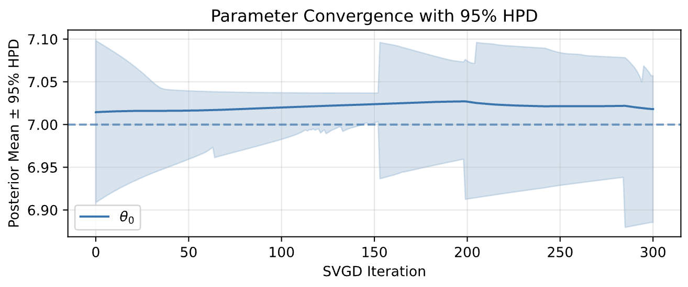
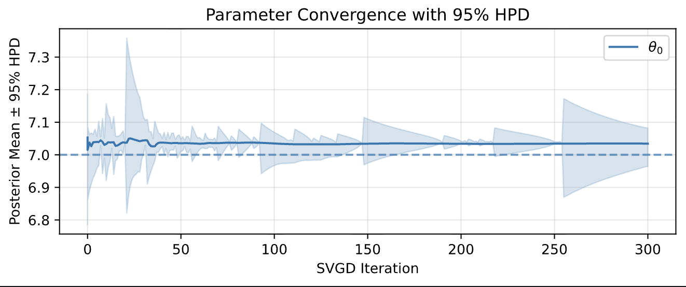
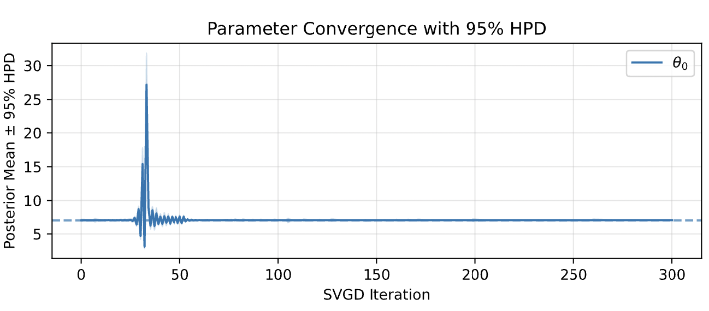
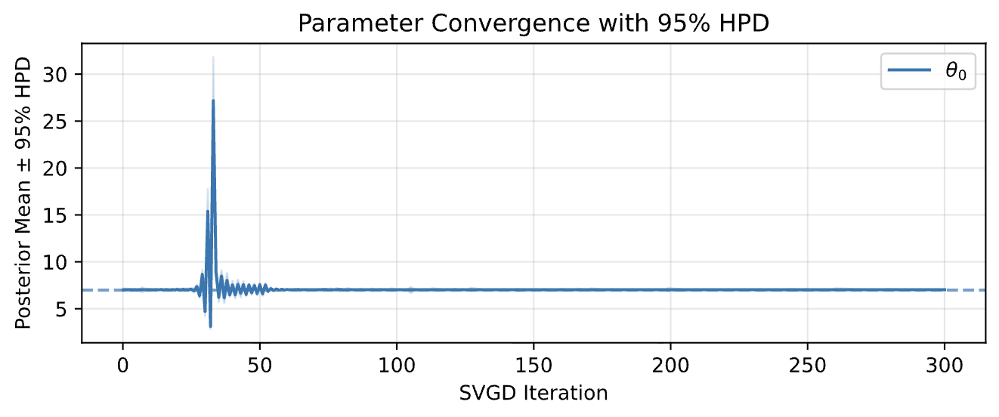

<!-- Italics are "grayed out" to make the example use stand out from dummy content. To make them black, just remove the last line in header_extra.tex: "\renewcommand\emph[1]{\oldemph{\color{gray}#1}}" -->

# Introduktion

Genetisk variation er grundlaget for evolution. Hvis man sammenligner DNA-sekvenser fra forskellige individer, vil man næsten altid finde små forskelle i deres arvemateriale. På samme position i arvemateriale kan et individ eksempelvis have et $A$ (adenin), mens et andet individ kan have et $G$ (guanin). Sådanne forskelle opstår fordi mutationer ophobes over mange generationer. Antallet og fordelingen af mutationerne afhænger af de evolutionære processer, der har påvirket populationen, herunder genetisk drift, migration, rekombination og ændringer i populationsstørrelse [@wakeley2009coalescent]. Genetiske data indeholder derfor information om en populations evolutionære historie.                                                                                   
Inden for populationsgenetik forsøger man netop at udlede denne information fra de observerede DNA-sekvenser. De evolutionære processer beskrives ofte ved hjælp af fremadrettede modeller, hvor man følger udviklingen af allelfrekvenser fra generation til generation. En af de mest klassiske modeller er Wright-Fisher-modellen, som blev udviklet i begyndelsen af det 20. århundrede af Sewall Wright og Ronald Fisher [@wakeley2009coalescent; @Hobolth2018]. Selvom sådanne modeller giver en detaljeret beskrivelse af de evoltionære processer, bliver de hurtigt komplekse og svære at arbejde med, når man vil analysere genetiske data fra mange individer. I stedet kan betragte de samme processer fra et andet perspektiv.

Coalescent teorien tilbyder netop sådan et perspektiv. I stedet for at beskrive evolutionen fremad i tid følger man de observerede genetiske linjer baglæns gennem historien. Teorien blev introduceret af John Kingman i 1982 [@Kingman1982] og beskriver, hvordan linjer gradvist coalescerer i fælles forfædre, indtil hele stikprøven kan spores tilbage til én fælles forfader [@wakeley2009coalescent]. De genealogier man ender med, indeholder information om blandt andet populationsstørrelser, migration og populationsstruktur og udgør dermed forbindelsen mellem de evolutionære processer og de genetiske mønstre, man observerer i data.            
Hvor meget information man kan udtrække fra disse genealogier, afhænger dog af, hvor kompleks coalescent-processen er. For den simpleste model, hvor populationen betragtes som én homogen enhed, kan mange egenskaber ved processen udledes analytisk. Man vil dog ofte gerne have modeller, som tager højde for faktorer som populationsstruktur, migration, rekombination eller ændringer i populationsstørrelse over tid. Sådanne udvidelser gør hurtigt de genealogiske processer mere komplicerede og dermed sværere at regne på analytisk. Der er derfor brug for en matematisk metode, som kan håndtere disse modeller.                                                                                                         
En sådan metode findes i fase-type teori, som oprindeligt blev udviklet inden for anvendt sandsynlighedsteori til at beskrive absorptionstider i Markov-processer [@BladtNielsen2017]. Da coalescent-processer i sig selv er absorptionsprocesser, kan fase-type fordelinger bruges til at beskrive genealogiske størrelser såsom træhøjder, grenlængder og site-frekvens-spektre (SFS) analytisk. Samtidig kan teorien håndtere komplekse modeller med populationsstruktur, migration, rekombination og tidsvarierende populationsstørrelser, bare at tilstandsrummet er konstrueret korrekt [@Hobolth2024].

I dette speciale anvendes disse metoder gennem Python-biblioteket `phasic`, som implementerer fase-type-baserede coalescentmodeller der gør det muligt at beregne fordelinger, momenter og sandsynligheder direkte ud fra de Markov-kæder, modellerne bygger på. For at anvende modellerne på genetiske data kræver det også statistiske metoder til parameterinferens. Derfor benyttes en Bayesiansk tilgang, hvor usikkerheden omkring modellernes parametre beskrives ved posteriorfordelinger. Til at finde disse posteriorfordelinger anvendes Stein Variational Gradient Descent (SVGD) [@liu2016svgd], som approksimerer posterioren ved hjælp af en samling partikler, der gradvist flyttes mod de områder, hvor posteriorens tæthed er størst.                         
For at kunne vurdere om metoderne fungerer som de skal, undersøges det, hvordan inferensen påvirkes af valg af priorer, og under hvilke betingelser parametre som populationsstørrelse og migration er identificerbare. Formålet med specialet er at undersøge, hvordan fase-type-baserede coalescentmodeller kan implementeres, verificeres og kombineres med Bayesiansk inferens til at rekonstruere en populations historie fra genetiske data. Konkret betyder det, at jeg verificerer, om `phasic`-implementeringen af Kingmans coalescent, to-ø-modellen og IM-modellen giver korrekte momenter, tæthedsfunktioner og site-frekvens-spektre (SFS) og om SVGD-inferensen er kalibreret korrekt. Derudover ser jeg på, hvornår parametrene for to-ø- og IM-modellen er identificerbar og hvad modellerne kan fortælle om den evolutionære historie for *Papio*-slægten. Dermed valideres modellerne først på simulerede data med kendte parametre. Derefter følger en analyse af, hvordan identificerbarhed og usikkerhed påvirkes af modelvalg og mutationsrate. Til sidst anvendes metoderne på genomdata fra bavianer i slægten *Papio*. De følgende afsnit introducerer trin for trin den baggrund, der er nødvendig for at besvare disse spørgsmål.

## Standard coalescent

Coalescent teoriens udgangspunkt er, at alle sekvenser i en stikprøve deler fælles forfædre, hvis man følger deres genetiske linjer tilstrækkeligt langt tilbage i tiden. En stikprøve på $n$ DNA-sekvenser fra det samme locus kan derfor beskrives ved et genealogisk træ, hvor linjerne gradvist coalescerer til fælles forfædre, indtil der kun er én linje tilbage. Den seneste fælles forfader for hele stikprøven kaldes *Most Recent Common Ancestor* (MRCA), og det tilhørende stamtræ betegnes genealogi [@wakeley2009coalescent].                                           
Dette træ kan dog ikke observeres direkte. Det man kan observere i genetiske data, er mutationerne langs træets grene. Genealogien fungerer derfor som en stokastisk variabel, der forbinder de evolutionære processer med de genetiske mønstre, man måler i DNA-sekvenserne [@wakeley2009coalescent]. Formen på træet afspejler populationens historie, i små populationer vil linjerne typisk finde fælles forfædre relativt hurtigt, mens linjerne i store populationer kan eksistere side om side i længere tid, før de coalescerer.

For at koble dette træ til de genetiske data antages ofte *infinite*-sites modellen. Her er mutationsraten så lav, at hver mutation kun opstår én gang i hele den evolutionære historie [@wakeley2009coalescent]. Hver mutation kan derfor knyttes til en bestemt gren i træet, og alle sekvenser, der nedstammer fra denne gren, bærer mutationen, mens de øvrige ikke gør. Hvis man antager selektiv neutralitet, kan træet og mutationsprocessen behandles uafhængigt af hinanden, her modellerer man først træet og placerer derefter mutationer på grenene som en separat Poisson-proces.    
For at forstå, hvor dette træ kommer fra, kan man se på Wright-Fisher modellen, som er den klassiske model for genetisk drift. Den standard coalescent kan netop udledes som en kontinuert-tids approksimation til denne model [@hobolth2019]. I Wright-Fisher modellen er populationsstørrelsen $2N$ konstant fra generation til generation, og hvert kromosom vælger sin forfader tilfældigt blandt de $2N$ kromosomer i den foregående generation. Sandsynligheden for, at to tilfældigt valgte kromosomer har samme forfader i en generation, er derfor $\frac{1}{2N}$. Kingman viste, at hvis tid måles i enheder af $2N$ generationer, og man lader $N \to \infty$, konvergerer Wright-Fisher modellen mod en kontinuert-tids Markov-proces [@Kingman1982]. Det er denne grænseproces, der udgør den klassiske standard coalescent.                                                                                                                                                                    Denne grænseproces har egenskaben, at den er en Markov-proces. Det betyder, at sandsynligheden for den næste hændelse kun afhænger af den nuværende tilstand og ikke af hele den tidligere historie. Formelt skrives dette som
$$
P(X_{t+s} = j \mid X_u, \, u \leq t) = P(X_{t+s} = j \mid X_t).
$$
Tilstanden kan beskrives ved antallet af aktive linjer i træet. Når der er $k$ linjer til stede, kan ethvert af de $\binom{k}{2}$ mulige linjepar coalescere, og ventetiden til næste coalescenthændelse er derfor eksponentielt fordelt med rate
$$
\lambda_k = \binom{k}{2}= \frac{k(k-1)}{2}.
$$
Dermed gælder
$$
T_k \sim \mathrm{Exp}\!\left(\frac{k(k-1)}{2}\right), \qquad k = n, n-1, \ldots, 2.
$$
Ventetiderne er stokastisk uafhængige, hvilket betyder, at tidspunktet for den næste coalescenthændelse ikke afhænger af, hvilke linjer der coalescerede tidligere. Denne egenskab gør, at mange størrelser i standard coalescenten kan udledes analytisk.                                                                                                                                           
En størrelse er træhøjden
$$
H = \sum_{k=2}^{n} T_k,
$$
som angiver tiden til MRCA. Træhøjdens forventning og varians er [@hobolth2019]:
$$
\mathbb{E}[H] = \sum_{k=2}^{n} \frac{2}{k(k-1)} = 2\!\left(1 - \frac{1}{n}\right), \qquad
\mathrm{Var}[H] = \sum_{k=2}^{n} \frac{4}{k^2(k-1)^2}.
$$
Den forventede træhøjde nærmer sig hurtigt værdien $2$, når stikprøvestørrelsen vokser. Dette betyder, at ekstra sekvenser kun i begrænset omfang forbedrer informationen om tidspunktet for MRCA.   I modsætning hertil indeholder den totale grenlængde
$$
L = \sum_{k=2}^{n} k\,T_k
$$
fortsat ny information, når flere sekvenser inkluderes, da den vokser logaritmisk med stikprøvestørrelsen. Den totale grenlængde vigtig, fordi mutationer akkumuleres langs træets grene og dermed direkte afhænger af $L$. Forventningen er
$$
\mathbb{E}[L] = \sum_{k=2}^{n} \frac{2}{k-1} = 2\,a_n,
$$
hvor
$$
a_n=\sum_{j=1}^{n-1} \frac{1}{j}
$$
er det harmoniske tal kendt fra Wattersons estimator [@hobolth2019; @watterson1975].                                                                                                          
Standard coalescent beskriver dermed den stokastiske genealogi, som ligger til grund for de observerede genetiske data. Næste skridt er at koble dette træ til de mutationer, man rent faktisk ser i DNA-sekvenserne. Det er denne sammenhæng mellem grenlængde og mutationer, der fører til SFS, som binder coalescent-teorien sammen med de populationsgenetiske data..

## Mutationer og site-frekvens-spektret (SFS)
Under den neutrale *infinite-sites*-model antages mutationer at opstå uafhængigt langs træets grene som en Poisson-proces med rate $\theta/2$, hvor $\theta=4N_e \mu$ er den skalerede mutationsrate. Givet en samlet grenlængde $t$ følger antallet af mutationer derfor en Poisson-fordeling:
$$
S \mid L = t \sim \mathrm{Poisson}\!\left(\frac{\theta t}{2}\right).
$$
Den totale grenlængde forbinder dermed træet med de mutationer, man observerer. Ved at tage forventningen over træet fås
$$
\mathbb{E}[S] = \frac{\theta}{2}\ \qquad \mathbb{E}[L] = \theta \sum_{j=1}^{n-1} \frac{1}{j} = \theta\, a_n,
$$
hvor $a_n$ er det harmoniske tal introduceret ovenfor [@hobolth2019]. Dette resultat leder til Wattersons estimator [@watterson1975]
$$
\hat{\theta}_W = \frac{S}{a_n},
$$
som giver en måde at estimere mutationsraten $\theta$ på.                                                                                                                                           
En alternativ estimator bygget i stedet på det gennemsnitlige antal parvise sekvensforskelle [@hobolth2021]:
$$
\hat{\theta}_\pi = \frac{1}{\binom{n}{2}} \sum_{i < j} \pi_{ij},
$$
hvor $\pi_{ij}$ er antallet af mutationer, der adskiller sekvens $i$ og $j$. Mens Wattersons estimator primært afhænger af det samlede antal segregerende sites, bygger $\hat{\theta}_\pi$ på de genetiske afstande mellem sekvenserne. De to estimatorer reagerer derfor forskelligt på ændringer i populationens historie. Dette udnyttes i Tajimas $D$-statistik, som sammenligner de to estimater [@hobolth2021; @tajima1989]:
$$
D = \frac{\hat{\theta}_\pi - \hat{\theta}_W}{\sqrt{\mathrm{Var}(\hat{\theta}_\pi - \hat{\theta}_W)}}.
$$
Under neutralitet og konstant populationsstørrelse forventes $D$ at ligge omkring nul. Negative værdier af $D$ indikerer et overskud af sjældne mutationer, hvilket ofte forbindes med populationsvækst eller positiv selektion. Positive værdier af $D$ peger derimod på et underskud af sjældne mutationer og kan være tegn på flaskehalse, populationsstruktur eller balancerende selektion [@tajima1989].

Hvor Wattersons estimator og Tajimas $D$ opsummerer variationen i data ved hjælp af enkelte tal, giver SFS et mere detaljeret billede. For en stikprøve på $n$ sekvenser defineres SFS som
$$
(\xi_1,\xi_2,\ldots,\xi_{n-1}),
$$
hvor $\xi_i$ angiver antallet af mutationer, der observeres i præcis $i$ af de $n$ sekvenser. SFS beskriver dermed, hvordan mutationerne fordeler sig på tværs af forskellige frekvensklasser. Under standard coalescenten med neutralitet og konstant populationsstørrelse gælder
$$
\mathbb{E}[\xi_i] = \frac{\theta}{i}, \qquad i = 1, 2, \ldots, n-1
$$
[@hobolth2021]. Det betyder, at sjældne mutationer forventes at dominere spektret. Især forventes singletons, dvs. mutationer der kun observeres i ét individ, at være langt hyppigere end mutationer med højere frekvens. Det skyldes, at en stor del af den samlede grenlængde ligger på de ydre grene af træet tæt på nutiden, hvor mutationer netop giver anledning til sjældne varianter.
SFS giver derfor information om populationens historie. Nylig populationsvækst fører ofte til et overskud af sjældne mutationer, mens flaskehalse, populationsstruktur eller migration typisk reducerer antallet af singletons og ændrer fordelingen af mutationer på tværs af frekvensklasser.                                                                                             
@fig-sfs viser det forventede site-frekvens-spektrum for $n=4$ beregnet analytisk ved hjælp af `phasic` [@phasic].

For $n=4$ er den forventede grenlængde for de fire frekvensklasser henholdsvis $1$-ton $= 2$, $2$-ton $=1$, $3$-ton $=0{,}67$, $4$-ton $=0$. Singletons udgør dermed den største forventede frekvensklasse, mens bidragene falder med stigende frekvens.                                                                                                                                        
SFS giver altså et detaljeret billede af variationen i data. Men hvis man vil beregne fordelinger, momenter og kovarianser for sådanne størrelser analytisk, kræver det en mere generel metode, nemlig fase-type fordelinger.

## Fase-type fordelinger

En fase-type fordeling beskriver absorptionstiden i en kontinuert-tids Markov-kæde med et endeligt antal transiente tilstande og én absorberende tilstand [@BladtNielsen2017]. En fase-type model beskrives ved intensitetsmatricen [@Hobolth2024]:
$$
\Lambda = \begin{pmatrix} \mathbf{T} & \mathbf{t} \\ \mathbf{0} & 0 \end{pmatrix},
$$
hvor $\mathbf{T}$ er sub-intensitetsmatricen for de transiente tilstande. Diagonalelementerne i $\mathbf{T}$ er negative og angiver den samlede rate, hvormed processen forlader en tilstand. Vektoren $\mathbf{t} = -\mathbf{T}\mathbf{e}$ angiver exit-raterne fra de transiente tilstande til den absorberende tilstand, hvor $\mathbf{e}$ er en søjlevektor bestående af ettaller.          
Hvis processen starter med initialfordelingen $\alpha$, skrives absorptionstiden som
$$
\tau \sim \mathrm{PH}(\alpha, \mathbf{T}).
$$
Fordelen ved denne repræsentation er, at tæthedsfunktioner, fordelinger og momenter kan beregnes direkte ved hjælp af matrixoperationer. For eksempel er tæthedsfunktionen og de første momenter givet ved [@BladtNielsen2017]:
$$
f_\tau(s) = \alpha \, e^{\mathbf{T}s} \, \mathbf{t}, \qquad
\mathbb{E}[\tau] = \alpha(-\mathbf{T})^{-1}\mathbf{e}, \qquad
\mathbb{E}[\tau^n] = n!\,\alpha(-\mathbf{T})^{-n}\mathbf{e}.
$$
Hvor $(\mathbf{T})^-1$ kaldes Green-matricen,
$$
\mathbf{U} = (-\mathbf{T})^{-1},
$$
hvor elementet $U_{ij}$ angiver den forventede tid, processen tilbringer i tilstand $j$, givet at den starter i tilstand $i$. Disse forventede opholdstider kaldes også *sojourn times*.

Denne tilgang kan nu anvendes direkte på Kingmans coalescent. Træhøjden $H$ kan beskrives som en fase-type fordeling, hvor tilstandene svarer til antallet af aktive linjer og processen bevæger sig fra $n$ linjer til $n-1, n-2$ osv. indtil MRCA nås. Startvektoren er derfor $\alpha = (1, 0, \ldots, 0),$ og sub-intensitetsmatricen kan skrives som [@Hobolth2024]:
$$
\mathbf{T} = \begin{pmatrix} -\lambda_n & \lambda_n & & \\ & -\lambda_{n-1} & \lambda_{n-1} & \\ & & \ddots & \\ & & & -\lambda_2 \end{pmatrix}, \qquad \lambda_k = \binom{k}{2}.
$$
Her angiver $\lambda_k$ den samlede rate for en coalescenthændelse, når der er $k$ linjer til stede.                                                                                                 
I `phasic` konstrueres dette tilstandsrum automatisk ud fra en callback-funktion, der definerer hvilke overgange der er mulige og med hvilke rater. For $n = 4$ er tilstandene beskrevet ved vektoren
$$
(s_1, s_2, s_3, s_4),
$$
hvor $s_i$ angiver antallet af linjer, der har præcis $i$ efterkommere i stikprøven. Denne repræsentation gør det muligt at holde styr på, hvilke dele af træet der bidrager til de forskellige frekvensklasser i SFS. Starttilstanden er $(4,0,0,0)$, hvilket svarer til, at alle fire sekvenser i stikprøven udgør hver sin linje med præcis en efterkommer, altså fire singletons. Når to linjer coalescerer, opstår en ny linje, hvis antal efterkommere er summen af de to linjers efterkommere. Coalescerer to af de fire singletons, går man derfor fra $(4,0,0,0)$ til $(2,1,0,0)$. Der er nu to singletons tilbage og en doubleton (en linje med to efterkommere). Coalescerer yderligere to linjer, kan man for eksempel ende i $(0,0,1,0)$, en tripleton med tre efterkommere. Processen fortsætter på denne måde, indtil alle fire sekvenser er samlet i en linje. Absorptionstilstanden er $(0,0,0,1)$, hvor der er én linje med alle fire efterkommere, det er MRCA. Tilstandsrummet for $n=4$ er illustreret i @fig-graf.


Fase-type fordelinger gør det muligt, at beregne mange forskellige populationsgenetiske størrelser. Disse kan beskrives ved at lægge en "vægt" eller belønning på hver tilstand i Markov-processen og summere disse vægte over den tid, processen tilbringer i hver tilstand. For eksempel kan total grenlængde, ydre grenlængde og de enkelte komponenter i SFS alle udtrykkes på denne måde, ved at vælge vægtene passende for hver tilstand. Denne tilgang kaldes reward-transformationer, og når man kombinerer flere sådanne størrelser samtidig, fører det til den multivariate fase-type teori, som behandles i det følgende.

## Reward-transformationer og multivariat fase-type

Ideen bag reward-transformationer er, at hver tilstand i Markov-kæden tildeles en reward (vægt), som angiver, hvor hurtigt en given størrelse akkumuleres, mens processen befinder sig i tilstanden. Hvis $r(i)$ angiver reward-værdien i tilstand $i$, kan den samlede reward skrives som
$$
Y = \int_0^\tau r(X_t)\,dt,
$$
hvor $\tau$ er absorptionstiden og $X_t$ angiver den aktuelle tilstand på tidspunkt $t$.                                                                                                            
Når alle rewards er positive, følger $Y$ igen en fase-type fordeling [@BladtNielsen2017]:
$$
Y \sim \mathrm{PH}\!\bigl(\alpha,\, \Delta(\mathbf{r})^{-1}\mathbf{T}\bigr),
$$
hvor $\Delta(\mathbf{r})$ er diagonalmatricen med reward-vektoren på diagonalen. Det betyder, at man kan analysere mange forskellige populationsgenetiske størrelser på samme måde som absorptionstider. I stedet for at udlede nye fordelinger kan man ændre reward-vektoren og genbruge den eksisterende fase-type struktur.                                                             
Den totale grenlængde er et eksempel på dette:
$$
L = \sum_{k=2}^n kT_k.
$$
Når der er $k$ aktive linjer i træet, akkumuleres grenlængde med hastighed $k$, fordi alle linjer bidrager samtidigt. Reward-vektoren bliver derfor
$$
\mathbf{r}_L=(n,n-1,\ldots,2).
$$
Den totale grenlængde kan dermed fortolkes som en reward-transformeret version af den samme coalescent-proces, der giver træhøjden. På samme måde kan man definere rewards, der kun tæller bestemte dele af træet. Man kan eksempelvis beregne ydre grenlængder ved kun at tildele positive rewards til grene, der fører direkte til observerede sekvenser. Tilsvarende kan man konstruere rewards for de enkelte frekvensklasser i SFS. Reward-transformationer giver derfor en forbindelse mellem træet og de populationsgenetiske størrelser, der senere bruges til inferens.            
@fig-pdf-grenlangder viser PDF og CDF for singleton-, doubleton- og tripleton-grenlængder beregnet ved hjælp af reward-transformationer.


Ofte er man interesseret i flere af disse størrelser på samme tid. Træhøjde, total grenlængde og ydre grenlængde beskriver forskellige aspekter af det samme træ og er derfor statistisk afhængige. For at håndtere dette udvides teorien til multivariate fase-type fordelinger (MPH). I MPH kobles flere reward-vektorer til den samme Markov-proces. Hver reward-vektor genererer en variabel, men alle variable afhænger af det samme træ, hvilket gør det muligt at beregne fælles fordelinger, kovarianser og blandede momenter analytisk. For to reward-transformerede variable $Y_1$ og $Y_2$ er det blandede moment givet ved [@Hobolth2024]:
$$
\mathbb{E}[Y_1 Y_2] = \alpha \mathbf{U} \Delta(\mathbf{r}_1) \mathbf{U} \Delta(\mathbf{r}_2) \mathbf{e} + \alpha \mathbf{U} \Delta(\mathbf{r}_2) \mathbf{U} \Delta(\mathbf{r}_1) \mathbf{e},
$$
hvor $\mathbf{U}=(-\mathbf{T})^{-1}$ er Green-matricen. Dette gør det muligt at beregne kovariansen mellem to populationsgenetiske størrelser direkte. Det betyder, at man kan undersøge, hvordan to størrelser, der begge afhænger af det samme træ, varierer i forhold til hinanden, for eksempel om en stor træhøjde typisk også giver en stor total grenlængde.
Indtil nu har fokus været på kontinuerte størrelser som tider og grenlængder. Mange af de størrelser, der observeres direkte i genetiske data, er imidlertid diskrete, hvilket fører til diskrete fase-type fordelinger

## Den diskrete fase-type fordeling og segregerende sites

Antallet af segregerende sites, mutationer i de enkelte frekvensklasser og komponenterne i SFS er alle tællevariable. Sådanne størrelser kan beregnes ved hjælp af diskrete fase-type fordelinger (DPH) [@BladtNielsen2017; @Hobolth2024]. En måde at forstå konstruktionen på er at betragte forholdet mellem mutationer og coalescenthændelser som en konkurrence. Når processen befinder sig i en tilstand med $k$ aktive linjer, kan den næste hændelse enten være en mutation eller en coalescenthændelse. Sandsynligheden for, at næste hændelse er en mutation, er [@hobolth2021]:
$$
p_k = \frac{k\theta/2}{k\theta/2 + k(k-1)/2} = \frac{\theta}{\theta + k-1},
$$
hvor $\theta$ er den skalerede mutationsrate [@hobolth2021]. Denne konkurrence mellem mutation og coalescent giver anledning til en diskret Markov-kæde, hvor hver mutationshændelse opfattes som et skridt i processen. Dermed kan antallet af mutationer analyseres ved hjælp af DPH-teorien, ligesom absorptionstider analyseres ved hjælp af kontinuerte fase-type fordelinger.                     
Konkret betyder det, at antallet af segregerende sites kan beskrives direkte som en DPH. Givet træet gælder [@Hobolth2024]
$$
S+1 \sim \mathrm{DPH} (\alpha_L,\mathbf P),
$$
hvor overgangsmatricen er givet ved
$$
\mathbf{P} = \left(\mathbf{I} - \frac{2}{\theta}\mathbf{T}_L\right)^{-1}.
$$
Her beskriver $\mathbf{T}_L$ den reward-transformerede proces for den totale grenlængde. Resultatet betyder, at sandsynligheder og likelihoods for antallet af segregerende sites kan beregnes analytisk. Den samme princip kan bruges til de enkelte komponenter i SFS. Hver frekvensklasse kan beskrives ved passende reward-strukturer, hvilket gør det muligt ikke blot at beregne forventninger, men også hele fordelinger og kovarianser mellem forskellige dele af spektret. Dermed bliver fase-type teorien en samlet måde at beskrive både størrelser fra træet og de mutationer, der observeres i genetiske data.

Indtil nu har fokus været på et enkelt locus, hvor alle positioner antages at dele det samme træ. Denne antagelse er ofte rimelig for korte DNA-segmenter, men holder dårligere, når større dele af genomet analyseres, fordi rekombination kan give forskellige positioner forskellige historier. Standard coalescent antager, at hele det undersøgte locus nedarves uden at blive splittet op og at alle positioner derfor deler det samme træ. Under meiosen kan genetisk materiale imidlertid udveksles mellem de tilsvarende kromosomer fra mor og far, hvilket betyder, at forskellige positioner i genomet kan have forskellige historier [@wakeley2009coalescent]. To nærliggende positioner vil derfor ikke nødvendigvis dele den samme MRCA eller den samme træstruktur. For at beskrive dette udvides coalescent-processen til en Ancestral Recombination Graph (ARG). Hvor den standard coalescent kun indeholder hændelser, der reducerer antallet af linjer, indeholder ARG'et både coalescent- og rekombinationshændelser. De to mekanismer virker i modsatte retninger, coalescent samler linjer, mens rekombination kan splitte ancestrale linjer op og dermed øge kompleksiteten af træstrukturen. Resultatet er et betydeligt større tilstandsrum. Dette illustreres i @fig-arg-graph, som viser tilstandsrummet for en to-locus ARG-model med $n=3$.

Sammenlignet med standard coalescent (@fig-graf) vokser antallet af mulige tilstande markant, selv for meget små stikprøver. Modellen skal nu holde styr på, hvilke dele af genomet der fortsat deler fælles historie og hvilke der allerede er blevet adskilt af tidligere rekombinationshændelser. Rekombinationsprocessen beskrives ved parameteren $\rho = 4N_e r,$ hvor $r$ er rekombinationsraten. Denne parameter har samme funktion som mutationsparameteren $\theta = 4N_e \mu$. ARG-modeller giver mulighed for at udnytte information fra hele genomet frem for et enkelt locus og illustrer samtidigt, hvordan fase-type teorien kan anvendes på mere komplekse strukturer end den standard coalescent.

Tilstandsrummet kan udvides yderligere ved at inkludere mutationshændelser direkte i grafen via joint probability-repræsentationen. I stedet for at observere TMRCA-tider direkte bruges det diskrete SFS som observationer og grafen udvides med absorberende tilstande, der svarer til unikke kombinationer af mutationshændelser. Et eksempel på et sådant tilstandsrum for $n=4$ og reward_limit=2 er vist i @fig-joint-statespace.

Joint probability-repræsentationen viser, hvor bredt fase-type tilgangen kan anvendes. Samtidig peger den på en anden faktor, der gør modellerne mere komplekse, nemlig populationsstruktur. I naturlige populationer lever individer typisk i flere grupper, der ligger spredt geografisk og sjældent blander sig fuldstændigt med hinanden. Hvor meget migration der sker mellem disse grupper, kan have stor betydning for de mønstre, der observeres i genetiske data. To-ø-modellen (*two-island-model*) og IM-modellen (*isolation-with-migration-model*) er to eksempler på, hvordan man kan modellere netop sådan en opdeling i delpopulationer med migration mellem dem.

## Populationsstruktur: to-ø-modellen og IM-modellen

Den simpleste model for populationsstruktur er to-ø-modellen. Modellen består af to populationer, hvor der foregår migration mellem populationerne med en konstant migrationsrate $m$. Inden for hver population følger processen de samme principper som standard coalescent, men der tilføjes migrationsovergange mellem populationerne [@Hobolth2024]. Hvis to linjer befinder sig i samme population, kan de coalescere direkte. Hvis de derimod befinder sig i forskellige populationer, må mindst en af linjerne først migrere, før en coalescenthændelse kan finde sted. Migration påvirker derfor processen ved at ændre, hvilke linjer der kan coalescere med hinanden.                                                                                                                               I denne model udvides tilstandsrummet derfor på en ny måde: hver linje karakteriseres nu ikke kun ved antallet af efterkommere i stikprøven, men også ved hvilken population linjen befinder sig i. Det betyder, at en linje med f.eks. en efterkommer i population 1 regnes som en anden tilstand end en linje med en efterkommer i population 2, selvom de "ligner" hinanden i forhold til standard coalescenten. Denne udvidelse er nødvendig, fordi to linjer kun kan coalescere, hvis de befinder sig i samme population, en linje i population 1 og en linje i population 2 kan derfor ikke coalescere direkte, før mindst én af dem er migreret over i den anden population. Resultatet er endnu et eksempel på, hvordan fase-type tilgangen kan skaleres til mere komplekse modeller, denne gang ved at lade hvilken population en linje befinder sig i, være en del af tilstandsbeskrivelsen. @fig-two-island-graph viser tilstandsrummet for to-ø-modellen med to linjer.

Figuren illustrerer, hvordan migration og coalescent konkurrerer med hinanden. Coalescenthændelser reducerer antallet af aktive linjer, mens migration flytter linjer mellem populationerne. Selv med kun to linjer bliver tilstandsrummet betydeligt større end i standard coalescent (@fig-graf).                                                                                                        
I denne model parametriseres processerne ved $\theta_0 = 4N_e\mu$ og $\theta_1 = 4N_em,$ hvor $\mu$ er mutationsraten, og $m$ er migrationsraten. En statistisk udfordring ved modellen er identificerbarhed. Høj migration og høj coalescentrate kan producere meget lignende mønstre, da begge mekanismer fører til korte TMRCA-tider og dermed relativt ens fordelinger af genetisk variation. Når migrationen bliver meget høj, bliver det derfor svært at afgøre, om et observeret mønster skyldes hyppig migration eller hurtig coalescent.

To-ø-modellen antager, at de to populationer har set ud, som de gør nu, hele vejen tilbage i tiden. I mange tilfælde er man dog interesseret i populationer, der på et bestemt tidspunkt har splittet sig fra en fælles forfader. Dette beskrives ved IM-modellen.                                                                                                                                
IM-modellen kombinerer populationsstruktur med et historisk split-tidspunkt. Modellen antager, at de to nuværende populationer opstod fra en fælles ancestral population for $t_s$ generationer siden. Fra nutiden og tilbage til split-tidspunktet udvikler populationerne sig som en struktureret model med migration, mens der før split-tidspunktet kun eksisterer en fælles ancestral population. De nutidige populationer kan være delvist adskilte, men de deler stadig en fælles evolutionær fortid.

IM-modellen er tidsinhomogen, det vil sige, at overgangsraterne ændrer sig ved split-tidspunktet og processen kan derfor ikke beskrives af en enkelt generator-matrix. I stedet opdeles historien i epoker med forskellige rater. Denne tilgang gør det muligt at beskrive hændelser såsom populationssplit, flaskehalse og ekspansioner, som kan efterlade karakteristiske signaler i TMRCA-fordelingen og i SFS. @fig-sfs-epoch viser et eksempel på, hvordan forskellige epoker påvirker det forventede SFS.

I tidsinhomogene modeller bestemmes formen af SFS ikke kun af populationsstørrelserne, men også af, hvor lange de enkelte epoker er. Et overskud af sjældne mutationer ses for eksempel ofte ved nylig populationsvækst, mens populationsstruktur og flaskehalse typisk giver mere komplekse afvigelser fra det neutrale spektrum. I `phasic` opbygges tidsinhomogene modeller epoke for epoke, hvorefter de kombineres analytisk. Det gør det muligt at beregne fordelinger og momenter for relativt komplekse modeller af populationens historie [@Roikjer2022; @phasic].

## Bayesiansk inferens med SVGD

Bayesianske tilgang er, at den ikke blot giver et punktestimat, men tilføjer posteriorfordelingen, som direkte kvantificerer usikkerheden omkring parametrene i coalescent-modellerne, der er opstillet i de foregående afsnit. I stedet for kun at angive den mest sandsynlige værdi opnår man en hel sandsynlighedsfordeling over mulige parameterværdier, hvilket er relevant, når data er støjfyldte og flere parameterkombinationer kan forklare de samme observationsmønstre.                                                                                                               
Givet observerede data $\mathbf{x}$ og en parametervektor $\theta$ med priorfordeling $\pi_0(\theta)$ skrives posteriorfordelingen som [@liu2016svgd]
$$
\pi(\theta \mid \mathbf{x}) = \bar\pi(\theta)/Z, \qquad \bar\pi(\theta) = \pi_0(\theta)\,p(\mathbf{x}\mid\theta),
$$

hvor $p(\mathbf{x}\mid\theta)$ er likelihooden og $Z=\int\bar\pi(\theta)\,d\theta$ er normaliseringskonstanten.                                                                             

En udfordring er, at denne posteriorfordeling sjældent kan beregnes analytisk, og den må derfor approksimeres numerisk. Den klassiske tilgang er Markov Chain Monte Carlo (MCMC), hvor man genererer prøver fra posteriorfordelingen ved hjælp af en stokastisk kæde. MCMC er meget anvendt, men kan være langsom og det kan være svært at afgøre, om kæden er konvergeret [@liu2016svgd]. Et alternativ er variationel inferens, hvor man i stedet approksimerer posterioren med en simplere fordeling ved at minimere afstanden mellem dem. Denne tilgang er ofte hurtigere, men de simple fordelinger, der typisk bruges, kan have svært ved at fange den sande posteriors form [@liu2016svgd].
SVGD kombinerer elementer fra begge tilgange. I stedet for at generere prøver en efter en som i MCMC, repræsenteres posterioren ved en samling partikler
$$
\{\theta_1,\theta_2,\ldots,\theta_{n_p}\},
$$
som iterativt flyttes gennem parameterrummet, så deres samlede fordeling gradvist nærmer sig den sande posterior. Opdateringen af hver partikel $i$ er givet ved
$$
\theta_i \leftarrow \theta_i + \epsilon\, \hat{\phi}^*(\theta_i),
$$
hvor $\epsilon$ er læringsraten og $\hat{\phi}^*$ beskriver den optimale opdateringsretning:
$$
\hat{\phi}^*(\theta) = \frac{1}{n_p}\sum_{j=1}^{n_p}\Bigl[k(\theta_j, \theta)\,\nabla_{\theta_j}\log\pi(\theta_j\mid\mathbf{x}) + \nabla_{\theta_j}k(\theta_j, \theta)\Bigr].
$$
De to led i opdateringen gør forskellige ting. Det første led trækker partiklerne mod områder med høj posterior sandsynlighed, mens det andet led skubber partiklerne væk fra hinanden, så de ikke ender i samme punkt. Sammen gør de to led det muligt at approksimere hele posteriorfordelingen og ikke kun dens maksimum [@liu2016svgd].

## Bavianer som modelsystem

Modellerne fra de foregående afsnit testes på simulerede data med kendte parametre, men formålet er til sidst at anvende dem på rigtige genetiske data. Til dette bruges bavianer i slægten *Papio* som modelsystem.                                                                                                                                                                                
*Papio* er en gruppe af nært beslægtede primater, som lever i store dele af Afrika [@kopp2023]. Slægten består af seks nulevende arter:

* Olive bavian (*Papio anubis*),
* Yellow bavian (*Papio cynocephalus*),
* Chacma bavian (*Papio ursinus*),
* Guinea bavian (*Papio papio*),
* Hamadryas bavian (*Papio hamadryas*),
* Kinda bavian (*Papio kindae*).

Disse seks arter opdeles i to klader: en nordlig klade bestående af P. hamadryas, P. anubis og P. papio, og en sydlig klade bestående af P. kindae, P. cynocephalus og P. ursinus [@rogers2019; @vilgalys2022]. De seks arter lever i hver deres område, som ligger op til hinanden uden at overlappe. De adskiller sig tydeligt fra hinanden i blandt andet kropsstørrelse og pelsfarve [@rogers2019]. Den geografiske fordeling og hybridzonerne er vist i @fig-Kort.

::: {#fig-Kort}
{width="50%"}

*Papio*-arter og deres nuværende geografiske udbredelse, samt placeringen af tre veldokumenterede aktive hybridzoner. x1: hybridzone mellem *P. hamadryas* og *P. anubis*. x2: hybridzone mellem *P. cynocephalus* og *P. anubis*. x3: hybridzone mellem *P. kindae* og *P. ursinus*. Billedet er fra @rogers2019.

:::

Bavianernes evolutionære historie begyndte for omkring $1.5$ millioner år, hvilket er på samme tid som menneskeslægten *Homo* [@rogers2019]. I modsætning til mennesker, hvor kun en art eksisterer i dag, har bavianer bevaret flere linjer, der på trods af geografisk adskillelse kan krydse sig i naturen og producere fertile hybrider [@sorensen2023; @jordan2018papio]. Som det fremgår af @fig-Kort, overlapper arterne geografisk ved en række hybridzoner, hvor genudveksling er dokumenteret [@sorensen2023]. @sorensen2023 analyserede 225 vilde bavianer fra 19 lokaliteter og dokumenterede admixture mellem *P. anubis* og *P. cynocephalus*, en tæt forbindelse mellem *P. kindae* og *P. cynocephalus*, samt tegn på tre-vejs admixture i yellow-bavianeren et mønster, som ikke tidligere er observeret i denne slægt. PSMC-analyser viser desuden, at alle seks populationer har oplevet fald i effektiv populationsstørrelse de seneste 100.000 år, sandsynligvis i forbindelse med klimatiske ændringer [@rogers2019]. Det gør bavianer særligt velegnede som modelsystem til at studere både divergens og hybridisering i naturlige populationer.

## Data

Datasættet fra @sorensen2023, beskrevet i det forrige afsnit, anvendes i dette speciale med fokus på kromosom $20$. Kromosom $20$ som indeholder $2.665.269$ varianter fordelt over $227$ diploide individer, svarende til $454$ haploide kromosomer. Fra datasættet anvendes alle seks arter med følgende antal segregerende SNPs og haploide prøver:

* *P. cynocephalus*: $1.379.280$ SNPs ($n=120$),
* *P. anubis*: $1.058.781$ SNPs ($n=180$),
* *P. kindae*: $833.071$ SNPs ($n=50$),
* *P. hamadryas*: $460.025$ SNPs ($n=48$),
* *P. ursinus*: $403.120$ SNPs ($n=8$),
* *P. papio*: $110.086$ SNPs ($n=24$).

Den mindste population i datasættet er *P. ursinus*, som kun har $8$ haploide prøver. Dette sætter den øvre grænse for direkte sammenligninger af SFS på tværs af arter.                            
For hvert individ er der beregnet allelfrekvenser per position i genomet. Disse angiver antallet af afledte alleler ud af det samlede antal sekvenser ved et givent site og allele counts bruges til inferensmodellerne. Diversiteten estimeres ved hjælp af Wattersons estimator. Mutationsraten $\mu = 0{,}9 \times 10^{-8}$, angivet som mutationer per basepar per generation, samt generationstiden $g=11$ år, er hentet fra @sorensen2023. Disse værdier bruges til at omregne skalerede modelparametre til størrelser, der kan tolkes, såsom effektiv populationsstørrelse ($N_e$) og tid angivet i år.

## Modeller og implementering

Alle coalescentmodeller er implementeret i `phasic` [@phasic] og er valideret både analytisk og ved sammenligning med simulationer udført i msprime. I analyserne for enkelt populations modellen anvendes $n_{\text{samples}} = 8$ haploide prøver, som er bestemt via test i NB02, mens to-ø- og IM-modellen bruger $n_{\text{samples}} = 4$ per population, valgt på baggrund af test i NB03.
Analysen er bygget op omkring syv Jupyter notebooks, der hver bygger videre på den foregående, fra grundlæggende verificering af modellerne til den endelige anvendelse på bavian-data.             
En oversigt over notebooks, de tilhørende modeller, parametre og formål er givet i @tbl-notebooks.

| Notebook | Model | Parametre | Formål |
|:---|:---|:---|:---|
| NB01 | Kingmans coalescent | $\theta$ | Verificering af fase-type implementering og analytiske egenskaber |
| NB02 | SVGD-kalibrering | Læringsrate, prior, antal observationer, antal prøver, partikler | Systematisk valg af inferenskonfiguration |
| NB03 | To-ø modellen | $\theta_0$, $\theta_1$ | Identificerbarhed ved varierende migration |
| NB04 | Tidsinhomogen coalescent | $\theta_0$, $\theta_1$ | Flaskehalse, ekspansioner og demografiske scenarier |
| NB05 | Joint probability-inferens og IM-modellen | $\theta$, $\mu$, $t_s$, `reward_limit` | Diskrete SFS-observationer, ARG og IM-modellen |
| NB06A | Enkelt populations analyse | $\theta$, $N_e$ | SVGD- og joint probability-inferens på bavian-data for seks *Papio*-arter |
| NB06B | To-populations analyse | $\theta_0$, $\theta_1$, $t_s$ | To-ø model og IM-model for bavian-artspar |

: Oversigt over notebooks og modeller implementeret i dette speciale. {#tbl-notebooks}

# Resultater

Resultatafsnittet følger analysens opbygning. Først tjekkes det om `phasic` beregner de rigtige størrelser ved at sammenligne med kendte resultater. Derefter undersøges det hvilken SVGD-konfiguration der fungerer bedst. Herefter testes to-ø-modellen og tidsinhomogene modeller. Til sidst bruges de validerede metoder på genomdata fra seks *Papio*-arter.

## Verificering af Kingmans coalescent (NB01)

Inden inferens på bavian-data sammenlignes `phasics` numeriske beregning af den forventede coalescenttid $\mathbb{E}[H]$ med den kendte analytiske formel $\sum_{k=2}^{n} \frac{2}{k(k-1)}$ for stikprøvestørrelser fra $n=2$ til $n=8$. Afvigelsen er nul for alle værdier af $n$, som vist i @tbl-verificering.



For $n=4$ er den forventede opholdstid $\mathbb{E}[T_k]$ i hver fase beregnet via Green-matricen $\mathbf{U} = (-\mathbf{T})^{-1}$. Med fire aktive linjer tilbringer processen $0{,}167$ coalescent-enheder i den første fase. Med tre linjer er opholdstiden $0{,}333$ enheder og med to linjer er den $1{,}000$ enhed. Det vil sige at to tredjedele af den samlede forventede TMRCA på $1{,}5$ enheder tilbringes i fasen med kun to aktive linjer, som vist i @tbl-sojourn.



Kovarianserne mellem singleton-, doubleton- og tripleton-grenlængder er beregnet via MPH-teorien. Singleton- og doubleton-grenlængder er negativt korrelerede med $\text{Cov}(B_1, B_2) = -0{,}222$. Singleton- og tripleton-grenlængder er positivt korrelerede med $\text{Cov}(B_1, B_3) = 0{,}889$. Den fulde kovariansmatrix er vist i @tbl-kovarians.



`phasic` og msprime sammenlignes på $3000$ simulerede træer. Den simulerede middelværdi $\mathbb{E}[H] = 1{,}499$ afviger $0{,}07\%$ fra den analytiske værdi på $1{,}500$. Den samlede relative afvigelse over hele fordelingen er $1{,}66\%$. Histogrammet af simulerede TMRCA-tider og den analytiske PDF fra `phasic` er vist i @fig-msprime-validering.



## SVGD-konfiguration (NB02)

### Læringsrate

For at finde den bedste læringsrate testes $16$ strategier over fem forskellige antal iterationer ($100$, $300$, $400$, $600$ og $1000$) på simulerede data med sand $\theta = 7$ og $n_{\text{obs}} = 10{.}000$. Resultaterne for alle $16$ strategier er vist i @tbl-lr-bred.

| Strategi (posterior-std) | 100 | 300 | 400 | 600 | 1000 |
|:---|---:|---:|---:|---:|---:|
| AdaptiveStepSize | 3,50322 | 3,50559 | 13,10750 | 11,98529 | 8,52756 |
| Constant(0.001) | 0,06508 | 0,04038 | 0,02779 | 0,03789 | 0,07295 |
| Constant(0.01) | 0,02153 | 0,01217 | 0,05662 | 0,01822 | 0,02644 |
| Constant(0.05) | 0,05499 | 0,02491 | 0,01534 | 0,01508 | 0,04527 |
| Constant(0.1) | 20,82313 | 25,33872 | 27,62536 | 7,25658 | 1,19354 |
| Constant(0.5) | 0,00000 | 0,00000 | 0,00000 | 0,00000 | 0,00000 |
| Exp(0.05 → 0.001, τ=30) | 0,03718 | 0,03236 | 0,12737 | 0,04072 | 0,17019 |
| Exp(0.1 → 0.001, τ=100) | 0,00553 | 0,02363 | 0,12584 | 0,02851 | 0,11037 |
| Exp(0.1 → 0.001, τ=30) | 0,01983 | 0,16619 | 0,01761 | 0,09809 | 0,07473 |
| Exp(0.3 → 0.001, τ=50) | 2,11684 | 0,00000 | 0,00000 | 0,00000 | 0,00000 |
| Exp(0.5 → 0.001, τ=50) | 0,00000 | 0,00000 | 0,00000 | 0,00000 | 0,00000 |
| Exp(1.0 → 0.01, τ=50) | 0,00000 | 0,00000 | 0,00000 | 0,00000 | 0,00000 |
| Warmup(peak=0.1, w=20) | 0,04633 | 0,01925 | 0,08288 | 0,05819 | 0,02920 |
| Warmup(peak=0.3, w=30) | 1,70064 | 0,00000 | 0,00000 | 1,53442 | 3,50087 |
| Warmup(peak=0.3, w=50) | 0,00000 | 0,00000 | 0,00000 | 3,50095 | 0,00000 |
| Warmup(peak=0.5, w=30) | 0,00000 | 0,00000 | 0,00000 | 0,00000 | 0,00000 |

: Posterior-std for $16$ læringsrate-strategier testet over fem forskellige antal iterationer $100$, $300$, $400$, $600$, $1000$ med sand $\theta = 7$ og $n = 10.000$ observationer. {#tbl-lr-bred}

En værdi på $0{,}00000$ betyder, at strategien ikke dækker sand $\theta$ i $95\%$-intervallet ved det specifikke antal af iterationer og disse strategier fravælges derfor. Det gælder Constant(0.5), Exp(0.5 → 0.001, τ=50), Exp(1.0 → 0.01, τ=50) og Warmup(peak=0.5, w=30), der ikke dækker $\theta$ ved nogen af iterationsantallene, samt Exp(0.3 → 0.001, τ=50) og Warmup(peak=0.3, w=30), der kun dækker $\theta$ ved enkelte iterationsantal. De resterende strategier dækker sand $\theta$ ved alle testede iterationsantal og har generelt lavere std for de eksponentielt aftagende strategier end for de konstante.

Posteriorintervallerne for de strategier, der dækker sand $\theta$, er kørt over mange uafhængige kørsler. På den baggrund vælges den bedste læringsrate. Konstant $0{,}001$ (@fig-lr-ci) giver det bredeste interval af de seks strategier, med store udsving i HPD-bredden gennem hele forløbet, der ikke bliver smallere med stigende antal iterationer.         
For Exp(0.05 → 0.001, τ=30) (@fig-lr-ci) ligger posterior mean for $\theta_0$ en smule over den sande værdi, gennem hele forløbet og rammer aldrig præcis $\theta=7$. HPD-båndet er bredest i de første iterationer, med flere udsving, og har generelt udsvingerne gennem hele forløbet. For Warmup(peak=0.1, w=20) ses en spids i posterior-mean omkring iteration $25$-$50$, hvor middelværdien kortvarigt rammer langt over $\theta=7$, før den hurtigt stabiliserer sig tæt på den sande værdi for resten af forløbet (@fig-lr-ci).      
`Exp(0.1 → 0.001, τ=100)` (@fig-lr-ci) ligesom Warmup en spids i posterior-mean omkring $30-35$, hvor middelværdien kortvarigt rammer langt over $\theta=7$, før den hurtigt stabiliserer sig tæt på den sande værdi for resten af forløbet. Sammenholdt med @tbl-lr-bred, hvor denne strategi har den laveste posterior-std blandt alle $16$ strategier over iterationsantal, vælges `Exp(0.1 → 0.001, τ=100)` som standard læringsrate. Selvom Warmup(peak=0.1, w=20) (@fig-lr-ci) også har et stabilt og pænt CI-plot, har `Exp(0.1 → 0.001, τ=100)` den laveste samlede std og vælges derfor frem for denne.

::: {#fig-lr-ci layout="[[1,1],[1,1]]"}

CI-plots for fire læringsrate-strategier over 300 iterationer med sand $\theta=7$.
:::

### Prior

Fem priors testes med den valgte læringsrate på simulerede data med sand $\theta = 7$: vag GaussPrior, GaussPrior, HalfCauchyPrior, LogGaussPrior og DataPrior. De fem prior-fordelinger er vist i @fig-priors.



Som det ses i @fig-priors, er den vage GaussPrior bred og højreskæv, hvilket giver høj sandsynlighed til værdier langt fra sand $\theta=7$. GaussPrior er til sammenligning smal og symmetrisk centreret omkring $\theta=7$, men dækker som det fremgår af @tbl-prior-sammenligning ikke sand $\theta$ i $95\%$-intervallet. HalfCauchyPrior er meget koncentreret omkring nul og falder hurtigt, hvilket betyder, at den i udgangspunktet lægger lav sandsynlighed på værdier omkring $\theta=7$. LogGaussPrior er vist på log-skala og er skæv mod høje værdier, mens DataPrior, vist som histogram er centreret tæt ved $\theta=7$.
Std og bias for de fem priors er vist i @tbl-prior-sammenligning.

| | Vag GaussPrior | GaussPrior | HalfCauchyPrior | LogGaussPrior | DataPrior |
|:---|:---:|:---:|:---:|:---:|:---:|
| Dækker | True | True | True | True | True |
| Score | 0,1504 | 0,1023 | 0,1482 | 0,2505 | 0,0934 |

: Sammenligning af fem priors med læringsrate Exp(0.1 → 0.001, τ=100) og sand $\theta = 7$. Rækkerne viser om sand $\theta$ dækkes i $95\%$-intervallet og samlet score (std $+ 2\times$ bias). Kolonnerne svarer til de fem priors. {#tbl-prior-sammenligning}

DataPrior har den laveste score af alle fem priors og dækker samtidig sand $\theta$. De øvrige priors ses at, vag Vag GaussPrior, HalfCauchyPrior og LogGaussPrior har de højeste score. GausPrior dækker også sand $\theta$ men har større scorre end DataPrior. DataPrior vælges derfor som standardprior.

### Antal observationer, samples og partikler

Effekten af antal observationer $n_{\text{obs}}$ testes over $\{1000, 2000, 3000, 5000, 10000, 50000, 100000\}$. Std falder med stigende $n_{\text{obs}}$ og flader ud ved $50{.}000$, som vist i @tbl-nobs-niter. $n_{\text{obs}} = 50{.}000$ vælges som standard.

| n_obs | $\hat\theta$ | Std | Bias |
|---:|---:|---:|---:|
| 1000 | 7,1202 | 0,18958 | 0,2226 |
| 2000 | 7,0010 | 0,04269 | 0,1125 |
| 3000 | 6,8819 | 0,09005 | 0,0780 |
| 5000 | 6,9369 | 0,04933 | 0,0483 |
| 10000 | 6,9761 | 0,06454 | 0,0165 |
| 50000 | 7,0130 | 0,01343 | 0,0248 |
| 100000 | 7,0029 | 0,01535 | 0,0079 |

: Effekt af antal observationer $n_{\text{obs}}$ på SVGD-inferens med sand $\theta = 7$, læringsrate Exp(0.1 → 0.001, τ=100), DataPrior og $20$ partikler. Kolonnerne viser $n_{\text{obs}}$, posterior-mean $\hat\theta$, posterior-std og absolut bias. {#tbl-nobs-niter}

Effekten af antal haploide samples testes over $\{2, 4, 6, 8, 10, 12\}$. Inferensen forbedres gradvist fra $n_{\text{samples}} = 2$ til $8$, men bryder sammen ved $10$ og $12$ fordi tilstandsrummet vokser eksponentielt. $n_{\text{samples}} = 8$ vælges som standard, som vist i @tbl-nsamples.

| n_samples | $\hat\theta$ | Std | Bias | Dækker | Tid (s) |
|---:|---:|---:|---:|:---:|---:|
| 2 | 6,9891 | 0,01448 | 0,0109 | True | 65,09 |
| 4 | 7,0266 | 0,00766 | 0,0266 | False | 67,89 |
| 6 | 6,9950 | 0,00959 | 0,0050 | True | 75,79 |
| 8 | 7,0002 | 0,00777 | 0,0002 | True | 89,42 |
| 10 | 3,9120 | 3,56182 | 3,0880 | True | 105,73 |
| 12 | 4,2601 | 3,51243 | 2,7399 | True | 155,02 |

: Effekt af antal samples $n_{\text{samples}}$ på SVGD-inferens med sand $\theta = 7$, $n_{\text{obs}} = 50.000$, læringsrate Exp(0.1 → 0.001, τ=100) og DataPrior. Kolonnerne viser $n_{\text{samples}}$, posterior-mean $\hat\theta$, posterior-std, absolut bias, om sand $\theta$ dækkes i $95\%$-intervallet og beregningstid i sekunder. {#tbl-nsamples}

Effekten af antal partikler testes over $\{10, 20, 40, 60, 80, 100\}$. Man ser, at fra $20$ partikler stabiliserer std sig og yderligere partikler giver ingen forbedring, som vist i @tbl-partikler. $20$ partikler vælges som standard.

| Partikler | $\hat\theta$ | Std | Bias | Dækker | Tid (s) | Score |
|---:|---:|---:|---:|---:|---:|---:|
| 10 | 7,0175 | 0,06530 | 0,0277 | 0,666667 | 35,20 | 0,12070 |
| 20 | 6,9868 | 0,01718 | 0,0191 | 0,666667 | 67,76 | 0,05538 |
| 40 | 7,0258 | 0,00920 | 0,0273 | 0,666667 | 129,86 | 0,06380 |
| 60 | 7,0180 | 0,00500 | 0,0278 | 0,000000 | 193,62 | 0,06060 |
| 80 | 7,0399 | 0,03422 | 0,0300 | 0,666667 | 287,98 | 0,09422 |
| 100 | 7,0116 | 0,00975 | 0,0155 | 0,666667 | 475,03 | 0,04075 |

: Effekt af antal partikler på SVGD-inferens med sand $\theta = 7$, $n_{\text{obs}} = 50.000$, læringsrate Exp(0.1 → 0.001, τ=100) og DataPrior. Kolonnerne viser antal partikler, posterior-mean $\hat\theta$, posterior-std, absolut bias, andel af kørsler der dækker sand $\theta$ i $95\%$-intervallet, beregningstid i sekunder og samlet score. {#tbl-partikler}

Den samlede standardkonfiguration fra de systematiske tests er opsummeret i @tbl-standard-config.

| Parameter | Valgt værdi | Gælder for |
|:---|:---|:---|
| Læringsrate | `Exp(0.1 → 0.001, τ=100)` | Alle modeller |
| Prior | `DataPrior` | Enkelt populations model |
| $n_{\text{obs}}$ | $50.000$ | Alle modeller |
| $n_{\text{samples}}$ | $8$ | Enkelt populations model |
| Partikler | $20$ | Alle modeller |

: Valgte SVGD-parametre bestemt fra systematiske tests i NB02. {#tbl-standard-config}

## To-ø modellen (NB03)

### Validering af implementering

Implementeringen af to-ø modellen valideres ved at sammenligne `phasic`s analytiske PDF med $10{.}000$ msprime-simulerede TMRCA-tider ved $\theta_0 = 0{,}7$ og $\theta_1 = 0{,}3$. Den relative afvigelse i middelværdi er under $5\%$ og de to kurver følger hinanden tæt, som vist i @fig-two-island-msprime-val.



SVGD køres på de samme simulerede data, og posteriorintervallerne er vist i @fig-msprime-svgd-twoisland. Posterior mean for $\theta_0$ har store udsving i de første $50$ iterationer, før den stabiliserer sig tæt på den sande værdi $\theta_0=0{,}7$ for resten af forløbet. Posterior mean for $\theta_1$ ligger fra start tæt på sin endelige værdi omkring $0{,}3$ med kun mindre udsving gennem forløbet. $95\%$ HPD-intervallet for $\theta_0$ er bredt i starten, bliver smallere omkring iteration $50$-$70$ og forbliver derefter forholdsvis konstant. Intervallet for $\theta_1$ er bredt gennem hele forløbet og dækker fra omkring $0$ til $0{,}5$. Begge sande værdier, $\theta_0 = 0{,}7$ og $\theta_1 = 0{,}3$ (stiplede linjer), dækkes af $95\%$ HPD-intervaller.



### Identificerbarhed ved varierende migration

Tre scenarier testes med fast $\theta_0 = 0{,}7$ og $\theta_1 = 0{,}2$ (lav), $\theta_1 = 0{,}3$ (moderat) og $\theta_1 = 1{,}0$ (høj) for at undersøge hvornår de to parametre kan adskilles.

Ved lav migration (@fig-ci-migration) viser posterior mean for $\theta_0$ et udsving omkring iteration $10$-$30$, hvor den når op til omkring $1{,}5$, før den stabiliserer sig tæt på den sande værdi $\theta_0=0{,}7$. Posterior mean for $\theta_1$ ligger fra start tæt på sin endelige værdi omkring $0{,}25$ og konvergerer mod omkring $0{,}22$. Begge sande parametre dækkes, med std $= 0{,}048$ for $\theta_1$.           
Ved moderat migration (@fig-ci-migration) er udsvinget for $\theta_0$ kraftigere og varer længere, til omkring iteration $50$, hvorefter $\theta_0$ stabiliserer sig omkring $0{,}62$ som er under den sande værdi $0{,}7$. Posterior mean for $\theta_1$ konvergerer mod omkring $0{,}25$ også under den sande værdi $0{,}3$. HPD-intervallet for $\theta_0$ forbliver bredt gennem hele forløbet og std for $\theta_1$ er steget til $0{,}330$.       
Ved høj migration (@fig-ci-migration) er HPD-intervallet for $\theta_1$ meget bredt, fra omkring $0$ til over $12$, gennem hele forløbet og bliver ikke smallere. Posterior mean for $\theta_0$ konvergerer mod omkring $0{,}6$-$0{,}7$, men også her er HPD-intervallet relativt bredt. Std for $\theta_1$ er $9{,}221$ og mange kørsler rammer ikke sand $\theta_1$.

::: {#fig-ci-migration layout="[[1],[1],[1]]"}






Posterior CI-plots for $\theta_0$ og $\theta_1$ ved lav, moderat og høj migration.
:::

Den joint posterior for de tre scenarier er vist i pairwise-plottene i @fig-pairwise-migration. Ved lav migration (@fig-pairwise-migration) er partikler samlet tæt sammen omkring de sande værdier $(\theta_0,\theta_1)\approx(0{,}7, 0{,}3)$, mens en enkelt partikel afviger som outlier omkring $(\theta_0,\theta_1)\approx(0{,}37, 0)$. Ved moderat migration (@fig-pairwise-migration) er de fleste partikler samlet omkring $(\theta_0,\theta_1)\approx(0{,}66, 0{,}29)$, tæt på men ikke præcis på de sande værdier $(0{,}7, 0{,}3)$, mens en mindre gruppe partikler igen ligger som outliers omkring $(\theta_0,\theta_1)\approx(0{,}34, 0)$. Ved høj migration (@fig-pairwise-migration) er fordelingen af $\theta_0$ todelt, med en gruppe partikler omkring $0{,}7$ og en anden gruppe omkring $0{,}35$. Samtidig er $\theta_1$ spredt over et meget bredt interval fra omkring $0$ til over $14$, langt fra den sande værdi $1{,}0$. Scatter-plottet viser en klar positiv sammenhæng mellem $\theta_0$ og $\theta_1$, og mange kombinationer af de to parametre er næsten lige sandsynlige givet data.

::: {#fig-pairwise-migration layout="[[1],[1],[1]]"}






Pairwise posterior for $\theta_0$ og $\theta_1$ ved lav, moderat og høj migration.
:::

## Tidsinhomogen coalescent (NB04)

TMRCA-fordelingen for en flaskehals med varierende dybde $f = N/N_b \in \{1, 2, 5, 10, 50\}$ er beregnet analytisk ved hjælp af `phasic`, som vist i @fig-bottleneck-cdf. 



Med stigende flaskehalsdybde $f$ rykker både CDF og PDF mod kortere TMRCA-tider. For $f=50$ sker næsten alt coalescent inden for selve flaskehalsperioden (den orange skravering), mens PDF-kurven for $f=1$ (ingen flaskehals) er spredt ud over hele tidsaksen. Dybere flaskehalsen giver kurverne en skarp top placeret ved flaskehalsens starttidspunkt, fordi næsten alle linjer coalescerer i den korte periode med lille populationsstørrelse.

CDF- og PDF-forløbet for fem scenarier er vist i @fig-multiepoch.



Ekspansion giver den hurtigste stigning i CDF og en PDF med top tæt på $t=0$, fordi en stor nutidig population betyder hurtig coalescent. Kontraktion giver omvendt den langsomste CDF-stigning med en bred, fladtoppet PDF og en bule omkring $t=2$, der afspejler den lange periode med lille ancestral population. Flaskehals + recovery følger ekspansionskurven tæt, den korte flaskehalsperiode dominerer TMRCA-fordelingen på samme måde som i @fig-bottleneck-cdf. PDF'en for trinvis vækst placerer sig mellem den konstante model og ekspansionsmodellen. Dens top ligger senere end for de rene ekspansions- og flaskehalsscenarier, men tidligere end for den konstante model.

## Joint probability-inferens (NB05)

### Prior-valg og inferens

To priors testes for joint probability-inferens. Std og bias for de to priors er vist i @tbl-prior-joint. GaussPrior giver den laveste bias og dækker sand $\theta$ og vælges som standard.



### IM-modellen og ARG-modellen

IM-modellen implementeres som en tidsinhomogen joint probability-graf via `joint_prob_graph(discrete=False)` kombineret med `epoch_starts=[0, 0.2]`, der opdeler historien i to epoker. Data simuleres med msprime med sand coalescentrate $\theta = 4\times10^{-4}$ i begge epoker (populationsstørrelse $N=10.000$ og mutationsrate $\mu=10^{-8}$), og mutationsraten fastsættes via `fixed`.
Konvergensforløbet for de to epokers parametre er vist i @fig-im-epoch-conv.



Posterior mean for $\theta_0$ (epoke 0) ligger tæt på $0$ gennem alle $50$ iterationer, både for mean og std, hvilket er i overensstemmelse med den lave sande værdi $\theta = 4\times10^{-4}$. Posterior mean for $\theta_2$ (epoke 1) starter højt omkring $3{,}9$ efter den første iteration og falder derefter gradvist til omkring $3{,}3$ ved iteration $50$. Posterior std for $\theta_2$ falder fra omkring $3{,}0$ til omkring $2{,}2$ inden for de første par iterationer og stiger derefter svagt igen til omkring $2{,}3$ ved iteration $50$.
Posteriorintervallerne er vist i @fig-im-epoch-ci.



For $\theta_0$ er $95\%$ HPD-intervallet meget smalt og ligger tæt på $0$ gennem hele forløbet. For $\theta_2$ er HPD-intervallet til sammenligning meget bredt, fra omkring $0{,}8$ til over $8$, hvilket afspejler den begrænsede mængde information om den anden epoke.

ARG-modellen estimerer coalescentraten $\theta$ og rekombinationsraten $\rho$ fra to loci med sand $\theta = 10$ og sand $\rho = 1$. Konvergensforløbet for posterior mean og std er vist i @fig-arg-conv.



Posterior mean for $\theta_0$ starter ved omkring $13$ og falder gradvist mod $10$ over de første $150$ iterationer, hvorefter den stabiliserer sig tæt på den sande værdi $\theta=10$. Posterior mean for $\theta_1$ ligger derimod allerede fra start tæt på sin endelige værdi omkring $1,5$ og ændrer sig kun lidt gennem forløbet. Posterior std for $\theta_0$ starter højt omkring $4{,}6$, stiger en anelse i starten og falder derefter langsomt til omkring $4{,}0$ ved iteration $300$. Std for $\theta_0$ forbliver altså forholdsvis høj gennem hele forløbet. Std for $\theta_1$ starter højere omkring $0{,}8$, falder hurtigt til under $0{,}5$ inden for de første $30$ iterationer og stabiliserer sig derefter omkring $0{,}5$.

Posteriorintervallerne ved konvergens er vist i @fig-arg-svgd-ci.



For $\theta_0$ er $95\%$ HPD-intervallet meget bredt gennem hele forløbet, fra omkring $5$ til $18$, men dækker den sande værdi $\theta=10$ (stiplet blå linje). For $\theta_1$ er HPD-intervallet til sammenligning smallere og ligger tæt omkring den sande værdi $\rho=1$ (stiplet grøn linje), selvom posterior mean for $\theta_1$ ligger lidt over $\rho=1$. Begge sande parametre dækkes altså af $95\%$ HPD-intervaller, men usikkerheden på $\theta_0$ er en del større end på $\theta_1$.

## Enkelt populations analyse af *Papio*-arterne (NB06a)

Kingmans coalescent tilpasses data fra seks *Papio*-populationer på kromosom $20$ med konfigurationen fra NB02. Coalescentraten $\hat{\theta}$ omregnes til effektiv populationsstørrelse via $N_e = \hat{\theta} / (4\mu)$. Effektiv populationsstørrelse $N_e$ er baseret på $\pi$ samt Tajimas $D$ for alle seks populationer og er vist i @fig-ne-tajima. 



*P. cynocephalus* har den højeste $\pi$-baserede $N_e$ ($N_e = 81.843$), efterfulgt af *P. kindae* ($N_e = 77.583$) mens *P. papio* har den laveste ($N_e = 14.217$). Tajimas $D$ er negativ for *P. cynocephalus* ($D = -0{,}589$) og *P. anubis* ($D = -0{,}637$), mens *P. kindae* ($D = 0{,}301$), *P. ursinus* ($D = 0{,}192$), *P. hamadryas* ($D = 0{,}649$) og *P. papio* ($D = 1{,}019$) alle har positiv $D$. 



Det ufoldede SFS er vist i @fig-sfs-bavian, subsampled til $n_{\text{sub}} = 8$ haplotyper og sammenlignet med den neutrale forventning. *P. cynocephalus* og *P. anubis* har et overskud af singletons (1-ton) relativt til den neutrale forventning. *P. papio* skiller sig ud med en relativt lavere fordeling med færre singletons. 



Det foldede SFS med den fulde stikprøvestørrelse per art er vist i @fig-sfs-foldet og viser samme overordnede mønster som det ufoldede SFS.



For at validere de $\pi$-baserede estimater køres SVGD-inferens for alle seks populationer. De estimerede $N_e$-værdier fra SVGD med $95\%$-intervaller er vist i @tbl-ne-single-pop. *P. cynocephalus* har den højeste effektive populationsstørrelse med $N_e = 98.257$, efterfulgt af *P. kindae* med $N_e = 75.235$ og *P. anubis* med $N_e = 73.744$. *P. ursinus* estimeres til $N_e = 60.637$ og *P. hamadryas* til $N_e = 39.215$. *P. papio* har den laveste effektive populationsstørrelse med $N_e = 11.366$. For *P. papio* var SVGD ustabilt og estimatet er beregnet direkte fra Wattersons estimator. For alle seks populationer afviger $\hat{\theta}_W$ og $\hat{\theta}_{\text{SVGD}}$ med under $5\%$ fra hinanden, hvilket bekræfter at SVGD-inferensen genfinder de empiriske estimater fra data korrekt.



En sammenligning af $N_e$ estimeret fra SVGD med $N_e$ beregnet fra nukleotiddiversitet $\pi$ er vist i @fig-ne-svgd. SVGD-estimaterne er systematisk lidt højere end $\pi$-estimaterne for de store populationer, mens de ligger tættere på for de små.

## To-populations analyse af bavian-artpar (NB06b)

Her anvendes modellerne fra NB03 og NB05 på bavian-data fra kromosom 20: to-ø modellen (NB03) samt IM-modellen og ARG-modellen (NB05) tilpasses og testes på de rigtige genomdata.

### To-ø modellen

To-ø modellen fra NB03 tilpasses bavian-data og køres for artsparret *P. Kindae* × *P. Cynocephalus*. Resultaterne viser, at $\hat\theta_0 = 1{,}7339$ med standardafvigelse $0{,}01829$, og $\hat\theta_1 = 0{,}5296$ med standardafvigelse $0{,}0034$. 

::: {#fig-two-island-kindae-cynocephalus layout="[[1],[1]]"}




Konvergens- og CI-plot for to-ø modellen, *P. kindae* × *P. cynocephalus*.
:::

Konvergensforløbet er vist i @fig-two-island-kindae-cynocephalus. Posterior mean for $\theta_0$ stiger hurtigt fra omkring $1{,}60$ til omkring $1{,}70$ inden for de første $50$ iterationer og forbliver derefter stabil resten af forløbet. Posterior mean for $\theta_1$ ligger derimod allerede fra start tæt på sin endelige værdi omkring $0{,}50$ og ændrer sig stort set ikke gennem forløbet. Posterior std for $\theta_0$ starter højt omkring $0{,}25$ og falder gradvist til omkring $0{,}02$ ved iteration $300$, mens std for $\theta_1$ starter lavere omkring $0{,}05$ og falder til tæt på $0$ over samme periode, med enkelte mindre udsving undervejs. CI-plottet i @fig-two-island-kindae-cynocephalus viser, at $95\%$ HPD-intervallet for $\theta_0$ er forholdsvis bredt, mens intervallet for $\theta_1$ er meget smalt, hvilket afspejler den lave posterior-std for begge parametre.

### IM-modellen

IM-modellen fra NB05 tilpasses bavian-data og køres for *P. cynocephalus* × *P. anubis*. Resultaterne viser, at $\hat\theta_0$ (moderne) $= 2{,}759$ med standardafvigelse $3{,}335$ og $\hat\theta_2$ (ancestral) $= 1{,}657$ med standardafvigelse $2{,}344$. Begge standardafvigelser er større end de tilsvarende estimater, hvilket viser, at usikkerheden på estimaterne er meget stor for begge epoker. Modellen kan derfor ikke sige noget præcist om coalescentraten, hverken i den moderne eller den ancestrale epoke, ud fra disse data.

::: {#fig-im-bavian layout="[[1],[1]]"}




Konvergens- og CI-plot for IM-modellen, *P. cynocephalus* × *P. anubis*.
:::

Konvergensplottet i @fig-im-bavian viser, hvordan $\hat\theta_0$ og $\hat\theta_2$ udvikler sig over de $300$ iterationer for henholdsvis den moderne og den ancestrale epoke. Kurverne for både posterior mean og posterior std er her stort set flade fra den første til den sidste iteration. SVGD-partiklerne ligger allerede fra start spredt over et bredt parameterområde. CI-plottet i @fig-im-bavian viser de tilhørende posteriorintervaller for de to parametre ved konvergens. $95\%$ HPD-intervallet for $\theta_0$ går fra omkring $0$ til $8{,}2$, og for $\theta_2$ fra omkring $0$ til $6{,}4$. De to intervaller overlapper næsten fuldstændigt, hvilket afspejler stor usikkerhed i estimaterne for begge epoker.

### ARG-modellen

ARG-modellen fra NB05 tilpasses bavian-data og køres for *P. cynocephalus*. Resultaterne viser, at $\hat\theta = 0{,}5887$ med standardafvigelse $1{,}397$ og $95\%$ HPD-interval $[0{,}01075, 2{,}221]$. $\hat\rho = 1{,}652$ med standardafvigelse $6{,}237$ og $95\%$ HPD-interval $[0{,}0003514, 7{,}101]$. Begge standardafvigelser er større end de tilsvarende estimater, hvilket viser, at usikkerheden på begge parametre er meget stor.

::: {#fig-arg-bavian layout="[[1],[1]]"}




Konvergens- og CI-plot for ARG-modellen, *P. cynocephalus*.
:::

Konvergensforløbet, som er vist i @fig-arg-bavian, viser, at posterior mean for $\hat\rho$ falder svagt fra omkring $1{,}8$ til omkring $1{,}65$, og at posterior mean for $\hat\theta$ tilsvarende falder svagt fra omkring $0{,}63$ til omkring $0{,}59$ over de $100$ iterationer. Posterior std er for begge parametre stort set konstant gennem hele forløbet, omkring $6{,}2$ for $\hat\rho$ og omkring $1{,}4$ for $\hat\theta$.
CI-plottet i @fig-arg-bavian viser de tilhørende posteriorintervaller for de to parametre ved konvergens. $95\%$ HPD-intervallet for $\hat\rho$ går fra omkring $0$ til $7$, og for $\hat\theta$ fra omkring $0$ til $2{,}3$. Begge intervaller er brede i forhold til de tilsvarende posterior mean-værdier, hvilket afspejler stor usikkerhed i estimaterne.

# Diskussion

I dette speciale har jeg undersøgt, om fase-type fordelinger og Bayesiansk inferens via SVGD kan bruges til at lave inferens på genomdata fra bavian. Overordnet set viser resultaterne, at metoderne er korrekt implementeret og fungerer godt på simulerede data, men at anvendelsen på bavian-data giver udfordringer, særligt IM- og ARG-modellerne. I det følgende diskuteres først metodernes validiering og kalibrering, derefter resultaterne fra enkelt populations analysen og til sidst to-ø-, IM- og ARG-modellerne samt de generelle begrænsninger ved analyserne.

## Metodernes validering og kalibrering

SVGD-inferensen fungerer overordnet godt i de simulerede analyser, men resultaterne fra NB02 og NB03 viser samtidig, at inferensen er følsom over for valg af prior og læringsrate. Hvis læringsraten sættes for højt og holdes konstant, bliver konvergensen ustabil, mens en aftagende `ExpStepSize` giver en stabil konvergens. Den brede GaussPrior giver bias ved høje θ-værdier. En mulig forklaring er, at en Gaussisk prior, hvis den anvendes dirkete på $\theta$ per definition strækker den sig fra $-\infty$ til $\infty$, den har ingen indbygget grænse, der forhindrer negative værdier. Negative værdier giver ikke biologisk mening, fordi θ repræsenterer en coalescent-rate og en rate der kan ikke være negativ, det ville svare til en negativ sandsynlighed for, at to linjer coalescer. DataPrior løser dette ved automatisk at centrere prioren omkring et realistisk θ via Wattersons estimator, hvilket giver gennemgående lavere bias i simuleringerne.

Et andet vigtigt valg er brugen af Wattersons estimator ($\hat{\theta}_W$) som forbindelse mellem de observerede allele counts og den parameterisering, der anvendes i `phasic`. Fremgangsmåden består i først at estimere $\hat{\theta}_W$ ud fra antallet af segregerende sites og derefter bruge denne værdi som input til den efterfølgende inferens. Posteriorintervallerne beskriver derfor usikkerheden i SVGD-estimaterne givet den estimerede værdi af $\hat{\theta}_W$. De inkluderer ikke usikkerheden i selve Wattersons estimator. Denne usikkerhed kan være betydelig, særligt i populationer med få prøver. For eksempel indgår der kun otte haploide prøver for *P. ursinus*, og her må man forvente en forholdsvis stor samplingvariation. De viste posteriorintervaller bør derfor fortolkes som et underestimat af den samlede usikkerhed. En mere komplet analyse ville integrere over usikkerheden i $\hat{\theta}_W$, men dette er ikke implementeret i dette speciale.

Valideringen mod msprime i NB01 giver samtidig stor tillid til de grundlæggende model implementeringer. De analytiske beregninger i `phasic` stemmer meget tæt overens med resultaterne fra de uafhængige simuleringer for enkelt populations modellen, og den observerede afvigelse ligger på $1{,}66\%$, hvilket er inden for den variation, man forventer ved $3000$ simuleringer. Sammenlignes de analytiske fase-type-fordelinger med TMRCA-fordelingerne fra msprime, følger kurverne hinanden tæt gennem hele fordelingen. Dette er vigtigt, fordi de to metoder bygger på forskellige beregningsprincipper. `phasic` beregner fordelinger analytisk ved hjælp af matrixeksponentialer, mens msprime baserer sig på gentagne stokastiske simulationer af genealogier. Når de to tilgange giver næsten identiske resultater, styrker det tilliden til både den matematiske model og den konkrete implementering af Kingmans coalescent.

For to-ø modellen viser valideringen mod msprime i NB03 en relativ afvigelse på under $5\%$, og de to PDF-kurver følger hinanden tæt (@fig-two-island-msprime-val). Dette giver tillid til selve to-ø-implementeringen som model for to populationer med symmetrisk migration. Konvergensplottet (@fig-msprime-svgd-twoisland) viser desuden, at posterior mean for begge parametre konvergerer mod de sande værdier $\theta_0 = 0{,}7$ og $\theta_1 = 0{,}3$, hvilket understøtter at SVGD-inferensen finder de korrekte parametre for denne model.

Identificerbarheds-analysen i NB03 er vigtig for fortolkningen til de mere komplekse analyser, der senere anvendes i NB06B. Resultaterne viste, at coalescentraten ($\theta_0$) generelt kan estimeres præcist og uden stor bias på tværs af de undersøgte migrationsscenarier. Dog ser man, at migrationsraten ($\theta_1$) kun er identificerbar ved lav til moderat migration. Ved lav migration ($\theta_1 = 0{,}2$) er standardafvigelsen $0{,}048$, men ved moderat migration ($\theta_1 = 0{,}3$) stiger den til $0{,}330$, og ved høj migration ($\theta_1=1{,}0$) vokser den til $9{,}221$, hvor mange kørsler slet ikke dækker den sande værdi. Når migrationen bliver høj, begynder de to populationer at opføre sig som en samlet population, og det bliver derfor sværere at skelne effekten af migration fra effekten af coalescentraten. Dette ses tydeligt i pairwise-plottene i @fig-pairwise-migration, hvor der ved høj migration opstår en positiv sammenhæng mellem $\theta_0$ og $\theta_1$. Statistisk betyder det, at flere forskellige parameterkombinationer kan forklare de samme observerede data næsten lige godt. En høj coalescentrate kombineret med lav migration kan eksempelvis give et meget lignende mønster som en lav coalescentrate kombineret med høj migration. Begge scenarier giver relativt korte TMRCA-tider og dermed lignende SFS. Når TMRCA-fordelingen for forskellige parameterkombinationer ligger tæt på hinanden, bliver det observerede mutationsmønster også næsten ens, uanset om den korte TMRCA skyldes høj migration eller høj coalescentrate.

Identificerbarhedsproblemet skyldes derfor ikke nødvendigvis manglende data eller utilstrækkelig inferens, men er en egenskab ved selve to-ø-modellen. Som beskrevet af @Hobolth2024 kan sådanne parametre være vanskelige at adskille, når de påvirker de observerede genealogiske mønstre på lignende måder. Flere data kan reducere samplingusikkerheden, men løser ikke nødvendigvis problemet, hvis modellen i sig selv kun svagt adskiller effekten af migration og coalescent-rate.

For IM-modellen viser konvergensanalysen i NB05 (@fig-im-epoch-conv, @fig-im-epoch-ci), at den tidsinhomogene joint probability-graf med `epoch_starts` giver et stabilt konvergensforløb for posterior mean på simulerede data med kendte parametre, selvom usikkerheden for den anden epoke forbliver stor. Det bekræfter, at metoden med tidsinhomogene joint probability-grafer med to epoker er korrekt implementeret, inden den bruges på bavian-data i NB06B.

## Genetisk variation og effektiv populationsstørrelse

SVGD-estimaterne for effektiv populationsstørrelse varierer betydeligt mellem de seks Papio-arter. Den laveste værdi estimeres for *P. papio* ($N_e = 11.366$), mens den højeste værdi estimeres for *P. cynocephalus* ($N_e = 98.257$). @rogers2019 viste med PSMC-analyser, at de fleste *Papio*-arter deler en forholdsvis ens historie tilbage til cirka $1{,}5$ millioner år siden, hvorefter arterne langsomt begyndte at adskille sig fra hinanden. De høje niveauer af genetisk variation i *P. cynocephalus* og *P. anubis* passer godt med dette billede og antyder, at disse arter fortsat har relativt store effektive populationsstørrelser, selvom tidligere studier også har dokumenteret nyere tilbagegange i populationsstørrelse [@rogers2019].

Det er desuden interessant, at forholdet mellem SVGD-estimaterne og de $\pi$-baserede reference-$N_e$-værdier varierer systematisk på tværs af arterne. For *P. cynocephalus* og *P. anubis* estimerer SVGD en $N_e$ på henholdsvis $1{,}20$ og $1{,}29$ gange højere end $\pi$-estimatoren, mens forholdet for *P. papio* og *P. hamadryas* er $0{,}80$ og $0{,}83$.

Denne forskel afspejler SFS-formen. Populationer med negativ Tajimas $D$ og et overskud af singletons har mange sjældne varianter, hvilket kan give et signal om større samlet grenlængde i træet og dermed føre til højere coalescent-baserede estimater af $N_e$. Omvendt vil populationer med relativt flere varianter ved middel frekvenser, som det ses hos *P. papio*, i højere grad passe til en model med lavere effektiv populationsstørrelse eller tidligere tilbagegang i populationsstørrelse.

Blandt de seks arter skiller *P. papio* sig mest ud. Det estimerede $N_e$ på $11.366$ er en del lavere end hos de øvrige arter. Samtidig observeres en positiv Tajimas $D$-værdi på $1{,}019$, den højeste af alle seks arter. Begge resultater peger i retning af et underskud af sjældne varianter, hvilket ofte ses efter en tilbagegang i populationsstørrelse eller flaskehals. Dette stemmer godt overens med resultaterne fra @rogers2019, som fandt tegn på en længerevarende reduktion i populationsstørrelsen hos *P. papio* begyndende for omtrent $400.000$ år siden.

De analyser, der er udført her, understøtter derfor fortolkningen af, at *P. papio* har gennemgået større tilbagegang i populationsstørrelse end de øvrige bavianarter. Det kan dog ikke udelukkes, at den relativt begrænsede stikprøvestørrelse bidrager til usikkerheden i estimaterne. Alligevel peger både nukleotiddiversiteten, SFS og Wattersons estimator i samme retning, hvilket taler for, at forklaringen ligger i populationens historie og ikke er statistisk variation.

De negative Tajimas $D$-værdier for *P. cynocephalus* ($D = -0{,}589$) og *P. anubis* ($D = -0{,}637$) er også interessante. Negative værdier opstår typisk, når der er et overskud af sjældne varianter i forhold til den neutrale forventning [@rogers2019]. En mulig forklaring er historisk populationsvækst, hvor mange mutationer er opstået relativt nyligt og derfor endnu ikke har nået høje frekvenser i populationen. Denne fortolkning stemmer godt overens med det, som @rogers2019 observerede for begge arter og den understøttes af SFS i @fig-sfs-bavian, hvor begge arter har et overskud af singletons relativt til den neutrale forventning.

Samtidig er populationsvækst ikke den eneste mulige forklaring. Positiv selektion kan skabe lignende signaler, fordi en fordelagtig variant kan øge frekvensen af nærliggende mutationer og samtidig efterlade et overskud af sjældne varianter. Derudover kan admixture mellem tidligere adskilte populationer ændre SFS og øge antallet af sjældne varianter. @sorensen2023 dokumenterede omfattende admixture i både *P. cynocephalus* og *P. anubis*, mens @vilgalys2022 fandt tegn på selektion mod admixture-ancestry i Amboseli-populationen. Det er derfor svært at give de observerede Tajimas $D$-værdier en enkelt årsag. Mest sandsynligt afspejler signalet en kombination af populationens historie, genflow og selektion.

For *P. ursinus* er Tajimas $D$-værdien $0{,}192$, hvilket ligger tæt på den neutrale forventning omkring nul, men stadig svagt positiv. Givet den meget begrænsede stikprøvestørrelse for denne art (kun fire diploide individer) er det dog svært at konkludere noget sikkert om, hvad denne værdi afspejler.

For *P. kindae* er resultaterne interessante. Arten har en svagt positiv Tajimas $D$-værdi på $0{,}301$. Dette kan virke overraskende, fordi tidligere studier har beskrevet *P. kindae* som en hybridpopulation med genetiske bidrag fra både den nordlige og den sydlige bavian-klade. Hybridisering forventes ofte at introducere ny genetisk variation og kan derfor i nogle tilfælde give et mere negativt SFS-signal. En mulig forklaring er, at det, der er sket med populationen efter selve hybridiseringen, har haft større betydning for signalet i dag end hybridiseringen selv. Det stemmer også med @rogers2019, som fandt tegn på en stigende populationsstørrelse. *P. hamadryas* har også en positiv $D$-værdi på $0{,}649$, som peger på et overskud af varianter ved middel frekvenser, noget der typisk passer med en historisk flaskehals eller en form for populationsstruktur.

## To-populations analyser af bavian-artpar

### To-ø modellen og *P. kindae* × *P. cynocephalus*

To-ø modellen blev anvendt på artsparret *P. kindae* × *P. cynocephalus* med $N_e$ for hver population sat fra enkelt populations analysen. Resultatet gav $\hat\theta_0 = 1{,}7339$ med standardafvigelse $0{,}01829$ og $\hat\theta_1 = 0{,}5296$ med standardafvigelse $0{,}0034$. De lave standardafvigelser og de smalle $95\%$ HPD-intervaller viser, at begge parametre er godt bestemt af data. Forholdet $\hat\theta_1/\hat\theta_0 \approx 0{,}31$ er af samme størrelsesorden som forholdet ved moderat migration i NB03 ($\theta_1/\theta_0=0{,}43$ for $\theta_0=0{,}7$, $\theta_1=0{,}3$), hvilket indikerer en migrationsrate, der er moderat i forhold til coalescentraten.

I forhold til identificerbarheds-analysen i NB03 stemmer dette resultat med, at parametrene for *P. kindae* og *P. cynocephalus* befinder sig i et område, hvor begge parametre kan estimeres med relativt lav usikkerhed, i modsætning til scenariet med høj migration, hvor $\theta_0$ og $\theta_1$ får en positiv sammenhæng og hvor flere kombinationer af de to parametre kan give næsten samme TMRCA-fordeling. Konvergensforløbet i to-ø modellen for *P. kindae* × *P. cynocephalus* understøtter dette billede: $\hat\theta_0$ konvergerer hurtigt mod sin endelige værdi, mens $\hat\theta_1$ allerede fra start ligger tæt på sin endelige værdi med lav std gennem hele forløbet, hvilket svarer til det mønster, der blev observeret for $\theta_1$ ved lav til moderat migration i NB03.

Selvom begge parametre her er godt bestemt statistisk, betyder det ikke nødvendigvis, at $\hat\theta_1$ direkte afspejler den faktiske migrationsrate mellem *P. kindae* og *P. cynocephalus*. To-ø modellen antager en fælles, symmetrisk migrationsrate gennem hele historien, hvilket muligvis ikke beskriver den faktiske historie mellem de to arter godt. Hvis de to arter i virkeligheden har et split-tidspunkt efterfulgt af enten ingen eller asymmetrisk migration, kan to-ø modellen kompensere for dette ved at finde et $\hat\theta_1$, der ikke svarer til en reel, symmetrisk migrationsrate, fordi modellen kun har migration som mekanisme til at forklare den observerede TMRCA mellem populationerne.

### IM-modellen og *P. cynocephalus* × *P. anubis*

IM-modellen blev anvendt på artsparret *P. cynocephalus* × *P. anubis* med et fast split-tidspunkt $t_s = 0{,}05$ coalescent-enheder. Resultatet gav $\hat\theta_0$ (moderne epoke) $= 2{,}759$ med standardafvigelse $3{,}335$, og $\hat\theta_2$ (ancestral epoke) $= 1{,}657$ med standardafvigelse $2{,}344$. I begge tilfælde er standardafvigelsen større end estimatet selv, hvilket betyder, at modellen ikke kan sige noget præcist om coalescentraten i nogen af de to epoker ud fra disse data, som det også fremgår af de brede posteriorintervaller i @fig-im-bavian.

En mulig forklaring er, at observationerne udgør et kombineret SFS over begge arter, genereret ved hypergeometrisk subsampling fra et poolet datasæt, snarere end artspar-specifikke data. Dermed kan signal, der ellers ville adskille de to epokers coalescentrater går tabt, fordi de to arters individuelle genetiske historie blandes sammen i et enkelt SFS.

Tilsammen betyder de brede posteriorer, at de absolutte estimater for $\hat\theta_0$ og $\hat\theta_2$ ikke kan tolkes som meningsfulde $N_e$-værdier for *P. cynocephalus* og *P. anubis*. Resultatet viser dog, at den tidsinhomogene joint probability-implementering med `epoch_starts` kører og giver output for begge epoker på rigtige genomdata, hvilket var formålet med at teste metoden fra NB05 på bavian-data. En meningsfuld kvantificering af split-tidspunkt og ancestral $N_e$ kræver et frit split-tidspunkt og sandsynligvis et bedre datagrundlag end et enkelt kromosom.

Samlet set stemmer resultaterne fra både to-ø og IM-modellen på bavian-data overens med identificerbarhedsproblemerne, der blev observeret i NB03 på simulerede data. Når migration er høj, eller når en epoke-opdeling ikke svarer til en reel overgang, bliver coalescentraterne og migrations-/ancestral-parametrene vanskelige eller umulige at adskille fra hinanden alene på baggrund af SFS.

### ARG-modellen og rekombinationsrate i *P. cynocephalus*

ARG-modellen fra NB05 blev anvendt på *P. cynocephalus* for at estimere coalescentraten $\theta$ og rekombinationsraten $\rho$ fra SNP-par. Resultatet gav $\hat\theta = 0{,}5887$ med standardafvigelse $1{,}397$ og $95\%$ HPD-interval $[0{,}01075, 2{,}221]$, og $\hat\rho = 1{,}652$ med standardafvigelse $6{,}237$ og $95\%$ HPD-interval $[0{,}0003514, 7{,}101]$. Begge standardafvigelser er væsentligt større end estimaterne selv og HPD-intervallerne dækker flere størrelsesordener.

En forklaring er, at hvert SNP-par kun bidrager med en simpel oplysning om, hvorvidt de to loci deler en mutation inden for stikprøven eller ej. At $\hat\rho$ er numerisk større end $\hat\theta$ kunne umiddelbart tolkes som et tegn på, at rekombination er hyppigere end coalescent i dette område af genomet, men givet det brede HPD-interval for $\rho$, der dækker næsten tre størrelsesordener, er der ikke grundlag for en præcis konklusion om rekombinationsraten i *P. cynocephalus*. Resultatet viser dog, at to-locus ARG-modellen kan anvendes på rigtige SNP-data fra kromosom $20$ og giver et estimat af $\theta$ og $\rho$ med tilhørende posteriorfordeling, hvilket var formålet med at teste metoden fra NB05. En mere pålidelig estimering ville kræve flere observationer og muligvis flere haplotyper per observation.

## Begrænsninger ved analysen

Selvom enkelt populations analysen giver overordnet resultater, der stemmer godt overens med tidligere studier. Der en række begrænsninger, som er særligt relevante for to-ø- og IM-analyserne. Den første begrænsning er, at alle analyser er baseret på kromosom $20$ alene. Et enkelt kromosom repræsenterer kun en lille del af genomet og dermed også kun en lille del af artens historie. Tilfældige udsving i mutationer, rekombination og genetisk drift kan derfor få større betydning, end hvis hele genomet var blevet analyseret. Sammenlignet med de studier af helgenomer, der ligger til grund for meget af den eksisterende litteratur, er datagrundlaget her væsentligt mindre. Dette gælder især for to-ø- og IM-analyserne, hvor signalet allerede er svagt på grund af identificerbarhedsproblemerne og hvor et begrænset datagrundlag derfor forstærker problemet yderligere.

En anden vigtig begrænsning er stikprøvestørrelsen. For flere af arterne bygger analyserne på relativt få individer. *P. ursinus* er fx kun repræsenteret af fire diploide individer, hvilket giver et meget begrænset billede af den genetiske variation i en art, der findes over store dele af Afrika. Tidligere studier har vist, at individer fra forskellige steder af samme art kan være ret forskellige genetisk og det er derfor svært at sige, hvor godt de estimerede parametre passer på arten som helhed. 

En tredje begrænsning er antagelsen om neutralitet. Hele den anvendte coalescentramme bygger på, at de analyserede genetiske varianter udvikler sig neutralt. I virkeligheden ved man, at selektion spiller en rolle i flere bavianpopulationer. @vilgalys2022 fandt fx selektion mod admixture-ancestry, og andre studier har fundet tegn på selektion i forbindelse med hybridisering. Hvis selektion påvirker dele af genomet, kan det ændre, hvordan træerne i datasættet ser ud og dermed også påvirke estimaterne af populationsparametrene. De estimerede værdier bør derfor forstås som effektive parametre, der afspejler de processer, som faktisk har formet variationen og ikke som en præcis beskrivelse af artens historie.

En fjerde begrænsning er antagelsen om, at hver art kan beskrives som en enkelt panmiktisk population. Denne antagelse er nødvendig af pga. de anvendte modeller, men den holder ikke fuldt ud. @sorensen2023 viste, at flere bavianarter har en betydelig populationstruktur. For eksempel er der genetiske forskelle mellem eastern og western yellow baboons, selvom de begge regnes som *P. cynocephalus*. Når individer fra forskellige geografiske områder samles i en analyse, behandles de som medlemmer af samme population, selvom de i virkeligheden kan have haft delvist adskilte historier. 
Denne forenkling kan påvirke de estimerede parametre. Populationstruktur øger ofte den observerede genetiske variation, fordi forskellige delpopulationer ophober mutationer uafhængigt af hinanden. Hvis denne struktur ikke tages med, kan variationen fejlagtigt blive tolket som tegn på en større effektiv populationsstørrelse. Tajimas $D$ er særligt følsom over for dette, da population-struktur typisk skaber et overskud af varianter ved middel frekvenser og dermed mere positive $D$-værdier. Det betyder, at de positive værdier, der ses for blandt andet *P. hamadryas* og *P. papio*, ikke nødvendigvis kun skyldes tilbagegang i populationsstørrelse, men også kan afspejle populationstruktur, som ikke er en del af modellen.

En femte begrænsning vedrører mutationsraten. Omregningen fra $\theta$ til effektiv populationsstørrelse afhænger direkte af den mutationsrate $\mu$ og generationstiden $g$ som blev antaget. I denne analyse anvendes de værdier, der også benyttes af @sorensen2023, nemlig $\mu = 0{,}9 \times 10^{-8}$ mutationer per site per generation og en generationstid på $g=11$. Selvom disse værdier er velbegrundede, er de ikke kendt præcist. Små ændringer i mutationsraten kan have stor betydning for de resulterende $N_e$-estimater og for IM-modellen, for konverteringen af split-tidspunktet $t_s$. Denne usikkerhed er forskellig fra den statistiske usikkerhed, der afspejles i posteriorintervallerne. Selv hvis man havde uendeligt mange genetiske data, ville usikkerheden omkring $\mu$ og $g$ stadig være til stede. De $N_e$-estimater og split-tidspunkter, der er vist her, bør derfor forstås som afhængige af de valgte biologiske parametre og ikke som eksakte størrelser.

## Fase-type metoden i relation til eksisterende metoder

For at sætte metodens styrker og begrænsninger i perspektiv sammenlignes de med de metoder, der ellers bruges til inferens fra genomdata på bavianer. De mest udbredte er coalescent-HMM-metoder som PSMC [@li2011psmc] og MSMC2 [@schiffels2014msmc], der begge har været brugt til at rekonstruere bavianers historie i @rogers2019 og @sorensen2023. PSMC analyserer et par haplotyper ad gangen og rekonstruerer en stykvis konstant kurve for $N_e$ over tid. MSMC2 udvider dette til at håndtere flere sekvenser og kan estimere tidspunktet for population adskillelse via cross-coalescence rates. Begge metoder er gode til at beskrive ændringer i populationsstørrelse, som sker over lang tid, men de præsenterer typisk resultater som punktestimater eller rekonstruerede kurver uden en fuld posteriorfordeling. Det kan gøre det vanskeligt at kvantificere usikkerheden på en systematisk Bayesiansk måde. Som @spence2018 påpeger, stiller coalescent-HMM-metoder desuden krav om, at tiden opdeles i intervaller og valget af disse intervaller er en parameter, der kan have stor indflydelse på resultaterne. En for grov opdeling kan skjule begivenheder, der er sket inden for kort tid, mens for fine intervaller øger beregningstiden. Metoden i dette speciale undgår dette ved at beregne sandsynligheder analytisk ud fra matricer og der er i princippet ingen opdeling af tid i beregningerne.

Fase-type tilgangen repræsenterer i den forstand en anden tilgang. I stedet for at rekonstruere en fri kurve fokuserer metoden på simple parametriske modeller, hvor alle relevante statistiske størrelser som fordelinger, momenter og likelihoods kan udledes analytisk.@Hobolth2024 beskriver det som en fordel, at fase-type teorien giver analytisk kontrol over coalescent-modellen via matrixoperationer, og at man derved kan beregne eksakte fordelinger for træhøjde, total grenlængde og SFS i strukturerede populationer uden brug af simulation. Reward-transformationer giver desuden adgang til kovariansstrukturen mellem forskellige træegenskaber. I det standard coalescent viste NB01, at $\text{Cov}(B_1, B_2) = -0{,}222$ og $\text{Cov}(B_1, B_3) = 0{,}889$, hvilket stemmer overens med de analytiske resultater i @Hobolth2024. Sådanne kovariansberegninger er hverken nemme eller direkte tilgængelige i HMM-baserede metoder.

En konkret forskel fra PSMC og MSMC er, at fase-type tilgangen giver en fuld posterior frem for et enkelt estimat. SVGD repræsenterer posteriorfordelingen som en samling af partikler, der gradvist flyttes mod den sande posterior ved hjælp af en funktionel gradient-algoritme [@liu2016svgd]. Det giver intervaller der er troværdige og en naturlig beskrivelse af korrelationen mellem parametre, som er illustreret af den tydelige sammenhæng mellem $\theta_0$ og $\theta_1$ ved høj migration i to-ø modellen. Identificerbarhedsproblemet i to-ø modellen er et andet sted, hvor fase-type rammen adskiller sig fra mere fleksible tilgange. Som @Hobolth2024 bemærker, er fase-type modeller i princippet identificerbare, når tilstandsrummet er korrekt specificeret. Men i praksis kan korrelationer mellem parametre gøre inferensen vanskelig, selv ved store datamængder. Sammenhængen mellem $\theta_0$ og $\theta_1$ ved høj migration skyldes ikke modelimplementeringen, men er en egenskab ved to-ø modellen: høj migration og lav coalescentrate kan give næsten identisk SFS som lav migration og høj coalescentrate. Dette identificerbarhedsproblem er velkendt fra strukturerede coalescent-modeller generelt og er ikke specielt for fase-type tilgangen, men det er sandsynligvis en væsentlig del af forklaringen på de brede og dårligt bestemte estimater, der blev fundet for IM-modellerne på bavian-data i dette speciale.

Samlet set peger sammenligningen ikke på, at fase-type tilgangen er bedre eller dårligere end HMM-baserede metoder. Metoderne er designet til at besvare delvist forskellige spørgsmål. HMM-metoder er særligt velegnede til at rekonstruere den evolutionære historie som en fri kurve over lang tid, mens fase-type tilgangen er mere velegnet til at teste specifikke hypoteser om migration, split-tidspunkter og populationsstruktur inden for en veldefineret modelramme med fuld Bayesiansk usikkerhedskvantificering under forudsætning af, at modellens parametre faktisk er identificerbare for de pågældende data.

# Konklusion

Formålet med dette speciale var at undersøge, hvordan fase-type-baserede coalescentmodeller kan implementeres, verificeres og kombineres med Bayesiansk inferens via SVGD til at rekonstruere en populations historie fra genetiske data. Konkret blev det undersøgt, om `phasic`-implementeringen af Kingmans coalescent, to-ø-modellen og IM-modellen giver korrekte momenter, tæthedsfunktioner og SFS. Om SVGD-inferensen er kalibreret korrekt. Hvornår parametrene for to-ø- og IM-modellen er identificerbare, og hvad modellerne kan fortælle om den evolutionære historie for *Papio*-slægten.

Verificeringen i NB01 viste, at `phasics` analytiske beregninger af momenter, sojurn-time og kovarianser stemmer fuldstændigt overens med de kendte teoretiske resultater og at de analytiske fordelinger følger msprime-simuleringer tæt. Dette bekræfter, at den grundlæggende implementering af Kingmans coalescent er korrekt.

SVGD-konfigurationen blev systematisk undersøgt i NB02, hvor en aftagende læringsrate (`Exp(0.1 → 0.001, τ=100)`) og `DataPrior` blev valgt som standard, da disse gav den mest stabile konvergens og lavest bias. Samtidig viste analysen, at inferensen er følsom over for valg af prior og læringsrate, og at brede Gaussiske priorer kan give bias, fordi de tillader negative θ-værdier.

To-ø modellen blev valideret mod msprime i NB03 med en relativ afvigelse under $5\%$, og SVGD fandt de sande parametre i de simulerede data. Identificerbarheds analysen viste dog, at migrationsraten kun kan estimeres pålideligt ved lav til moderat migration. Høj migration gør coalescentrate og migrationsrate svære at adskille, fordi de begge giver kortere TMRCA-tider og dermed lignende SFS. NB04 og NB05 viste, at `phasic` kan håndtere tidsinhomogene modeller med epoke-opdelinger, og at den tidsinhomogene joint probability-graf med `epoch_starts` konvergerer stabilt på simulerede data for både IM-modellen og ARG-modellen.

Anvendelsen på bavian-data fra kromosom $20$ (NB06A og NB06B) gav SVGD-estimater for $N_e$, der generelt lå i god overensstemmelse med $\pi$-baserede estimater og med tidligere fund i litteraturen. To-ø-modellen for *P. kindae* × *P. cynocephalus* gav velbestemte estimater for begge parametre med lav usikkerhed, og forholdet mellem de to parametre svarer til moderat migration, som ifølge identificerbarheds-analysen i NB03 er et område, hvor parametrene generelt kan estimeres med relativt lav usikkerhed. IM-modellen for *P. cynocephalus* × *P. anubis* kunne derimod ikke give meningsfulde estimater for split-tidspunkt eller ancestral $N_e$, da begge parametre havde en standardafvigelse større end estimatet selv. 

Samlet set viser specialet, at fase-type-baserede coalescentmodeller kombineret med SVGD er korrekt implementeret og fungerer godt på simulerede data, hvor de sande parametre kan genfindes med velkalibrerede posteriorer. Metoden giver desuden, i modsætning til mange HMM-baserede tilgange, fuld adgang til posteriorfordelinger, kovariansstrukturer og analytiske beregninger uden behov for opdeling af tid. På bavian-data fungerer enkelt populations analysen godt, og to-ø modellen gav også velbestemte estimater for artsparret *P. kindae* × *P. cynocephalus*. Anvendelsen af IM-modellen og ARG-modellen viser dog, at en meningsfuld kvantificering af split-tidspunkter, ancestral $N_e$ og rekombinationsrate kræver mere data, end et enkelt kromosom og et begrænset antal SNP-par kan give, samt modeller der bedre matcher den evolutionære historie, for eksempel med frit split-tidspunkt.

Analyserne peger på flere retninger for fremtidigt arbejde. Det mest oplagte er at anvende hele genomet i stedet for kun kromosom 20, hvilket ville give et bredere SFS-signal og reducere den statistiske usikkerhed markant, særligt for IM- og ARG-analyserne. Dernæst ville et frit split-tidspunkt i IM-modellen, i stedet for et fast $t_s$, gøre det muligt at undersøge, om et realistisk split-tidspunkt kan reducere de brede posteriorer og dermed give et stærkere signal i epoke-opdelingen. For ARG-modellen ville flere observationer og flere haplotyper per observation kunne forbedre identificerbarheden af rekombinationsraten. Endelig ville det være relevant at undersøge identificerbarheden for IM-modellen på samme måde som identificerbarheds-analysen for to-ø modellen i NB03, for at afklare under hvilke betingelser split-tidspunkt og ancestral $N_e$ rent faktisk kan estimeres fra SFS-data.

# Referencer

::: {#refs}
:::

# Appendiks

## Data tilgængelighed 

Alle notebooks, kode og resultater til dette speciale er tilgængelige på GitHub. Analyserne er fuldt reproducerbare via *phasic*-biblioteket og de syv Jupyter notebooks der er navngivet kronologisk og kører i den rigtige rækkefølge.

Alle beregninger er udført på GenomeDK (GDK), en HPC-klynge på Aarhus Universitet. Selve skrivning, redigering og rendering af projektet er også foregået på GDK, så arbejdet kunne foregå sammenhængende med analyserne. 

## Brug af Generativ Kunstig Intelligens

I overensstemmelse med Aarhus Universitets retningslinjer oplyser jeg hermed min brug af generativ kunstig intelligens (GAI) under udarbejdelsen af dette speciale. Brugen er sket kritisk og ansvarligt, så det færdige arbejde forbliver mit eget og lever op til normerne for akademisk integritet. Værktøjerne har suppleret min egen faglige indsigt og accelereret rutineopgaver, men alle kreative, analytiske og videnskabelige bidrag er mine egne.

**Claude (Anthropic)** blev brugt til kodereview og fejlsøgning i Python-notebooks, herunder debugging af `phasic`-implementeringer, SVGD-konfigurationer og msprime-validering. Claude blev også brugt til strukturering og rendering af Quarto-dokumentet, herunder opsætning af `header_extra.tex` og løsning af LaTeX-/PDF-renderingsproblemer.

**Copilot** blev brugt til kodefuldførelse og fejlsøgning samt til at tilpasse eksisterende kode til opdaterede variable og analysebehov.