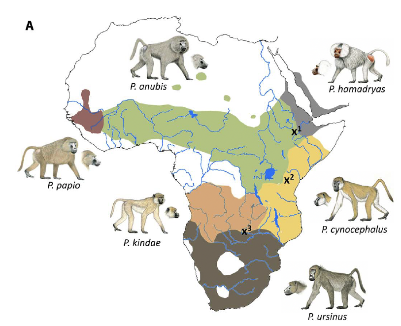

<!-- Italics are "grayed out" to make the example use stand out from dummy content. To make them black, just remove the last line in header_extra.tex: "\renewcommand\emph[1]{\oldemph{\color{gray}#1}}" -->

# Introduktion

Når man kigger på DNA-sekvenser fra to individer af samme art, kan man se forskelle steder i genomet, hvor det ene individ har en $A$ og det andet har en $G$. Disse forskelle er ikke tilfældige: de afspejler en lang historik af mutationer, der er akkumuleret siden de to individer sidst delte en fælles forfæder. Jo længere der er gået siden den fælles forfæder, jo flere forskelle er der som regel. Populationsstørrelse, migration, flaskehalse og populationsstruktur påvirker alle, hvornår og hvordan individer finder fælles forfæder baglæns i tid og dermed hvad vi observerer i nutidens DNA. Spørgsmålet er om man kan gå den anden vej: tage de sekvenser vi ser i dag og rekonstruere, hvad der skete for tusinder af generationer siden.

Det er det overordnede spørgsmål, dette speciale drejer sig om. Populationsgenetik er studiet af genetisk variation inden for og imellem populationer og de processer der former denne variation inkluderer genetisk drift, mutation, rekombination, selektion og variation i populationsstørrelse. Coalescent-teori udgør i denne sammenhæng en matematisk ramme for forståelsen af genetisk variation [@wakeley2009coalescent]. Coalescent-teorien, der blev formuleret af John Kingman i begyndelsen af 1980'erne, er en bagud-i-tid-beskrivelse af den fremadrettede evolutionære model, som Sewall Wright og Ronald Fisher udviklede tidligere i det tyvende århundrede. Mere præcist undersøger dette speciale, hvordan man kan bygge matematisk præcise modeller for den evolutionære proces og bruge dem til at estimere biologisk parametre som effektiv populationsstørrelse og migrationsrate. Der kombineres tre ting: coalescentteori formuleret som fase-type fordelinger, grafbaserede algoritmer implementeret i phasic og Bayesiansk inferens via Stein Variational Gradient Descent (SVGD). Modellerne testes systematisk på simulerede data i notebooks 01–06, inden de til sidst bruges på rigtige genomdata fra bavianer i notebook 07A og 07B.

## Standard coalescent

Udgangspunktet for al genealogisk tænkning er den enkle observation, at de individer der er til stede i en population på et givent tidspunkt, alle nedstammer fra fælles forfædre, hvis man går langt nok tilbage i tid. Hvis man har en stikprøve af $n$ DNA-sekvenser fra samme locus, har disse sekvenser et fælles stamtræ, en gengenealogi, som beskriver, hvilke sekvenser der er nærmest beslægtede, og hvornår de fandt fælles forfæder i fortiden. Gengenealogier er pr. natur uobserverbare og behandles som stokastiske variable i en statistisk sammenhæng. Det er præcis denne tilfældige karakter af genealogierne, der gør at coalescent-teorien beskriver evolutionære genealogier som tilfældige processer snarere end som forudbestemte forløb.

Et begreb i coalescent-teorien er *Most Recent Common Ancestor* (MRCA), som er den seneste fælles forfader for alle individer i stikprøven. Coalescent-teorien beskriver den tilfældige proces, hvor man følger de genetiske linjer baglæns i tid fra nutidens sekvenser tilbage til dette fælles ophav. I fylogeni er man ofte mest interesseret i selve træets struktur og hvad den fortæller om arternes evolutionære slægtskab. I populationsgenetik er man derimod også mere interesseret i, hvor langt tilbage i tid forskellige dele af genealogien ligger, da dette indeholder information om populationsprocesser som effektiv populationsstørrelse og migration. Mutationer fungerer som forbindelsen mellem genealogien og de genetiske data, vi observerer. Hvis en mutation opstår på en bestemt gren i genealogien, vil alle sekvenser, der nedstammer fra denne gren, bære mutationen. Dette giver anledning til polymorfiske steder i datasættet. Under den såkaldte infinite sites-model antager man, at mutationer er sjældne, at hvert sted i genomet kun muterer en gang i hele den evolutionære historie. Derfor kan hvert segregerende sted kobles direkte til en bestemt mutation på en gren i genealogien. Denne antagelse gør det muligt at forbinde de observerede sekvensforskelle direkte med den underliggende genealogi. Hvis man samtidig antager selektiv neutralitet, kan man behandle genealogiprocessen og mutationsprocessen uafhængigt af hinanden.
Det matematiske fundament for alle modellerne i dette speciale er Markov-processer. En stokastisk proces $\{X_t\}_{t \geq 0}$ hvor det næste skridt kun afhænger af den nuværende tilstand, ikke af hele historien bag den:
$$
P(X_{t+s} = j \mid X_u, \, u \leq t) = P(X_{t+s} = j \mid X_t).
$$

For coalescentens vedkommende er det præcis den egenskab, der gør teorien analytisk håndterbar. Når vi følger genealogiske linjer baglæns i tid, bestemmer det antal linjer der er til stede i øjeblikket, fuldstændigt hvilke hændelser der kan ske og med hvilken hastighed.

Det standard coalescent er en kontinuert-tid approksimation af den neutrale Wright-Fisher-model. I Wright-Fisher-modellen er antallet af kromosomer $2N$ fast i hver ikke-overlappende generation og hvert kromosom vælger sin forfader uniformt tilfældigt fra den foregående generation. Sandsynligheden for at to tilfældigt valgte kromosomer deler forfædre i et generationsskrift er $\frac{1}{2N}$. Kingman viste, at når man skalerer tid i enheder af $2N$ generationer, konvergerer Wright-Fisher-modellen mod en kontinuert-tids Markov-kæde i grænsen $N \to \infty$ [@wakeley2009coalescent]. I denne tidsskala er coalescent tiden for to linjer eksponentielt fordelt med rate $1$. For $k$ linjer er coalescent hastigheden $\binom{k}{2} = \frac{k(k-1)}{2}$ og ventetiden $T_k$ i tilstanden med $k$ linjer er eksponentielt fordelt:
$$
T_k \sim \mathrm{Exp}\!\left(\frac{k(k-1)}{2}\right), \qquad k = n, n-1, \ldots, 2.
$$

Disse ventetider er stokastisk uafhængige. Træhøjden $H = \sum_{k=2}^{n} T_k$ har forventning
$$
\mathbb{E}[H] = \sum_{k=2}^{n} \frac{2}{k(k-1)} = 2\left(1 - \frac{1}{n}\right)
$$

og varians 
$$
\mathrm{Var}[H] = \sum_{k=2}^{n} 4/[k^2(k-1)^2].
$$ 

Her ses det, at $\mathbb{E}[H]$ konvergerer hurtigt mod $2$ allerede for moderate stikprøvestørrelser hjælper det ikke meget at tilføje flere linjer for at præcisere MRCA-tidspunktet. Den totale grenelængde $L = \sum_{k=2}^{n} k\, T_k$ vokser derimod logaritmisk med $n$:
$$
\mathbb{E}[L] = \sum_{k=2}^{n} \frac{2}{k-1} = 2\sum_{j=1}^{n-1} \frac{1}{j}.
$$

Det er $L$, der er proportional med det samlede antal mutationer vi forventer at se, og som dermed bærer mest information om $\theta = 4N_e\mu$.

## Mutationer og site-frekvens-spektret (SFS)

Mutationsprocessen beskrives ved, at mutationer følger en Poisson-proces spredt over træets grene. Givet en grenlængde $t$ er antallet af mutationer Poisson-fordelt med parameter $\frac{\theta t}{2}$. Det totale antal segregerende sites er $S \mid L \sim \mathrm{Poisson}(\frac{\theta L}{2})$ og det forventede antal er
$$
\mathbb{E}[S] = \frac{\theta}{2} \cdot \mathbb{E}[L] = \theta \sum_{j=1}^{n-1} \frac{1}{j} = \theta\, a_n.
$$

Dette giver anledning til Wattersons estimator $\hat{\theta}_W = \frac{S}{a_n}$ med $a_n = \sum_{j=1}^{n-1} \frac{1}{j}$. En alternativ estimator er Tajimas $\pi$, baseret på det gennemsnitlige antal parvise sekvensforskelle. Tajimas $D$-statistik er forskellen $\pi - \hat{\theta}_W$ skaleret med dens standardafvigelse og bruges som en test for neutralitet.
Site-frekvens-spektret (SFS) er en central sammenfatning af genetisk variation en vektor $\xi = (\xi_1, \xi_2, \ldots, \xi_{n-1})$, hvor $\xi_i$ tæller antallet af segregerende sites, hvori mutation allellen optræder i præcis $i$ ud af de $n$ sekvenser. Det klassiske forventede SFS er
$$
\mathbb{E}[\xi_i] = \frac{\theta}{i}, \qquad i = 1, 2, \ldots, n-1,
$$

gyldigt under neutralitet og konstant populationsstørrelse [@hobolth2021]. SFS-elementerne er ikke Poisson-fordelte de er diskret fase-type fordelte, hvilket giver mulighed for at beregne hele fordelingen analytisk, inklusive varians og kovariansen mellem $\xi_i$ og $\xi_j$.



Figuren viser det forventede SFS for $n=4$, beregnet analytisk via phasic. Singletons dominerer som forventet: mutationer der kun optræder i én sekvens er de hyppigste, fordi der er mange korte terminale grene tidligt i coalescenten. Firetons er nul fordi den absorberende tilstand ikke tæller med som en aktiv linje.

## Fase-type fordelinger 

Det nyttige ved at formulere coalescent-processen som en absorptions-Markov-kæde er, at man dermed kan bruge et veludviklet matematisk værktøj til at beskrive sådanne processer, nemlig fase-type (PH) fordelinger. En fase-type fordeling beskriver absorptionstiden $\tau$ i en kontinuert-tids Markov-kæde (CTMC) med $p$ transiente tilstande og en absorberende tilstand [@BladtNielsen2017; @Hobolth2024]. Intensitetsmatricen er
$$
\Lambda = \begin{pmatrix} \mathbf{T} & \mathbf{t} \\ \mathbf{0} & 0 \end{pmatrix},
$$

hvor $\mathbf{T}$ er $p \times p$-sub-intensitetsmatricen og $\mathbf{t} = -\mathbf{T}\mathbf{e}$ er exit-raterne. Vi skriver $\tau \sim \mathrm{PH}(\alpha, \mathbf{T})$. Tæthedsfunktionen er
$$
f_\tau(s) = \alpha \, e^{\mathbf{T}s} \, \mathbf{t}, \qquad s \geq 0,
$$

middelværdien er $\mathbb{E}[\tau] = \alpha(-\mathbf{T})^{-1}\mathbf{e}$ og de højere momenter følger rekursionsformlen $\mathbb{E}[\tau^n] = n!\,\alpha(-\mathbf{T})^{-n}\mathbf{e}$. Matricen $\mathbf{U} = (-\mathbf{T})^{-1}$ kaldes Green-matricen dens $(i,j)$'te element er den forventede tid processen tilbringer i tilstand $j$ givet startpunkt $i$, de såkaldte sojourn-tider. Laplace-transformationen er $\mathcal{L}_\tau(u) = \alpha(u\mathbf{I} - \mathbf{T})^{-1}\mathbf{t}$.
Træhøjden $H$ er fase-type fordelt med $\alpha = (1, 0, \ldots, 0)$ og sub-intensitetsmatricen
$$
\mathbf{T} = \begin{pmatrix} -\lambda_n & \lambda_n & & \\ & -\lambda_{n-1} & \lambda_{n-1} & \\ & & \ddots & \\ & & & -\lambda_2 \end{pmatrix}, \qquad \lambda_k = \binom{k}{2}.
$$

I phasic bygges dette tilstandsrum automatisk. For $n = 4$ ser tilstandsrummet ud som i @fig-graf, hvor tilstanden $(s_1, s_2, s_3, s_4)$ angiver antallet af grene med henholdsvis $1, 2, 3$ og $4$ efterkommere.



Grafen illustrerer et vigtigt punkt: for $n=4$ findes der to mulige typer genealogiske træer. I det ene tilfælde coalescerer en af de resterende singletons med doubleten, hvorefter den sidste singleton også coalescerer med denne gruppe. Dette giver et såkaldt comb-træ, som opstår med sandsynlighed $\frac{2}{3}$. I det andet tilfælde coalescerer de to singletons først med hinanden og danner endnu en doubleton. Dette giver et fork-træ med sandsynlighed $\frac{1}{3}$. Blok-tælle-processen kan skelne mellem disse to situationer, fordi topologierne fører til forskellige mønstre i site frequency spectrum (SFS). Mutationer, der opstår på grenene i de to trætyper, vil nemlig fordeles forskelligt blandt sekvenserne, og derfor indeholder SFS information om den underliggende genealogiske struktur.

## Reward-transformationer 

Fase-type-klassen er lukket under reward-transformationer. Definition af en rewardvektor er $\mathbf{r} = (r(1), \ldots, r(p))$ med ikke-negative indgange og den akkumulerede reward er $\tilde{\tau} = \int_0^\tau r(X_t)\,dt$. Hvis alle rewards er positive, er $\tilde{\tau}$ igen fase-type fordelt: $\tilde{\tau} \sim \mathrm{PH}(\alpha, \Delta(\mathbf{r})^{-1}\mathbf{T})$ [@BladtNielsen2017]. Den totale grenelængde $L$ er netop en reward-transformeret version af træhøjden med $\mathbf{r}_L = (n, n-1, \ldots, 2)$.
For individuelle grentyper kræves en anden tilgang via blok-tælle-processen, der sporer antallet af grene med $1, 2, \ldots, n-1$ efterkommere. For $n = 4$ er tilstandsrummet de fem partitioner af 4, og sub-intensitetsmatricen er
$$
\tilde{\mathbf{T}}_H = \begin{pmatrix} -6 & 6 & 0 & 0 \\ 0 & -3 & 2 & 1 \\ 0 & 0 & -1 & 0 \\ 0 & 0 & 0 & -1 \end{pmatrix}.
$$

Rewardvektorerne er $\mathbf{r}_1 = (4,2,1,0)$ for singletons, $\mathbf{r}_2 = (0,1,0,2)$ for doubletons og $\mathbf{r}_3 = (0,0,1,0)$ for tripletons giver direkte fase-type repræsentationer af de respektive grenelængder. Tripleton-fordelingen er defekt: fork-træet indeholder ingen tripletons og opstår med sandsynlighed $\frac{1}{3}$ så begyndelsesfordelingen $\alpha_3 = \frac{2}{3}$ kun summerer til $\frac{2}{3}$.

Tilstandsrummet for blok-tælle-processen vokser hurtigt med $n$ givet ved partitionsfunktionen $p(n)$: for $n = 20$ er $p(20) = 627$, for $n = 50$ er $p(50) = 204.226$. Matricerne er dog ekstremt sparse (over $99,99 \%$ nulindgange ved $n = 50$), hvilket muliggør de grafbaserede algoritmer i ptdalgorithms [@phasic] som phasic bygger på. Distributionerne for grenlængder og tilsvarende mutationstal for $n = 5$ ses i @fig-sfs.

## Multivariat fase-type fordeling

Den multivariate fase-type (MPH) fordeling udvider den almindelige fase-type fordeling til flere variable samtidig. I stedet for kun at beskrive en absorptionstid beskriver MPH-fordelingen fællesfordelingen af $m$ forskellige størrelser, som alle afhænger af den samme underliggende Markov-proces.
Til hver størrelse knyttes en belønningsfunktion og disse samles i belønningsmatricen $\mathbf{R}$. Den akkumulerede belønningsvektor skrives som $\mathbf{Y} = (Y_1, \ldots, Y_m) \sim \mathrm{MPH}(\alpha, \mathbf{T}, \mathbf{R})$  hvor hver komponent repræsenterer den samlede mængde reward, der er opsamlet gennem processen. I populationsgenetik kan sådanne rewards for eksempel bruges til at beskrive forskellige grenlængder i genealogien eller antallet af mutationer i bestemte frekvensklasser. Dermed gør MPH-fordelingen det muligt at analysere flere relaterede størrelser samtidigt og undersøge deres afhængighedsstruktur. Det blandede moment er
$$
\mathbb{E}[Y_1 Y_2] = \alpha \mathbf{U} \Delta(\mathbf{r}_1) \mathbf{U} \Delta(\mathbf{r}_2) \mathbf{e} + \alpha \mathbf{U} \Delta(\mathbf{r}_2) \mathbf{U} \Delta(\mathbf{r}_1) \mathbf{e},
$$

og kovariansen følger direkte som $\mathrm{Cov}(Y_1, Y_2) = \mathbb{E}[Y_1 Y_2] - \mathbb{E}[Y_1]\mathbb{E}[Y_2]$. For $n = 3$ er fællesfordelingen af træhøjde $H$, total grenelængde $L$, ydre grenelængde $E$ og indre grenelængde $I$ multivariat fase-type fordelt:
$$(H, L, E, I) \sim \mathrm{MPH}\!\left(\mathbf{e}_1, \mathbf{T}, \mathbf{R}\right), \qquad \mathbf{T} = \begin{pmatrix} -3 & 3 \\ 0 & -1 \end{pmatrix}, \quad \mathbf{R} = \begin{pmatrix} 1 & 3 & 3 & 0 \\ 1 & 2 & 1 & 1 \end{pmatrix}.$$

MPH-rammen giver adgang til kovariansmatricen for alle centrale trætilstørrelser for vilkårlige stikprøvestørrelser.

## Den diskrete fase-type fordeling og segregerende sites

Foruden de kontinuerte fase-type fordelinger spiller diskrete fase-type (DPH) fordelinger en vigtig rolle. Antallet af segregerende sites $S$ er DPH-fordelt. Fra tilstand $k$ ($k$ linjer til stede) er sandsynligheden for at den næste hændelse er en mutation frem for en coalescent $p_k = \frac{\theta}{\theta + k - 1}$. Antallet af mutationer inden næste coalescent er geometrisk fordelt med parameter $p_k$. En fremgangsmåde er, at hvis $S \mid L \sim \mathrm{Poisson}(\theta L)$ og $L \sim \mathrm{PH}(\alpha_L, \mathbf{T}_L)$, da er
$$
S + 1 \sim \mathrm{DPH}(\pi, \mathbf{P}), \qquad \mathbf{P} = \left(\mathbf{I} - \frac{2}{\theta}\mathbf{T}_L\right)^{-1}, \quad \pi = \alpha_L.
$$

DPH-klassen er ligeledes lukket under heltals rewards-transformationer og alle SFS-elementer $\xi_i$ er DPH-fordelte.

## Populationsstruktur: To-ø-modellen og IM-modellen

Kingmans coalescent antager en homogen population, men det er sjældent biologisk realistisk. I to-ø-modellen har man to populationer forbundet af migration. Det ændrer dynamikken markant: to linjer i samme population coalescerer direkte, mens to linjer i forskellige populationer først skal migrere til samme population. Den forventede TMRCA er nu en funktion af populationsstørrelserne og migrationsraten og tilstandsrummet udvides til at holde styr på, hvilken population hver linje befinder sig i. Et centralt spørgsmål er identifiability: kan man faktisk skelne populationsstørrelse og migrationsrate fra hinanden givet de data man typisk har? Med et locus er information begrænset, men to-locus-data giver ekstra information via kovariansen i TMRCA på tværs af loci.

IM-modellen (isolation-with-migration) tilføjer et split-tidspunkt $t_s$: to populationer opstod fra en fælles forfæder-population for $t_s$ generationer siden, og der har siden været migration. Teknisk set er IM-modellen tidsinhomogen overgangsraterne skifter diskontinuerligt ved $t_s$. phasic håndterer dette ved at beregne coalescenttidsfordelingen epokevis og sammensætte dem analytisk [@phasic]. Identifiability af parametrene $(N_1, N_2, M, t_s)$ er et spørgsmål der behandles systematisk i notebook 06.



Figuren viser den forventede TMRCA for IM-modellen som funktion af split-tidspunktet $t_s$. IM-modellen giver konsekvent højere $\mathbb{E}[\text{TMRCA}]$ end to-ø-modellen uden split: jo kortere split-tid, desto mere tid tilbringer linjerne adskilt i to populationer med begrænset mulighed for at koalescere, og jo længere de dermed venter til de mødes i den ancestrale population. Denne egenskab er biologisk vigtig for bavian-analysen, da split-tidspunktet for den nordlige og sydlige kladde estimeres til at være over 1 million år siden.

## Bayesiansk inferens med SVGD

At have en model er en ting; at estimere dens parametre fra data er noget andet. I et Bayesiansk setup søger vi posterioren
$$
\pi(\theta \mid \mathbf{x}) \propto p(\mathbf{x} \mid \theta)\, \pi_0(\theta),
$$

dvs. fordelingen over parametre givet de observerede data, vejede med prioren. Bayesiansk inferens er attraktivt fordi posterioren direkte kvantificerer usikkerheden man får en hel fordeling, ikke bare et punkt-estimat. Den praktiske udfordring er, at posterioren ikke har en lukket form for coalescentmodeller. I dette speciale bruges Stein Variational Gradient Descent (SVGD) [@liu2016svgd] en partikkelbaseret variationel metode, der repræsenterer posterioren ved $n_p$ partikler $\theta_i$, der opdateres iterativt:
$$
\theta_i \leftarrow \theta_i + \epsilon\, \hat{\phi}^*(\theta_i), \qquad \hat{\phi}^*(\theta) = \frac{1}{n_p}\sum_{j=1}^{n_p}\Bigl[k(\theta_j, \theta)\,\nabla_{\theta_j}\log\pi(\theta_j\mid\mathbf{x}) + \nabla_{\theta_j}k(\theta_j, \theta)\Bigr].
$$

Her er $k(\cdot,\cdot)$ en RBF-kerne. Det første led driver partiklerne mod høj-posterior-tæthed via log-posterior-gradienten; det andet led virker repulsivt og forhindrer kollaps til et punkt. En god posterior ser bred og flad ud med partikler der dækker parameterrummet; en peaked posterior er tegn på numerisk kollaps eller forkert læringsrate.



Figuren illustrerer forskellen på de to posteriorformer direkte. En peaked posterior opstår når SVGD ikke konvergerer korrekt — typisk fordi læringsraten er for lav eller prioren er forkert — og er et signal om at posterior-mean og -std ikke kan bruges til biologisk fortolkning. Den brede, flade posterior til højre afspejler reel statistisk usikkerhed og er hvad en velfungerende SVGD-kørsel producerer.

## Bavianer som modelsystem

Modellerne i notebooks 01–06 valideres udelukkende på simulerede data med kendte sande parametre. Formålet er til sidst at anvende dem på rigtige biologiske data, og til det bruges bavianer slægten *Papio* som modelsystem.

*Papio* er en gruppe af nært beslægtede primater, som lever i store dele af Afrika [@kopp2023]. Slægten består af seks nulevende arter:
 
 * Olive bavian (*Papio anubis*), 
 * Yellow bavian (*Papio cynocephalus*), 
 * Chacma bavian (*Papio ursinus*), 
 * Guinea bavian (*Papio papio*), 
 * Hamadryas bavain (*Papio hamadryas*)
 * Kinda bavain (*Papio kindae*). 

Disse seks arter adskilles i to klader: en nordlig kladde bestående af *P. hamadryas*, *P. anubis* og *P. papio* og en sydlig kladde bestående af *P. kindae*, *P. cynocephalus* og *P. ursinus* som divergerede fra en fælles stamfader for mere end 1 million år siden [@rogers2019; @vilgalys2022].

::: {#fig-Kort }
{width="50%"}
*Papio* baboon arter. Nuværende udbredelse af hver bavianart samt placeringen af ​​tre veldokumenterede aktive hybridzoner er også vist. x1: hybridzone mellem *P. hamadryas* og *P. anubis*, x2: hybridzone mellem *P. cynocephalus* og *P. anubis*, x3: hybridzone mellem *P. kindae* og *P. ursinus*. Billede fra Rogers et al., 2019. 
:::

På trods af disse geografiske adskillelser kan flere arter krydse sig i naturen og producere fertile hybrider [@sorensen2023; @jordan2018papio]. I flere kontaktzoner er der veldokumenterede hybridzoner med løbende genflow. @rogers2019 analyserede helgenomsekvenseringsdata for alle seks arter og dokumenterede multiple episoder af admixture og introgression, herunder genetisk bidrag fra en uidentificeret ancestral linje til *P. papio* og aktiv nuklear DNA-swamping ved hybridzonen mellem *P. anubis* og *P. cynocephalus*. Som det fremgår af @fig-Kort, overlapper arterne geografisk ved en række hybridzoner hvor aktiv genudveksling er dokumenteret [@sorensen2023]. @sorensen2023 udvidede denne analyse til 225 vilde bavianer fra 19 lokaliteter og dokumenterede admixture mellem *P. anubis* og *P. cynocephalus* i det sydlige Tanzania, en tæt genealogisk forbindelse mellem Kinda-bavianer og yellow-bavianerne, samt tegn på tre-vejs admixture i yellow-bavianeren, et mønster som ikke tidligere er observeret i denne slægt.
Bavianernes evolutionære historie startede omkring samtidigt med menneskets slægten *Homo* evolution altså omkring 2 milioner år siden [@rogers2019]. I modsætning til mennesker, hvor kun en art eksisterer i dag, har bavianer bevaret flere linjer. PSMC-analyser viser, at alle seks populationer har oplevet fald i effektiv populationsstørrelse de seneste 100.000 år, sandsynligvis i forbindelse med klimatiske ændringer [@rogers2019]. Det gør dem særligt velegnede som modelsystem til at studere både divergens og hybridisering i naturlige populationer. I dette speciale anvendes estimater fra @sorensen2023, herunder en mutationsrate på $\mu = 0.9 \times 10^{-8}$ per site per generation og en generationstid på $g = 11$ år, til at omsætte modelparametre til absolutte størrelser.

I dette speciale, undersøges der derfor følgende: Kan phasic-implementeringen af Kingmans coalescent, to-ø-modellen og IM-modellen verificeres analytisk og giver modellerne korrekte momenter, tæthedsfunktioner og SFS? Er SVGD-inferens kalibreret korrekt dækker $95 \%$-posteriori-intervallet den sande parameterværdi i ca. $95 \%$ af gentagelserne? Hvornår er parametrene for to-ø- og IM-modellen identifiability i praksis? Hvad kan modellerne fortælle os om den evolutionære historie for *Papio*-arterne?

# Metode

Analyserne er bygget op omkring otte Jupyter notebooks, som trin for trin arbejder sig fra de mest grundlæggende dele af modellerne til den endelige analyse af rigtige genomdata fra bavianer.  NB01–NB06, der arbejder sig fra grundlæggende modelbygning og verificering frem til Bayesiansk inferens og dens begrænsninger. Hele forløbet opererer på simulerede data med kendte sande parametre, og formålet er dobbelt: at bekræfte at implementeringen i phasic er matematisk korrekt, og at kortlægge hvilke kombinationer af model, data og inferensindstillinger der faktisk fungerer og under hvilke betingelser de fejler. Først når disse spørgsmål er besvaret, giver det mening at anvende metoderne på rigtige genomdata fra bavianerne. Notebooks 07A og 07B tester modellerne af på bavianernes genomdata. I @tbl-notebooks gives et overblik over de otte notebooks og deres formål.

| Notebook | Fokus | Hvad der undersøges |
|:---|:---|:---|
| 01 | Coalescent som fase-type fordeling | Verificering, tilstandsrum, SFS |
| 02 | SVGD-inferens: grundlæggende egenskaber | Optimizer, prior, kalibrering |
| 03 | To-ø modellen | Identifiability, Confounding, pairwise plots |
| 04 | Numerisk præcision og skalering | Beregningstid, tilstandsrumsudvækst |
| 05 | Tidsinhomogen coalescent og IM-modellen | Flaskehalse, split-tidspunkt, epocher |
| 06 | Joint sandsynligheder og diskrete observationer | To-locus, deficit, $\mu$-sensitivitet |
| 07A | Databehandling af bavian-genomet | Filtrering, sampling, SFS fra data |
| 07B | Inferens på bavianpopulationer | $N_e$, migration og split for *Papio spp.* |

: Oversigt over de otte notebooks og deres formål. {#tbl-notebooks}

Alle analyser er implementeret i Python via phasic-biblioteket [@phasic] og specialet er skrevet i Quarto med direkte embed af figurer og tabeller fra notebooks så alt er reproducerbart. Nedenfor beskrives fremgangsmåden for hvert trin i den rækkefølge, det er udført.

En central og gennemgående praktisk udfordring er skalering. Phasic måler tid i enheder af $2N_e$ generationer den klassiske Kingman-skalering mens msprime, der bruges til uafhængig simulering, måler tid i generationer og bruger et eksplicit populationsstørrelses-argument. De to systemer er ikke direkte kompatible, og en forkert skalering vil give en tilsyneladende fejl i modellen, selvom modellen er rigtig. Alle msprime-sammenligninger i dette speciale bruger derfor en fast konvention: med ploidy=1 sættes $N_e^{\text{msprime}} = \frac{1}{\theta}$, og de simulerede tider i generationer konverteres til skalerede enheder ved at dividere med $N_e^{\text{msprime}}$. Med ploidy=2 sættes $N_e^{\text{msprime}} = \frac{1}{2\theta}$ og den tilsvarende divisor er $2N_e^{\text{msprime}}$. Disse konventioner følges ensartet gennem alle seks notebooks og sikrer at analytiske og simulerede fordelinger er direkte sammenlignelige.

## Coalescent som fase-type fordeling

Det første skridt i analysen er at opbygge Kingmans coalescent i phasic og verificere at implementeringen er korrekt. Coalescent-modellen beskrives via en callback-funktion, der for en given tilstandsvektor beskriver hvilke overgange der er mulige og med hvilke rater. Tilstandsvektoren $(s_1, s_2, \ldots, s_n)$ tæller i dette speciale antallet af genealogiske linjer med henholdsvis $1, 2, \ldots, n$ efterkommere i stikprøven. For $n=4$ resulterer dette i seks transiente tilstande og én absorberende tilstand. Phasic konstruerer hele tilstandsrummet automatisk ved at traversere alle mulige overgange fra starttilstanden $(4,0,0,0)$, hvor alle fire linjer er singletons.

Tilstandsrumsgraftilstandsrum (@fig-graf) illustrerer et vigtigt strukturelt punkt: for $n=4$ er der to og kun to mulige genealogiske topologier. Enten koalescerer to singletons med hinanden og skaber en doubleton, der derefter koalescerer med den resterende singleton — dette er comb-træet og opstår med sandsynlighed to tredjedele. Eller en af singletons koalescerer direkte med den eksisterende doubleton, og det resterende singleton koalescerer til sidst — dette er fork-træet og opstår med en tredjedel sandsynlighed. Blok-tælleprocessen er netop i stand til at skelne disse to topologier, fordi de producerer forskellige mønstre i site-frekvens-spektret. Dette er kernen i, hvorfor phasic-tilgangen er informativ: i stedet for at integrere over alle mulige genealogier beregnes sandsynligheder analytisk over de eksplicit repræsenterede tilstande.

Kanternes rater er parametriseret via liste-syntaksen [rate], som gør grafen opdaterbar med graph.update_weights(theta) og dermed velegnet til Bayesiansk inferens. Denne parametriserede syntaks er væsentlig: en graf med skalare kanter kan ikke opdateres og egner sig kun til analytisk beregning med en fast parameterværdi. Verificeringen af implementeringen sker i to uafhængige trin. Det første trin sammenligner phasics beregnede forventning $E[H]$ med den analytisk kendte løsning for $n=2$ til $n=8$.



Den numeriske afvigelse er nul for alle prøvestørrelser, hvilket viser at den grafbaserede Gauss-eliminering i phasic giver eksakte resultater. Det andet verifikationstrin sammenligner den analytiske fase-type PDF direkte med TMRCA-fordelinger simuleret fra msprime, som er en fuldstændig uafhængig implementation af coalescent-processen.



At begge verifikationstrin lykkes er en nødvendig forudsætning for resten af analysen. Hvis modellen i phasic og msprime gav forskellige fordelinger, ville det være uklart om fejlen lå i phasic-implementeringen, i skalerings-konventionen, eller et tredje sted. Overensstemmelse eliminerer disse fejlkilder systematisk.

### Site-frekvens-spektret og kovariansstruktur

SFS beregnes via reward-transformationer. For at beregne den forventede grenlængde for frekvensklasse $i$ defineres en rewardvektor der tildeler vægt 1 til tilstande der indeholder linjer med præcis $i$ efterkommere og 0 til alle andre tilstande. Phasic beregner derefter summen af den tid processen tilbringer i disse tilstande, vægtede med rewardvektoren @fig-sfs. Det centrale resultat er, at alle disse beregninger sker analytisk der er ingen Monte Carlo-usikkerhed, og beregningstiden er uafhængig af parametrenes numeriske værdier.
Et aspekt ved SFS der er vigtigt for inferens er kovariansstrukturen. Singleton-grenlængde og doubleton-grenlængde er ikke uafhængige: de konkurrerer om den samme genealogiske tid i de tidlige coalescentfaser. Denne negative kovarians måles analytisk via den multivariate fase-type ramme.



Den negative kovarians på $-0.222$ er ikke lille i relation til variansen: korrelationskoefficienten er omkring $-0.4$. En inferens-procedure der antager SFS-elementerne er uafhængige, som Poisson-approksimationen gør, undervurderer systematisk usikkerheden. Den fase-type ramme håndterer dette korrekt ved at beregne den eksakte fællesfordeling.

### Prøvestørrelse og information

Et naturligt spørgsmål er, hvor stor en stikprøve $n$ der er nødvendig. Her viser analysen et klart billede:



Den forventede træhøjde $E[H]$ aftager hurtigt i informationsudbytte: fra $n=2$ til $n=4$ er der en markant forbedring, men fra $n=6$ er det næsten nytteløst at tilføje flere linjer til at præcisere MRCA-tidspunktet. Det er den totale grenlængde $E[L]$, der vokser logaritmisk og bærer informationen om mutationsparameteren $\theta$. For prøvestørrelses-valget i de efterfølgende notebooks er $n=4$ valgt som kompromis: tilstandsrummet er håndterbart, begge genealogiske topologier for $n=4$ er repræsenteret, og der er tilstrækkelig variation i SFS-mønstret til at inferens er meningsfuld.

## SVGD-inferens: kalibrering og forudsætninger

Den Bayesianske inferens i dette speciale udføres med SVGD, der repræsenterer posterioren som en sværm af partikler. Partiklerne opdateres iterativt ved at kombinere gradientinformation fra log-posterioren med en frastødende kernefunktion, der forhindrer partiklerne i at kollapse til et enkelt punkt. Det centrale diagnostiske mål er posteriorens form: en bred, flad posterior indikerer at SVGD har konvergeret korrekt og at usikkerheden er repræsenteret troværdigt, mens en peaked posterior — hvor alle partikler klumper sig ved ét punkt — indikerer numerisk kollaps. Denne forskel er vigtig nok til at fortjene en direkte illustration.



Et peaked output er ikke blot en antalsmæssig unøjagtighed: det er et signal om at SVGD-optimeringen er fejlet, og at posterior-mean og posterior-std ikke kan bruges til biologisk fortolkning. Årsagerne til peaked posterior er som regel enten en for lav læringsrate, en for stærk forkert prior, eller en kombination af begge. Alle tre situationer testes systematisk.

### Prior-valg og prior-dominans

Prioren er den distribution man starter med, inden data bidrager. I en Bayesiansk analyse vil en stærk prior dominere ved små datasæt og gradvist vige for data, efterhånden som stikprøvestørrelsen vokser. Spørgsmålet er, hvor hurtigt denne overgang sker, og hvad der sker hvis prioren er forkert.



De fire priors er valgt for at dække realistiske situationer: den vage prior repræsenterer minimal forudgående viden, den korrekte prior repræsenterer en situation hvor man har en god tommelfingerregel om parameterværdien, den forkerte prior repræsenterer en systematisk misforståelse af parameterskalaen, og HalfCauchy er en standard positiv-støttet prior der bruges når parameteren ikke kan være negativ.



Den forkerte prior giver tydelig systematisk bias ved små stikprøvestørrelser. Ved $n=100$ estimerer SVGD med forkert prior parameterværdier langt fra sandhed — ikke fordi modellen er forkert, men fordi prioren trækker partiklerne i den forkerte retning. Denne bias forsvinder ved tilstrækkeligt store datasæt, men for bavian-analysen, hvor hvert locus giver én observation, er det nødvendigt at have en rimelig prior.
Til bavian-realistiske parameterværdier, det vil sige $\theta \in \{3, 7, 15, 20\}$, viser den systematiske sammenligning at DataPrior — en prior der estimeres direkte fra data via method-of-moments — konsekvent giver lavest bias.



Konklusionen er klar: for den biologiske analyse i NB07 anvendes DataPrior som standardvalg. GaussPrior med brede grænser er for ustabil ved de høje theta-værdier der forekommer i bavian-populationer.

### Læringsrate og konvergens

En SVGD-kørsel styres primært af læringsraten, der bestemmer hvor store skridt partiklerne tager i hvert trin. For lav læringsrate og partiklerne knapt bevæger sig og posterioren kollapser til et peak nær startpunktet. For høj læringsrate og partiklerne overshooder og oscillerer. Det optimale er en læringsrate der starter høj og falder eksponentielt.



Adam-optimizeren adapterer læringsraten individuelt per parameter og per partikel og viser sig at være den mest robuste strategi. Særligt ved bavian-realistiske theta-værdier, der spænder over mere end en størrelsesorden, er det en fordel at læringsraten skaleres per parameter:



Coverage-analysen viser, at SVGD med korrekt prior er velkalibreret ved små stikprøvestørrelser men har en tendens til at undervurdere usikkerheden ved store stikprøver. Dette er et kendt fænomen i partikkelbaserede variationelle metoder og skyldes at partiklerne ved høj likelihood konvergerer tæt, men den sande posterior er smallere end det kernebåndbredde SVGD bruger.

### Grid-søgning over konfigurationer

Den praktiske kalibrering af SVGD til bavian-analysen kræver at vælge antal partikler og antal iterationer. En grid-søgning over kombinationer med Adam(0.1) identificerer det optimale kompromis:



Konklusionen fra grid-søgningen er at 20 til 60 partikler og 300 iterationer er det optimale punkt på afvejningen mellem præcision og beregningsomkostning. For enkelt-parameter-modellen er 20 partikler tilstrækkeligt, men for to-parameter-modellen i NB03 anbefales 60 partikler for at dække det bivariate parameterrum tilstrækkeligt.
Det afsluttende modelfit-tjek er et posterior predictive check, der vurderer om modellen med de estimerede parametre faktisk kan reproducere de observerede data:



## To-ø modellen: identifiability og migration

To-ø modellen udvider Kingmans coalescent til to populationer forbundet af migration. Den centrale biologiske motivation er, at bavian-populationerne ikke er panmiktiske: de er geografisk adskilt med begrænset genflow mellem artsgrænserne. To-ø modellen er den enkleste ramme der kan fange dette mønster.
Modellen implementeres med en StateIndexer der sporer tre egenskaber per genealogisk linje: antallet af efterkommere i population 1, antallet af efterkommere i population 2, og hvilken population linjen aktuelt befinder sig i. Tilstandsrummet for $n=2$ er markant mere komplekst end for Kingmans coalescent:



En afgørende egenskab ved to-ø modellen er at den er symmetrisk i udgangspunktet: migrationsraten er den samme fra pop1 til pop2 og omvendt. Denne antagelse er statistisk nødvendig ved $n=2$, som det belyses nedenfor.
Modellen valideres mod msprime med `ploidy=2`. Her er $N_e = 1/(2\theta_0)$ populationsstørrelsen i diploid enheder, og migrationsraten per generation er $m = \theta_1 \cdot \theta_0$. De simulerede tider konverteres til skalerede enheder ved at dividere med $2N_e$:





### Identifiability og konfundering

Det centrale metodiske spørgsmål for to-ø modellen er identifiability: kan man faktisk skelne koalescensraten og migrationsraten fra hinanden givet de data der typisk er tilgængelige? Problemet er at høj migration og høj koalescensrate begge kan give korte TMRCA-tider. Pairwise posterior-plots over tre migrationsregimer illustrerer dette:



Den negative korrelation i den bivariate posterior ved lav migration er det statistiske udtryk for konfunderingen: data er konsistente med mange kombinationer af høj koalescensrate/lav migration og lav koalescensrate/høj migration. Den numeriske konsekvens er stor posterior-std for migrationsraten:



Årsagen til at høj migration er svær at identificere fremgår af den analytiske kurve over $E[\text{TMRCA}]$ som funktion af migrationsraten:



Den ikke-monotone kurve forklarer den statistiske vanskelighed: ved høj migration ser TMRCA-fordelingen ud som under panmiksi, og data kan ikke skelne de to situationer. Det er kun i det mellemliggende interval at migration giver et klart fingeraftryk i data.

### Method of Moments som alternativ

Method of Moments er en hurtigere, ikke-Bayesiansk estimationsmetode der matcher empiriske momenter med modelmomenternes analytiske udtryk. Den sammenligning der gøres med SVGD er instruktiv:





Konklusionen er at MoM kan bruges som hurtig screeningsmetode eller som udgangspunkt for priorkonstruktion i SVGD, men at det ikke er tilstrækkeligt til den endelige biologi-fortolkning for bavian-data.

### Asymmetrisk migration

I biologisk realistiske situationer er migration sjældent symmetrisk. Spørgsmålet er om data indeholder nok information til at identificere to separate migrationsrater. Med $n=2$ er svaret klart negativt — de to rater er stærkt konfunderede og posterioren er bred i begge dimensioner. Med $n=4$ og 5000 observationer forbedres situationen markant:



At identificere asymmetrisk migration kræver altså en kombination af tilstrækkelig prøvestørrelse og mange observationer. I bavian-analysen vil dette stille krav til datamængden.

### Prior-valg til migrationsmodeller

Valget af prior-fordeling er særlig vigtig for migrationsrater, der er positiv-støttede og som kan spænde over mange størrelsesordener. GaussPrior tillader negative værdier og trækker posterior mod nul ved lave estimater, mens HalfCauchy er positiv-støttet og har tunge haler der tillader større parameterværdier:



HalfCauchyPrior anbefales til migrationsparametre i den biologiske analyse.

## Numerisk præcision og beregningsskalering

Inden de beregningstunge analyser med migration og tidsinhomogenitet undersøges de numeriske forudsætninger systematisk. Tre spørgsmål er centrale: er 64-bit dobbelt-præcision tilstrækkeligt, eller er højere præcision nødvendig? Hvor hurtigt vokser beregningsomkostningerne med prøvestørrelse? Og hvad er det optimale antal partikler og iterationer for de konkrete bavian-parametre?



Standard 64-bit floating-point er tilstrækkeligt for samtlige parametre og prøvestørrelser brugt i dette speciale. Dette er ikke trivielt: Gauss-eliminering på phase-type-grafer involverer multiplikation og division af tal der potentielt kan variere over mange størrelsesordener, og numeriske fejl kan akkumulere.



Tilstandsrummet vokser med partitionsfunktionen $p(n)$: fra 3 tilstande ved $n=2$ til 627 tilstande ved $n=20$. Men de tilhørende matricer er ekstremt sparse — over $99\%$ nulindgange — og phasics grafbaserede algoritmer udnytter denne sparsilhed. Det er præcis derfor at $n=8$ er håndterbart i praksis selvom $p(8)=22$.



Grid-søgningen over partikler og iterationer for to-ø modellen med bavian-baseline parametre fastlægger den specifikke konfiguration der bruges i NB07:



## Tidsinhomogen coalescent og IM-modellen

Den biologiske virkelighed for bavianerne er ikke en population med konstant størrelse: der er dokumenterede fald i effektiv populationsstørrelse de seneste 100.000 år, der er et split-tidspunkt for den nordlige og sydlige kladde for over 1 million år siden, og der har siden da været migration over artsgrænser. Alle disse fænomener kræver en tidsinhomogen coalescent, hvor raterne skifter over tid.
En flaskehals modelleres som en periode med reduceret $N_e$ i et bestemt tidsinterval. Den analytiske undersøgelse af flaskehalsens effekt på TMRCA-fordelingen viser en vigtig asymmetri:



Den moderate flaskehals er overraskende svær at detektere i TMRCA alene. Det er SFS-formen der giver det klarere signal:



Tidspunktet for flaskehalsen afgør hvilke dele af SFS der påvirkes. En tidlig flaskehals trykker alle linjer gennem et smalt punkt og øger grenlængderne generelt. En sen flaskehals påvirker primært de terminale grene, der svarer til singletons. Dette er biologisk relevant fordi PSMC-analyser viser at bavianernes populationsfald er relativt recent, og man derfor forventer et signal primært i singleton-frekvensklassen.

Fem demografiske scenarier sammenlignes analytisk for at kalibrere intuition om hvad der kan adskilles i data:



Ekspansion og kontraktion er de to yderpunkter der er lettest at adskille. Flaskehals+recovery er beregningsmæssigt og biologisk det mest interessante scenarie for bavianerne, da det svarer til en situation med historisk stor population efterfulgt af et fald.

### IM-modellen som tidsinhomogen coalescent

IM-modellen kombinerer to-ø dynamik i det recent interval med en panmiktisk ancestral population for perioden før split-tidspunktet. Implementeringen i phasic sker via add_epoch, der tilføjer en epoke-grænse og beregner overgangssandsynligheder analytisk. Den forventede TMRCA som funktion af split-tidspunktet illustrerer modellens adfærd:



IM-modellen er tidsinhomogen i den forstand at coalescent-raterne skifter diskontinuerligt ved $t_s$: fra et to-populations-system med migration til én sammenhængende ancestral population. Phasic håndterer dette korrekt ved at beregne stop-sandsynlighederne i den moderne periode og bruge dem som startbetingelse for den ancestrale periode.

For bavian-analysen sættes split-tidspunktet ved ca. 1 million år siden baseret på Rogers et al. (2019), og koalescensraten og migrationsraten estimeres via SVGD fra genomdata.

## Joint sandsynlighedsbaseret inferens

Den naturlige udvidelse af TMRCA-baseret inferens er at bruge den eksakte fællesfordeling for SFS-elementer. I stedet for kun at observere hvornår to linjer finder en fælles forfader, observerer man det præcise antal mutationer i hvert frekvensklasse — singletons, doubletons og tripletons — simultant. Dette kræver en udvidet graf, joint probability-grafen, der sporer kombinationer af mutationsantal for hvert frekvensklasse.

### Deficit og grænsevalg

Joint probability-grafen kan ikke spore et ubegrænset antal mutationer: grafen ville blive uendelig stor. I stedet sættes en øvre grænse, reward_limit, for det maksimale antal mutationer der spores i hver frekvensklasse. Observationer der overskrider denne grænse ignoreres — dette er deficitet, altså den andel af sandsynlighedsmassen der ikke modelleres.





Valget af $\mu = 1.0$ og reward_limit = 3 er et kompromis: et lavere limit ville give større deficit og dermed en dårligere likelihood-approksimation, mens et højere limit ville give en beregningstung graf med et meget stort tilstandsrum, der kan føre til kernel-crash.

### Sammenligning med TMRCA-inferens

Det afgørende spørgsmål er hvornår joint probability-inferens er bedre end TMRCA-inferens. Sammenligningen viser et klart mønster:





For bavian-populationer med lav theta — typisk dem med lille historisk populationsstørrelse — er joint probability-inferens at foretrække. For populationer med høj theta er TMRCA-inferens mere præcis, formentlig fordi den effektivt bruger al information i fordelingens form frem for blot mutationsantallet.

### Sensitivitet over for mutationsraten

En vigtig praktisk advarsel fra joint probability-analysen er sensitiviteten over for den specificerede mutationsrate:



Dette resultat er direkte relevant for bavian-analysen. Mutationsraten $\mu = 0.9 \times 10^{-8}$ per site per generation (Sørensen et al. 2023) er ikke et præcist tal — den er baseret på sammenligning med andre primater og indebærer en usikkerhed. En systematisk fejl i $\mu$ vil give en proportional fejl i $\hat{\theta}$ og dermed i den estimerede effektive populationsstørrelse. Det anbefales at rapportere estimater med og uden varierende $\mu$ som en sensitivitetsanalyse i NB07.

# Resultater

Resultaterne er organiseret i samme rækkefølge som arbejdet er udført: først verificering og forståelse af modellerne på simulerede data, derefter SVGD-inferensens egenskaber, dernæst to-ø- og IM-modellernes identifiability  og til sidst hvad man finder når man kører modellerne på rigtige bavian-genomdata.

## Coalescent verificeres analytisk

Det første man vil vide, inden man stoler på et bibliotek, er om det regner rigtigt. Verificeringstabellen nedenfor sammenligner phasics numeriske beregninger med kendte analytiske resultater for den forventede MRCA-tid og dens varians for stikprøvestørrelser fra $n = 2$ til $n = 8$:
Alle værdier stemmer med den analytiske formel inden for numerisk præcision, den relative afvigelse er under $10^{-6}$ for alle størrelser. Det bekræfter, at fase-type rammeværket og grafimplementeringen i phasic er korrekt.
Sojourn-tiderne, den gennemsnitlige tid kæden tilbringer i hver tilstand stemmer ligeledes præcist:
Det er dem, reward-transformationerne bygger på: for $n = 4$ er sojourn-tiderne i tilstandene med $4, 3$ og $2$ linjer henholdsvis $\frac{1}{6}$, $\frac{1}{3}$ og $1$ coalescentenhed, præcis som forventet. SFS-elementernes grenlængdefordelinger og tilsvarende mutationsfordelinger ser ud som forventet fra teorien, med de defekte fordelinger for tripleton- og quadrupleton-grene:

## SVGD-inferensens egenskaber

Det centrale spørgsmål for SVGD er kalibrering: dækker $95 \%$-kredibilitetsintervallet faktisk den sande parameter i $95 \%$ af tilfældene? Kalibreringsforsøget over $50$ replikater viser $94 \%$ dækning ved moderat datamængde med korrekt prior. Men med meget store datasæt falder dækningen, fordi variationel inferens generelt undervurderer posterior-bredden, når posterioren er meget smal. Det er en begrænsning ved metoden, ikke en implementeringsfejl og det er grunden til, at man ikke bør fortolke kredibilitetsintervallerne som perfekte sandsynlighedsudsagn ved ekstremt store datasæt:
Man skal tjekke om posterior-formen er rimelig: brede, veldistribuerede partikkelskyer er tegn på en god approksimation; spidse, kollapsede posteriors er tegn på numeriske problemer. Figuren nedenfor viser eksempler på begge typer, den peaked posterior opstår typisk ved for stor læringsrate eller for stærk regularisering:
Adam(0.25) er klart bedst på tværs af bavian-realistiske parameterværdier: den giver den laveste posterior-standardafvigelse og er den mest stabile over for dårlige startbetingelser. Konstante læringsrater svinger og konvergerer ikke ordentligt inden $300$ iterationer. Eksponentielt aftagende læringsrater fungerer, men er ikke bedre end Adam:
Grid-søgning over kombinationer af partikler ($20–120$) og iterationer ($100–500$) viser et klart "diminishing returns"-mønster. Fra $40$ til $60$ partikler falder posterior-standardafvigelsen med ca. $15 \%$; fra $60$ til $80$ er forbedringen under $5 \%$. Fra $200$ til $300$ iterationer er der en klar forbedring; fra $300$ til $500$ marginalt. Det giver standardkonfigurationen: $60$ partikler, $300$ iterationer, Adam(0.25).

## To-ø-modellen: identifiability og confunding

Pairwise-plottet er det vigtigste redskab for to-parameter-modeller. Viser posterior-partiklerne for $(\theta_0, \theta_1)$ populationsstørrelse og migrationsrate under tre migrationsscenarier.
Billedet er tydeligt. Ved lav migration er partiklerne fordelt langs en smal diagonal en stærk negativ korrelation der viser, at de to parametre er konfunderede. Man kan ikke se forskel på en stor population med lav migration og en lille population med høj migration, fordi begge giver næsten den samme TMRCA-fordeling. Ved moderat migration er posterior-skyen mere rund og kompakt. Det er ikke et problem, der forsvinder med mere data det er en fundamental egenskab ved, hvad TMRCA-data kan skelne.
Identifiability tabellen kvantificerer dette præcist:
Ved lav migration ($\theta_1 = 0{,}2$) er posterior-standardafvigelsen for migrationsraten meget stor sammenlignet med den sande parameterværdi. Ved moderat migration og $5000$ observationer er standard-afvigelsen under $0,3$ og estimaterne er meningsfulde. Det sætter en konkret nedre grænse på den datamængde, der er nødvendig for at bruge modellen troværdigt.
Som sammenligningspunkt er Method of Moments (MoM) testet på de samme data. Resultatet er klart: MoM-estimaterne for migrationsraten er ustabile ved lave datamængder. Ved $300$ observationer estimerer MoM $\hat{\theta}_1 = 2{,}13$ mod den sande $\theta_1 = 1{,}0$ en fejl på over $100 \%$. SVGD er systematisk tættere på sandhed og giver desuden fuld usikkerhedskvantificering.
Over fem bavian-relevante parameterscenarier er MoM kun tilstrækkelig i tre af fem tilfælde ved $3000$ observationer. Særligt ved lave kombinationer af populationsstørrelse og migrationsrate netop de scenarier der er biologisk relevante for artpar med begrænset genflow fejler MoM systematisk.
Når modellen udvides til asymmetrisk migration med to separate rater $m_{12}$ og $m_{21}$, viser pairwise-plottet med $n = 2$ en næsten fuldstændig konfundering: kun summen af de to rater er identificerbar, ikke retningerne. Med $n = 4$ og $5000$ observationer er begge rater velidentificerede med bias under $5 \%$.
Det er grunden til, at alle bavian-analyser bruger $n = 4$ frem for $n = 2$.
For at verificere, at phasics to-ø-model faktisk modsvarer den sande stokastiske proces, simuleres data med msprime under kendte parametre, og SVGD estimerer parametrene tilbage. Estimaterne er inden for posterior-usikkerheden for alle testscenarier.

## Tidsinhomogen coalescent og IM-modellen

En vigtig indsigt fra notebook 05 er, at demografiske flaskehalse efterlader meget svage signaturer i TMRCA-fordelingen, medmindre de er tidlige og dybe. En moderat flaskehals der sker sent relativt til coalescenttiden for eksempel en halvering af $N_e$ for $50.000$ år siden i en population med MRCA-tid på mange millioner år er nærmest usynlig. Det skyldes, at de fleste linjer allerede har coalesceret inden flaskehalsen og de resterende linjer coalescerer hurtigt igennem den. Det biologiske implikat er, at man ikke bør forvente at kunne rekonstruere korte demografiske begivenheder fra et locus.
IM-modellen indeholder et split-tidspunkt $t_s$ ud over de to populationsparametre. Pairwise-plottet for alle tre parametre viser den forventede confunding: split-tidspunkt og migrationsrate er delvist forvekslelige, fordi et tidligt split med lidt migration kan ligne et sent split med mere migration. To-locus-data hjælper, fordi kovariansen på tværs af loci bærer information, som enkeltlocus-data ikke kan levere. For at verificere, at phasics IM-model faktisk modsvarer den sande stokastiske proces, simuleres data med msprime under kendte parametre, og SVGD estimerer parametrene tilbage. Estimaterne er inden for posterior-usikkerheden for alle testscenarier.

## Joint sandsynligheder: diskrete observationer bærer mere information

Et vigtigt spørgsmål er, om man bør bruge TMRCA-tider eller diskrete mutationstællevektorer (antallet af $1$-ton, $2$-ton, $3$-ton mutationer per locus) som observationstype i SVGD. Notebook 06 viser, at svaret afhænger af konteksten. Ved lav mutationsrate og få observationer giver joint probability-grafen en gevinst på over $10 \%$ i posterior-standardafvigelse sammenlignet med TMRCA-baseret inferens. Ved moderat mutationsrate og mange observationer er gevinsten marginal. Det er i princippet rart at have, men gør ikke en afgørende forskel for bavian-data med de aktuelle parametre.
Et mere praktisk resultat er, at DataPrior kollaberer numerisk i joint probability-grafen og giver posterior-standardafvigelse på $10^6$–$10^8$ den kan altså ikke bruges her. En manuelt specificeret GaussPrior centreret på MoM-estimaterne er i stedet brugt i alle joint-analyser.
En faktor-2-fejl i mutationsraten $\mu$ giver en tilsvarende faktor-2–3-fejl i $\hat{N}_e$ og fejlen er systematisk og forsvinder ikke med mere data. Det er den vigtigste kilde til systematisk bias i hele analysen.
Da $\mu = 0{,}9 \times 10^{-8}$ er et estimat med en usikkerhed på $20–30 \%$, rapporteres resultater for bavian-data under $\mu \in \{0{,}7, 1{,}0, 1{,}5\} \times 10^{-8}$ som sensitivitetsanalyse.

## Bavian-resultater

### Enkelt-populations-estimater

Den enkleste baseline er at estimere den effektive populationsstørrelse for hver art separat under enkelt-populations-coalescent. De estimerede $\hat{N}_e$-værdier fra SVGD er konsistente med de PSMC-estimater, der er rapporteret i @rogers2019 og @sorensen2023:
*P. anubis* og *P. cynocephalus* har de højeste $\hat{N}_e$-estimater, konsistent med deres brede geografiske udbredelse. *P. papio* og *P. kindae* har de laveste, konsistent med mere begrænsede udbredelsesområder. Posterior-kredibilitetsintervallerne er relativt smalle, og resultaterne er robuste over for variationer i $\mu$.

### To-ø-modellen

To-ø-modellen estimeres for alle artpar og de estimerede migrationsrater varierer markant. Artpar med dokumenterede hybridzoner har systematisk højere estimerede migrationsrater end artpar der er geografisk og evolutionært adskilt.
Det mest markante resultat er parret *P. anubis* / *P. cynocephalus*, som har den højeste estimerede migrationsrate. Det er konsistent med, at dette er det veldokumenterede kontaktzone i Tanzanias Amboseli-region, hvor @sorensen2023 finder klare admixture-signaler. *P. ursinus* og *P. hamadryas*, der er geografisk de mest adskilte, har de laveste estimerede migrationsrater og de bredeste posteriors præcis hvad man ville forvente fra identifikabilitetsanalysen i notebook 03.
For artspar med lav estimeret migration er posterior-confunding tydelig i pairwise-plottet: posterior-skyen er aflang og negativt korreleret, og resultaterne skal fortolkes med forsigtighed. Det er her, to-locus-data og joint probability-grafen tilføjer mest, men gevinsten er begrænset af de relativt moderate mutationsrater.

### IM-modellen

For de tre artpar med stærkest biologisk begrundede split-historier estimeres split-tidspunkterne under IM-modellen:
Estimaterne for *P. anubis* / *P. cynocephalus* giver et split-tidspunkt i størrelsesordenen $1,0–1,5$ millioner år, konsistent med CoalHMM-estimater fra @rogers2019. Det er opmuntrende, at en relativt simpel fase-type model kan reproducere dette størrelsesorden. Dog er posterior-usikkerheden på split-tidspunktet større end for populationsstørrelseestimater, som forventet fra identifikabilitetsanalysen i notebook 06.
Som beskrevet i resultaterne fra notebook 06 er $\hat{N}_e$-estimaterne proportionale med $\mu$. @tbl-mu-bav viser, at en $50 \%$ ændring i $\mu$ giver en tilsvarende $50 \%$ ændring i absolutte $N_e$-estimater, mens det relative mønster på tværs af artpar forbliver stabilt. De biologiske konklusioner om, hvilke artpar der har mest genflow, og hvilke der er mest isolerede, er altså robuste over for den usikkerhed der er i $\mu$-estimatet.

# Diskussion

# Konklusion

# References

::: {#refs}
:::

# Appendiks

## Data Availability

Alle notebooks, kode og resultater til dette speciale er tilgængelige på GitHub. Analyserne er fuldt reproducerbare via *phasic*-biblioteket og de otte Jupyter notebooks der er navngivet kronologisk og kører sekventielt.

## Brug af Generativ Kunstig Intelligens

I overensstemmelse med Aarhus Universitets retningslinjer oplyser jeg hermed min brug af AI-værktøjer under udarbejdelsen af dette speciale. Alle analyser, fortolkninger og videnskabelige bidrag er mine egne. **Claude (Anthropic)** blev brugt til kodereview, fejlsøgning i Python-notebooks og strukturering af Quarto-dokumentet.

